# **🚀 JVM Architecture - Complete Guide**

The **Java Virtual Machine (JVM)** is the cornerstone of Java's "Write Once, Run Anywhere" philosophy. It's a sophisticated runtime engine that executes Java bytecode while providing platform independence, memory management, and performance optimization.

---

## **📋 Table of Contents**
1. [What is JVM?](#1-what-is-jvm)
2. [Complete JVM Architecture](#2-complete-jvm-architecture)
3. [Detailed Memory Management](#3-detailed-memory-management)
4. [ClassLoader Subsystem](#4-classloader-subsystem)
5. [Execution Engine Deep Dive](#5-execution-engine-deep-dive)
6. [Java Program Execution Flow](#6-java-program-execution-flow)
7. [Garbage Collection Process](#7-garbage-collection-process)
8. [JIT Compilation Process](#8-jit-compilation-process)
9. [Performance Tuning](#9-performance-tuning)
10. [Common Issues & Solutions](#10-common-issues--solutions)

---

## **1. What is JVM?** 🤔

### **Definition & Core Concepts**
✅ **JVM (Java Virtual Machine)**: A runtime environment that executes Java bytecode  
✅ **Platform Specific**: Different implementations for Windows, Linux, macOS  
✅ **Language Agnostic**: Can run Kotlin, Scala, Groovy, and other JVM languages  
✅ **Memory Manager**: Handles object allocation, garbage collection, and optimization

### **Key Responsibilities**
- 🔄 **Bytecode Execution**: Converts platform-neutral bytecode to native machine code
- 🧠 **Memory Management**: Automatic allocation and deallocation of memory
- 🛡️ **Security**: Bytecode verification and sandboxing
- ⚡ **Performance**: Runtime optimizations through JIT compilation
- 🔗 **Native Integration**: Interface with operating system and native libraries

---

## **2. Complete JVM Architecture** 🏗️

```mermaid
graph TB
    subgraph "JVM Architecture"
        subgraph "ClassLoader Subsystem"
            BC[".class Files<br/>(Bytecode)"]
            CL1["Bootstrap<br/>ClassLoader"]
            CL2["Extension<br/>ClassLoader"] 
            CL3["Application<br/>ClassLoader"]
            BC --> CL1
            CL1 --> CL2
            CL2 --> CL3
        end
        
        subgraph "Runtime Memory Areas"
            subgraph "Method Area"
                MA["Class Metadata<br/>Static Variables<br/>Method Bytecode"]
            end
            
            subgraph "Heap Memory"
                YG["Young Generation<br/>(Eden + S0 + S1)"]
                OG["Old Generation<br/>(Tenured Space)"]
                MS["MetaSpace<br/>(Java 8+)"]
            end
            
            subgraph "Per-Thread Areas"
                PC["PC Register<br/>(Program Counter)"]
                JVS["JVM Stack<br/>(Stack Frames)"]
                NMS["Native Method<br/>Stack"]
            end
        end
        
        subgraph "Execution Engine"
            INT["Interpreter<br/>(Line by Line)"]
            JIT["JIT Compiler<br/>(Hot Code → Native)"]
            GC["Garbage Collector<br/>(Memory Cleanup)"]
        end
        
        subgraph "Native Interface"
            JNI["Java Native<br/>Interface (JNI)"]
            NML["Native Method<br/>Libraries (.dll/.so)"]
        end
    end
    
    CL3 --> MA
    CL3 --> YG
    MA --> INT
    YG --> GC
    OG --> GC
    INT --> JIT
    JIT --> JNI
    JNI --> NML
```



### **Architecture Components Breakdown**

| **Component** | **Purpose** | **Key Features** |
|---------------|-------------|------------------|
| **ClassLoader** | Load, link, initialize classes | Hierarchical delegation, security |
| **Memory Areas** | Store program data | Heap, Stack, Method Area separation |
| **Execution Engine** | Execute bytecode | Interpreter + JIT optimization |
| **Native Interface** | OS integration | System calls, native libraries |

---

## **3. Detailed Memory Management** 💾

```mermaid
graph TD
    subgraph "JVM Memory Areas"
        subgraph "Heap Memory (Shared)"
            subgraph "Young Generation"
                E["Eden Space<br/>🆕 New Objects"]
                S0["Survivor 0<br/>🔄 First GC Survivors"]
                S1["Survivor 1<br/>🔄 Second GC Survivors"]
                E --> S0
                S0 --> S1
                S1 --> S0
            end
            
            subgraph "Old Generation"
                T["Tenured Space<br/>🏠 Long-lived Objects"]
                S1 --> T
            end
            
            subgraph "Non-Heap"
                M["MetaSpace<br/>📚 Class Metadata<br/>(Java 8+)"]
                CC["Code Cache<br/>⚡ Compiled Native Code"]
                CS["Compressed Class Space<br/>🗜️ Class Pointers"]
            end
        end
        
        subgraph "Per-Thread Areas (Non-Shared)"
            subgraph "Thread 1"
                PC1["PC Register<br/>📍 Current Instruction"]
                JVS1["JVM Stack<br/>📚 Method Frames"]
                NMS1["Native Stack<br/>🔗 Native Calls"]
            end
            
            subgraph "Thread 2"
                PC2["PC Register<br/>📍 Current Instruction"]
                JVS2["JVM Stack<br/>📚 Method Frames"]
                NMS2["Native Stack<br/>🔗 Native Calls"]
            end
        end
        
        subgraph "Method Area (Shared)"
            RT["Runtime Constant Pool<br/>🎯 String Literals, Constants"]
            FM["Field & Method Data<br/>🔧 Method Bytecode"]
            SC["Static Class Data<br/>📊 Static Variables"]
        end
    end
```



### **Memory Areas Deep Dive**

#### **🏠 Heap Memory (Shared across threads)**
- **Purpose**: Store all objects and instance variables
- **Structure**:
  - **Eden Space**: Where new objects are allocated
  - **Survivor Spaces (S0, S1)**: Hold objects that survived at least one GC
  - **Old Generation**: Long-lived objects promoted from Young Generation

**Example**:
```java
// These objects go to Heap
String name = new String("Java");  // → Eden Space
List<Integer> numbers = new ArrayList<>();  // → Eden Space
// After several GC cycles → Old Generation
```

#### **📚 Stack Memory (Per-thread)**
- **Purpose**: Store method call frames, local variables, partial results
- **Structure**: LIFO (Last In, First Out) stack of frames
- **Contents of each frame**:
  - Local variables
  - Operand stack
  - Reference to constant pool
  - Return address

**Example**:
```java
public void methodA() {
    int x = 10;        // → Stack (local variable)
    methodB(x);        // → New frame pushed
}

public void methodB(int param) {
    String temp = "Hello";  // → Stack (local variable)
    // "Hello" object → Heap, temp reference → Stack
}
```

#### **🎯 Method Area (Shared)**
- **Purpose**: Store class-level information
- **Contents**:
  - Class metadata (methods, fields, access modifiers)
  - Static variables and methods
  - Runtime constant pool
  - Method bytecode

---

## **4. ClassLoader Subsystem** 📥

```mermaid
graph TD
    subgraph "ClassLoader Hierarchy & Process"
        subgraph "ClassLoader Types (Parent Delegation)"
            A["🌟 Bootstrap ClassLoader<br/>📍 Written in C/C++<br/>📚 Loads: java.lang.*, java.util.*<br/>📂 Location: JRE/lib/rt.jar"]
            B["🔧 Extension ClassLoader<br/>📍 Java class (URLClassLoader)<br/>📚 Loads: javax.*, extensions<br/>📂 Location: JRE/lib/ext/"]
            C["📱 Application ClassLoader<br/>📍 Java class (URLClassLoader)<br/>📚 Loads: User classes<br/>📂 Location: CLASSPATH"]
            D["🎯 Custom ClassLoader<br/>📍 User-defined<br/>📚 Loads: Special sources<br/>📂 Location: Network, DB, etc."]
            
            A --> B
            B --> C
            C --> D
        end
        
        subgraph "Class Loading Process"
            E["🔍 Class Request<br/>MyClass.class needed"]
            F["👆 Delegate to Parent<br/>Check Bootstrap first"]
            G{"📦 Class Found<br/>in Bootstrap?"}
            H{"📦 Class Found<br/>in Extension?"}
            I{"📦 Class Found<br/>in Application?"}
            J["⚠️ ClassNotFoundException<br/>Class not found"]
            
            E --> F
            F --> G
            G -->|Yes| K["✅ Return Class<br/>from Bootstrap"]
            G -->|No| H
            H -->|Yes| L["✅ Return Class<br/>from Extension"]
            H -->|No| I
            I -->|Yes| M["✅ Return Class<br/>from Application"]
            I -->|No| J
        end
        
        subgraph "Class Loading Phases"
            N["📥 Loading<br/>🔸 Find .class file<br/>🔸 Read bytecode<br/>🔸 Create Class object"]
            O["🔗 Linking"]
            P["⚡ Initialization<br/>🔸 Execute static blocks<br/>🔸 Initialize static variables"]
            
            subgraph "Linking Sub-phases"
                Q["✅ Verification<br/>🔸 Bytecode validation<br/>🔸 Security checks<br/>🔸 JVM compliance"]
                R["🛠️ Preparation<br/>🔸 Allocate memory<br/>🔸 Default values<br/>🔸 Static variables"]
                S["🎯 Resolution<br/>🔸 Symbolic references<br/>🔸 Method/field lookup<br/>🔸 Class loading"]
            end
            
            N --> O
            O --> Q
            Q --> R
            R --> S
            S --> P
        end
    end
    
    K --> N
    L --> N
    M --> N
```



### **ClassLoader Principles**

#### **🔄 Parent Delegation Model**
1. **Request flows upward**: Child asks parent first
2. **Loading flows downward**: If parent can't load, child tries
3. **Security benefit**: Core classes can't be overridden

#### **📝 Class Loading Example**
```java
// This class loading request follows parent delegation
MyCustomClass obj = new MyCustomClass();

// Flow:
// 1. Application ClassLoader asks Extension ClassLoader
// 2. Extension ClassLoader asks Bootstrap ClassLoader  
// 3. Bootstrap can't find MyCustomClass
// 4. Extension can't find MyCustomClass
// 5. Application ClassLoader loads from CLASSPATH
```

---

## **5. Execution Engine Deep Dive** ⚡

### **Execution Components**

#### **🐌 Interpreter**
- **Purpose**: Execute bytecode line by line
- **Advantage**: Quick startup, no compilation overhead
- **Disadvantage**: Slower execution for repeated code

#### **⚡ JIT (Just-In-Time) Compiler**
- **Purpose**: Compile frequently used bytecode to native machine code
- **Advantage**: Much faster execution after compilation
- **Types**:
  - **C1 (Client Compiler)**: Fast compilation, basic optimizations
  - **C2 (Server Compiler)**: Slower compilation, aggressive optimizations

#### **🗑️ Garbage Collector**
- **Purpose**: Automatic memory management
- **Process**: Mark → Sweep → Compact
- **Types**: Serial, Parallel, G1, ZGC, Shenandoah

---

## **6. Java Program Execution Flow** 🔄

```mermaid
flowchart TD
    A["📝 Java Source Code<br/>(.java files)"] --> B["☕ Java Compiler<br/>(javac)"]
    B --> C["📦 Java Bytecode<br/>(.class files)"]
    C --> D["🚀 JVM Startup"]
    
    D --> E["🔍 ClassLoader<br/>Loading Phase"]
    E --> F["✅ Verification<br/>Bytecode Security Check"]
    F --> G["🔗 Preparation<br/>Memory Allocation"]
    G --> H["🎯 Resolution<br/>Symbolic References"]
    H --> I["⚡ Initialization<br/>Static Blocks Execution"]
    
    I --> J["📊 Runtime Data Areas<br/>Memory Setup"]
    J --> K{"🤔 Execution Method"}
    
    K -->|"First Time"| L["🐌 Interpreter<br/>Line-by-line execution"]
    K -->|"Hot Code"| M["⚡ JIT Compiler<br/>Native code compilation"]
    
    L --> N["📊 Profiling<br/>Method call frequency"]
    N -->|"Frequently Called"| M
    
    M --> O["💾 Code Cache<br/>Store compiled code"]
    O --> P["🚀 Native Execution<br/>Direct CPU execution"]
    L --> P
    
    P --> Q["🗑️ Garbage Collection<br/>Memory cleanup"]
    Q --> R["📱 Program Output"]
```



### **Execution Steps Detailed**

1. **📝 Source Code**: Write Java code in `.java` files
2. **⚙️ Compilation**: `javac` converts to platform-neutral bytecode
3. **🚀 JVM Launch**: JVM starts and initializes runtime environment
4. **📥 Class Loading**: ClassLoader loads required classes
5. **✅ Verification**: Bytecode verified for security and correctness
6. **🎯 Execution**: Interpreter or JIT executes the code
7. **🗑️ Memory Management**: GC handles memory cleanup automatically

---

## **7. Garbage Collection Process** 🗑️


### **GC Types Comparison**

| **GC Type** | **Best For** | **Latency** | **Throughput** | **Memory Overhead** |
|-------------|--------------|-------------|----------------|-------------------|
| **Serial GC** | Small applications | High | Low | Low |
| **Parallel GC** | Throughput-focused | Medium | High | Medium |
| **G1 GC** | Large heaps | Low | Medium | Medium |
| **ZGC** | Ultra-low latency | Very Low | Medium | High |
| **Shenandoah** | Consistent low latency | Very Low | Medium | High |

### **GC Tuning Examples**
```bash
# Serial GC (for small applications)
-XX:+UseSerialGC

# Parallel GC (default in Java 8)
-XX:+UseParallelGC -XX:ParallelGCThreads=4

# G1 GC (default since Java 9)
-XX:+UseG1GC -XX:MaxGCPauseMillis=200

# ZGC (Java 11+)
-XX:+UseZGC -XX:+UnlockExperimentalVMOptions
```

---

## **8. JIT Compilation Process** 🔥

```mermaid
flowchart TD
    A["📝 Java Bytecode<br/>(.class files)"] --> B["🔍 Interpreter<br/>Initial Execution"]
    B --> C["📊 Profiler<br/>Method Call Tracking"]
    C --> D{"🔥 Hot Spot Detection<br/>Method call count > threshold"}
    
    D -->|"Cold Code"| E["🐌 Continue<br/>Interpretation"]
    D -->|"Hot Code"| F["⚡ JIT Compilation<br/>Trigger"]
    
    E --> C
    
    F --> G["🧠 Client Compiler (C1)<br/>Fast compilation<br/>Basic optimizations"]
    F --> H["🚀 Server Compiler (C2)<br/>Aggressive optimizations<br/>Advanced analysis"]
    
    G --> I["📦 Compiled Code<br/>Level 1-3 optimization"]
    H --> J["🎯 Highly Optimized Code<br/>Level 4 optimization"]
    
    I --> K["💾 Code Cache<br/>Store compiled code"]
    J --> K
    
    K --> L["🚀 Native Execution<br/>Direct CPU instructions"]
    L --> M["📊 Performance Monitoring<br/>Continuous profiling"]
    
    M --> N{"🔄 Deoptimization<br/>Needed?"}
    N -->|"Yes"| O["⬇️ Fallback to<br/>Interpreter/Lower Level"]
    N -->|"No"| L
    
    O --> C
    
    subgraph "Optimization Techniques"
        P["🎯 Inlining<br/>Embed method calls"]
        Q["🗜️ Dead Code Elimination<br/>Remove unused code"]
        R["🔄 Loop Optimization<br/>Unrolling, vectorization"]
        S["🧠 Escape Analysis<br/>Stack allocation"]
        T["⚡ Branch Prediction<br/>Optimize conditionals"]
    end
```



### **JIT Optimization Levels**

| **Level** | **Compiler** | **Optimizations** | **Performance** |
|-----------|--------------|-------------------|-----------------|
| **0** | Interpreter | None | Baseline |
| **1** | C1 | Simple | 2-3x faster |
| **2** | C1 | Limited profiling | 3-5x faster |
| **3** | C1 | Full profiling | 5-8x faster |
| **4** | C2 | Aggressive | 10-100x faster |

### **Key JIT Optimizations**

#### **🎯 Method Inlining**
```java
// Before inlining
public int calculate(int x) {
    return multiply(x, 2) + add(x, 5);
}

// After inlining (conceptually)
public int calculate(int x) {
    return (x * 2) + (x + 5);  // Methods inlined
}
```

#### **🧠 Escape Analysis**
```java
public void method() {
    Point p = new Point(10, 20);  // Object doesn't escape
    int sum = p.x + p.y;
    // JIT can allocate Point on stack instead of heap
}
```

---

## **9. Performance Tuning** 🚀

### **JVM Tuning Parameters**

#### **🏠 Heap Memory Tuning**
```bash
# Set initial and maximum heap size
-Xms2g -Xmx8g

# Set Young Generation size
-Xmn2g
# OR
-XX:NewRatio=3  # Old/Young ratio

# Survivor space ratio
-XX:SurvivorRatio=8  # Eden/Survivor ratio
```

#### **⚡ GC Tuning**
```bash
# G1 GC tuning
-XX:+UseG1GC
-XX:MaxGCPauseMillis=200
-XX:G1HeapRegionSize=16m
-XX:G1NewSizePercent=20
-XX:G1MaxNewSizePercent=40

# Parallel GC tuning
-XX:+UseParallelGC
-XX:ParallelGCThreads=8
-XX:MaxGCPauseMillis=1000
```

#### **🔥 JIT Tuning**
```bash
# JIT compilation thresholds
-XX:CompileThreshold=10000       # Server compiler threshold
-XX:Tier3CompileThreshold=2000   # Client compiler threshold

# Code cache tuning
-XX:InitialCodeCacheSize=64m
-XX:ReservedCodeCacheSize=256m
```

### **📊 Performance Monitoring**

#### **Built-in Tools**
```bash
# JConsole - GUI monitoring
jconsole

# VisualVM - Advanced profiling
jvisualvm

# Command line monitoring
jstat -gc -t PID 1s    # GC statistics every second
jmap -histo PID        # Heap histogram
jstack PID             # Thread dump
```

#### **JVM Flags for Monitoring**
```bash
# GC logging
-Xloggc:gc.log
-XX:+PrintGCDetails
-XX:+PrintGCTimeStamps
-XX:+UseGCLogFileRotation

# JIT compilation logging
-XX:+PrintCompilation -XX:+UnlockDiagnosticVMOptions -XX:+PrintInlining
```

### **🎯 Performance Best Practices**

#### **Memory Optimization**
1. **Right-size heap**: Not too small (frequent GC) or too large (long GC pauses)
2. **Choose appropriate GC**: G1 for large heaps, Parallel for throughput
3. **Minimize object allocation**: Reuse objects, use primitives when possible
4. **Optimize data structures**: Use appropriate collections

#### **Code Optimization for JIT**
```java
// ✅ JIT-friendly: Simple, predictable patterns
public int sum(int[] array) {
    int total = 0;
    for (int i = 0; i < array.length; i++) {
        total += array[i];
    }
    return total;
}

// ❌ JIT-unfriendly: Complex branching, unpredictable
public int complexCalculation(Object obj) {
    if (obj instanceof String) {
        return ((String) obj).length();
    } else if (obj instanceof Integer) {
        return (Integer) obj * 2;
    } else {
        return 0;
    }
}
```

---

## **10. Common Issues & Solutions** ❗

### **Memory Issues**

#### **OutOfMemoryError: Java heap space**
```bash
# Problem: Heap too small or memory leak
# Solution: Increase heap size or find memory leaks
-Xmx4g  # Increase max heap to 4GB

# Enable heap dump on OOM
-XX:+HeapDumpOnOutOfMemoryError
-XX:HeapDumpPath=/path/to/dumps/
```

#### **OutOfMemoryError: Metaspace**
```bash
# Problem: Too many classes loaded
# Solution: Increase Metaspace size
-XX:MetaspaceSize=256m
-XX:MaxMetaspaceSize=512m
```

#### **StackOverflowError**
```bash
# Problem: Deep recursion or large local variables
# Solution: Increase stack size
-Xss2m  # Increase stack size to 2MB per thread
```

### **Performance Issues**

#### **High GC Overhead**
```java
// Problem: Frequent GC due to short-lived large objects
// Solution: Object pooling or better allocation patterns

// ❌ Creates many temporary objects
public String buildString(String[] parts) {
    String result = "";
    for (String part : parts) {
        result += part;  // Creates new String each time
    }
    return result;
}

// ✅ Uses StringBuilder (better for GC)
public String buildString(String[] parts) {
    StringBuilder sb = new StringBuilder();
    for (String part : parts) {
        sb.append(part);
    }
    return sb.toString();
}
```

#### **Slow Startup Time**
```bash
# Solution: JIT tuning for faster warmup
-XX:TieredStopAtLevel=1  # Use only C1 compiler for faster startup
-XX:CompileThreshold=1500  # Lower compilation threshold
```

### **Debugging Commands**

#### **Memory Analysis**
```bash
# Generate heap dump
jcmd PID GC.run_finalization
jcmd PID VM.gc
jmap -dump:format=b,file=heap.hprof PID

# Analyze heap dump with Eclipse MAT or VisualVM
```

#### **Thread Analysis**
```bash
# Thread dump
jstack PID > threads.txt
kill -3 PID  # On Unix systems

# Analyze deadlocks, high CPU threads
```

#### **GC Analysis**
```bash
# GC log analysis
-XX:+PrintGC -XX:+PrintGCDetails -XX:+PrintGCTimeStamps
# Use GCViewer or GCEasy.io for analysis
```

---

## **🎯 Quick Reference Card**

### **JVM Memory Structure**
```
┌─── Heap (Shared) ──────────────────┐
│ Young Gen │ Old Gen │ MetaSpace     │
│ E│S0│S1   │ Tenured │ Class Data    │
└────────────────────────────────────┘
┌─── Per-Thread (Non-Shared) ────────┐
│ PC Register │ JVM Stack │ Native    │
└────────────────────────────────────┘
```

### **Essential JVM Flags**
```bash
# Memory
-Xms<size>    # Initial heap size
-Xmx<size>    # Maximum heap size  
-Xss<size>    # Stack size per thread

# GC
-XX:+UseG1GC           # Use G1 garbage collector
-XX:+UseParallelGC     # Use Parallel garbage collector
-XX:MaxGCPauseMillis=N # Target max GC pause time

# Debugging
-XX:+PrintGCDetails    # Print GC information
-XX:+HeapDumpOnOutOfMemoryError  # Dump heap on OOM
```

### **Performance Monitoring Commands**
```bash
jps           # List Java processes
jstat -gc PID # GC statistics
jmap -histo PID # Heap histogram  
jstack PID    # Thread dump
jconsole      # GUI monitoring tool
```

---

## **🚀 Conclusion**

The JVM is a sophisticated runtime environment that provides:

✅ **Platform Independence**: Write once, run anywhere  
✅ **Automatic Memory Management**: Garbage collection eliminates manual memory management  
✅ **Performance Optimization**: JIT compilation provides native-level performance  
✅ **Security**: Bytecode verification and sandboxing  
✅ **Scalability**: Handles everything from small apps to enterprise systems

### **🎯 Next Steps for Learning**
1. **Hands-on Practice**: Experiment with different GC algorithms
2. **Performance Profiling**: Use tools like VisualVM, JProfiler
3. **Memory Analysis**: Practice heap dump analysis with Eclipse MAT
4. **JVM Internals**: Study OpenJDK source code
5. **Advanced Topics**: Learn about JVM languages (Kotlin, Scala)

---

## **📚 Additional Resources**

- 📖 **Books**: "Java Performance" by Scott Oaks, "Optimizing Java" by Benjamin Evans
- 🔧 **Tools**: VisualVM, Eclipse MAT, GCEasy.io, JProfiler
- 📝 **Documentation**: Oracle JVM Documentation, OpenJDK Wiki
- 🎥 **Videos**: JVM Deep Dive courses, Oracle Java conferences

---

*This comprehensive guide covers JVM architecture from basics to advanced concepts. Use it as a reference for understanding JVM internals, troubleshooting performance issues, and optimizing Java applications.* 🚀 **Happy Learning!**