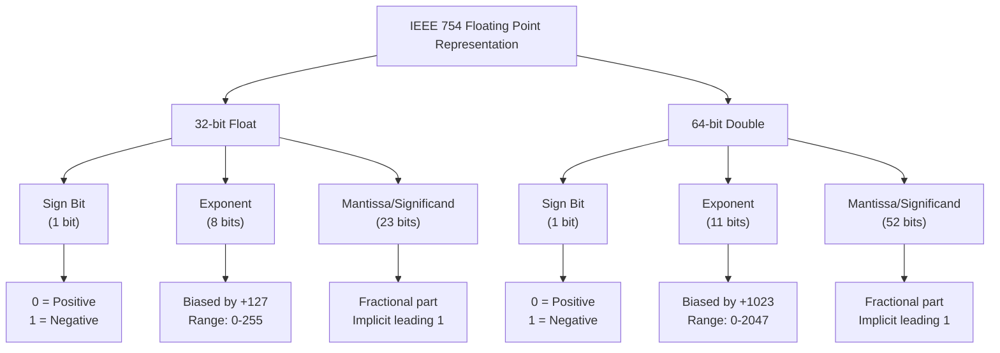
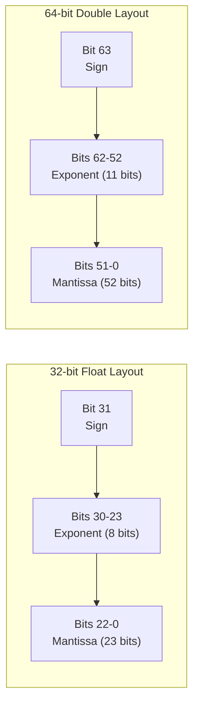
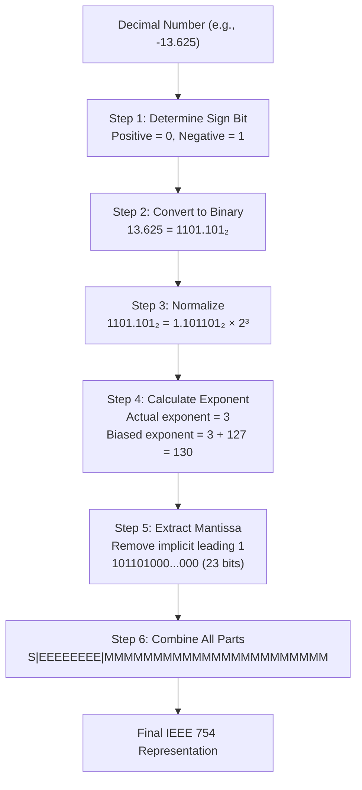
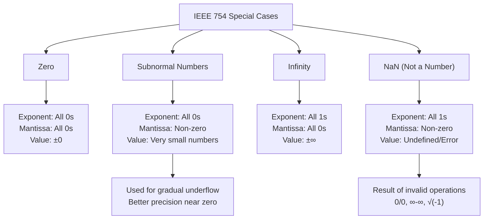
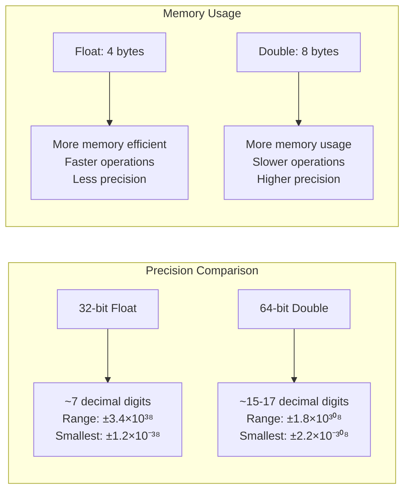

# 🔢 IEEE 754 Floating-Point Representation

## 📊 Overview

In computer systems, floating-point numbers are represented using the **IEEE 754 standard**. This standard defines how **float (32-bit)** and **double (64-bit)** values are stored in memory using three components: **sign bit**, **exponent**, and **mantissa (significand)**.

## 🏗️ Architecture Overview



## 🔍 Bit Layout Visualization



---

## 🏷️ 1. IEEE 754 Single-Precision (32-bit `float`)

### 📋 Component Breakdown

| **Component** | **Sign (S)** | **Exponent (E)** | **Mantissa (M)** |
|--------------|-------------|------------------|------------------|
| **Bits**     | 1 bit       | 8 bits           | 23 bits          |
| **Position** | Bit 31      | Bits 30–23       | Bits 22–0        |
| **Range**    | 0-1         | 0-255            | 0-8388607        |

### 🧮 Mathematical Formula

```
Value = (-1)^S × (1 + M/2^23) × 2^(E - 127)
```

Where:
- **S** = Sign bit (0 for positive, 1 for negative)
- **E** = Biased exponent (actual exponent + 127)
- **M** = Mantissa (fractional part)

### 🔄 Conversion Process



### 📝 Detailed Example: Storing `-13.625` as a `float`

#### Step 1: Sign Determination
- Number is negative → **S = 1**

#### Step 2: Binary Conversion
- **Integer part:** `13 = 1101₂`
- **Fractional part:** `0.625 = 0.101₂`
   - 0.625 × 2 = 1.25 → 1 (integer part)
   - 0.25 × 2 = 0.5 → 0
   - 0.5 × 2 = 1.0 → 1
   - Result: `0.101₂`
- **Complete binary:** `1101.101₂`

#### Step 3: Normalization
- `1101.101₂ = 1.101101₂ × 2³`
- **Actual exponent:** 3

#### Step 4: Exponent Calculation
- **Biased exponent:** `3 + 127 = 130`
- **Binary representation:** `130 = 10000010₂`

#### Step 5: Mantissa Extraction
- **Normalized form:** `1.101101₂`
- **Remove implicit leading 1:** `101101₂`
- **Pad to 23 bits:** `10110100000000000000000₂`

#### Step 6: Final Assembly
```
Sign    Exponent    Mantissa
1       10000010    10110100000000000000000
```

#### Step 7: Hexadecimal Representation
```
Binary:  11000001010110100000000000000000
Hex:     C15A0000
```

---

## 🏷️ 2. IEEE 754 Double-Precision (64-bit `double`)

### 📋 Component Breakdown

| **Component** | **Sign (S)** | **Exponent (E)** | **Mantissa (M)** |
|--------------|-------------|------------------|------------------|
| **Bits**     | 1 bit       | 11 bits          | 52 bits          |
| **Position** | Bit 63      | Bits 62–52       | Bits 51–0        |
| **Range**    | 0-1         | 0-2047           | 0-4503599627370495 |

### 🧮 Mathematical Formula

```
Value = (-1)^S × (1 + M/2^52) × 2^(E - 1023)
```

### 📝 Example: Storing `-13.625` as a `double`

#### Steps 1-3: Same as float
- **Sign:** 1 (negative)
- **Binary:** `1101.101₂`
- **Normalized:** `1.101101₂ × 2³`

#### Step 4: Exponent Calculation
- **Biased exponent:** `3 + 1023 = 1026`
- **Binary:** `1026 = 10000000010₂`

#### Step 5: Mantissa (52 bits)
- **Fractional part:** `101101000...000` (52 bits total)

#### Step 6: Final Assembly
```
Sign  Exponent     Mantissa (52 bits)
1     10000000010  1011010000000000000000000000000000000000000000000000
```

#### Step 7: Hexadecimal
```
Hex: C02D400000000000
```

---

## ⚠️ Special Cases in IEEE 754



### 📊 Special Cases Table

| **Case**         | **Exponent (E)** | **Mantissa (M)** | **Value Formula** | **Examples** |
|------------------|------------------|------------------|-------------------|--------------|
| **Positive Zero** | All `0`         | All `0`          | `+0`              | `0.0f` |
| **Negative Zero** | All `0`         | All `0`          | `-0`              | `-0.0f` |
| **Subnormal**    | All `0`          | Non-zero         | `(-1)^S × 0.M × 2^(-126)` | Very small numbers |
| **Positive Infinity** | All `1`    | All `0`          | `+∞`              | `1.0f/0.0f` |
| **Negative Infinity** | All `1`    | All `0`          | `-∞`              | `-1.0f/0.0f` |
| **NaN (Quiet)**     | All `1`      | MSB=1, others any | `NaN`             | `0.0f/0.0f` |
| **NaN (Signaling)** | All `1`      | MSB=0, others non-zero | `NaN`       | Hardware exceptions |

---

## 📏 Precision and Range Comparison



### 📋 Detailed Comparison

| **Aspect**               | **Float (32-bit)**      | **Double (64-bit)**     |
|--------------------------|-------------------------|------------------------|
| **Decimal Precision**    | ~7 significant digits   | ~15-17 significant digits |
| **Largest Value**        | ±3.4028235 × 10³⁸      | ±1.7976931 × 10³⁰⁸     |
| **Smallest Positive**    | ±1.175494 × 10⁻³⁸      | ±2.225074 × 10⁻³⁰⁸     |
| **Memory Usage**         | 4 bytes                 | 8 bytes                |
| **Mantissa Precision**   | 23 bits (~7 digits)    | 52 bits (~16 digits)   |
| **Exponent Range**       | -126 to +127            | -1022 to +1023         |

---

## 🧩 Additional Examples

### Example 1: Positive Number (3.14159)

#### Float Representation:
```
3.14159 ≈ 3.141590118408203125 (actual stored value)

Binary: 11.001001000011111101101...
Normalized: 1.1001001000011111101101 × 2¹

Sign: 0
Exponent: 1 + 127 = 128 = 10000000₂
Mantissa: 10010010000111111011010 (23 bits)

Final: 01000000010010010000111111011010
Hex: 40490FDB
```

#### Double Representation:
```
3.14159 ≈ 3.141590000000000103440... (actual stored value)

Same normalization process but with 11-bit exponent and 52-bit mantissa
Hex: 400921FB4D12D84A
```

### Example 2: Very Small Number (1.0e-10)

#### Float Representation:
```
1.0e-10 in binary requires large negative exponent
Often results in subnormal numbers or underflow to zero
```

#### Double Representation:
```
Better precision for very small numbers
Can represent 1.0e-10 more accurately
```

---

## 🎯 Practical Implications

### 🔴 Common Pitfalls

1. **Precision Loss**
   ```c
   float f = 0.1f + 0.2f;  // Not exactly 0.3!
   // f ≈ 0.30000001192092896
   ```

2. **Comparison Issues**
   ```c
   float a = 0.1f + 0.2f;
   float b = 0.3f;
   if (a == b) {  // This might be false!
       // Use epsilon comparison instead
   }
   ```

3. **Overflow/Underflow**
   ```c
   float huge = 3.4e38f * 2.0f;  // Results in infinity
   float tiny = 1.0e-45f / 2.0f; // Results in zero or subnormal
   ```

### ✅ Best Practices

1. **Use Epsilon Comparison**
   ```c
   #define EPSILON 1e-6f
   bool floatEqual(float a, float b) {
       return fabs(a - b) < EPSILON;
   }
   ```

2. **Choose Appropriate Type**
   - Use `float` for graphics, games (performance critical)
   - Use `double` for scientific calculations (precision critical)

3. **Be Aware of Rounding**
   ```c
   float sum = 0.0f;
   for (int i = 0; i < 1000000; i++) {
       sum += 0.1f;  // Accumulates rounding errors
   }
   // sum ≠ 100000.0f exactly
   ```

---

## 📚 Summary

### Key Points:
- **Float (32-bit):** `1 sign bit | 8 exponent bits (bias=127) | 23 mantissa bits`
- **Double (64-bit):** `1 sign bit | 11 exponent bits (bias=1023) | 52 mantissa bits`
- **Normalized form:** `(-1)^S × (1.M) × 2^(E - bias)`
- **Subnormal numbers** allow representation of very small numbers near zero
- **Special cases** handle zero, infinity, and undefined operations (NaN)

### Performance vs Precision Trade-off:
- **Float:** Faster, less memory, ~7 decimal digits precision
- **Double:** Slower, more memory, ~15-17 decimal digits precision

### Real-world Applications:
- **Graphics/Games:** Prefer float for performance
- **Scientific Computing:** Prefer double for accuracy
- **Financial Calculations:** Consider decimal types for exact arithmetic

This IEEE 754 format ensures **efficient storage** while maintaining **reasonable precision** for floating-point arithmetic across different computer architectures.