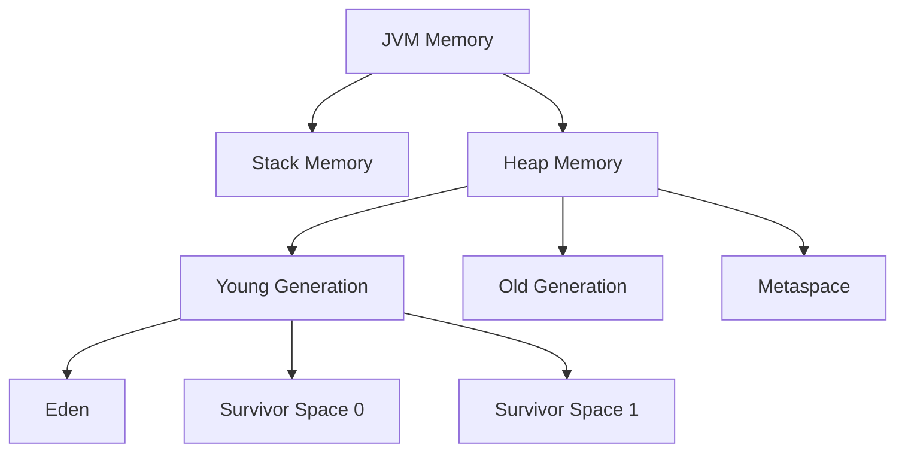
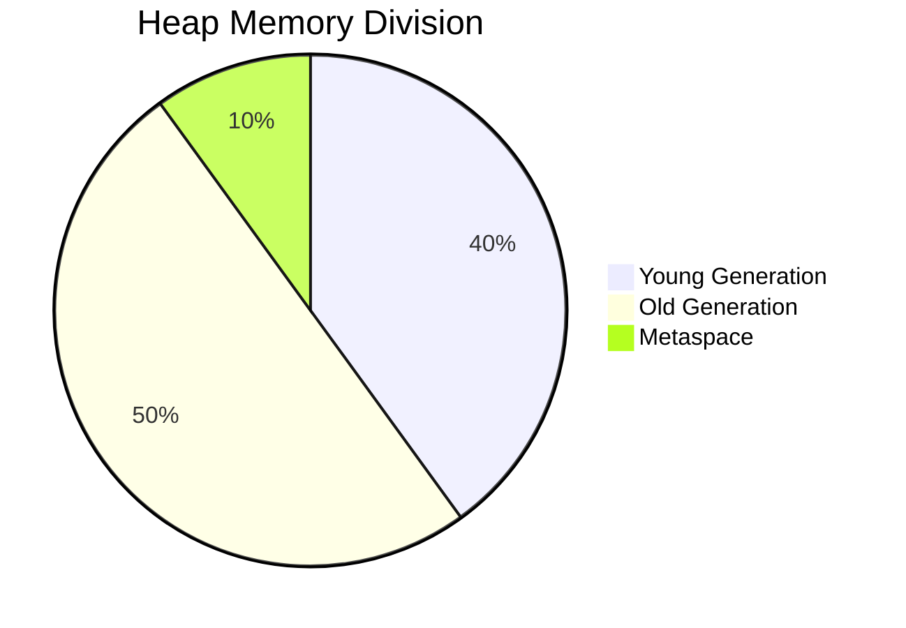
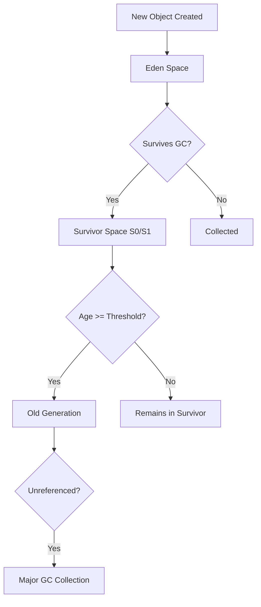
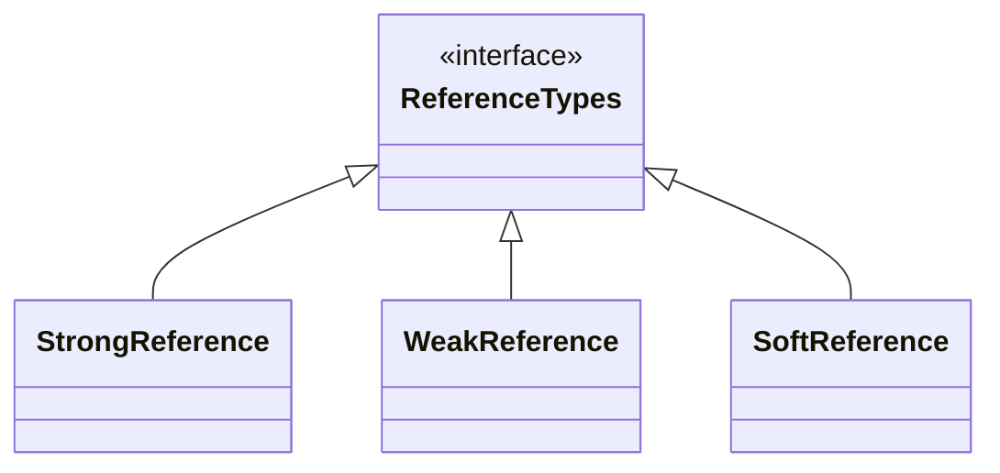
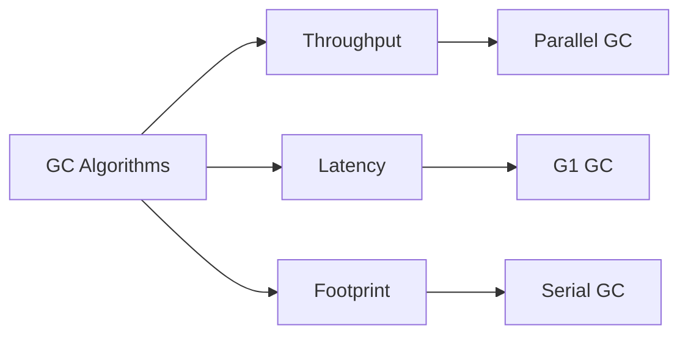

# Java Memory Management

## 1. Java Memory Structure

Java Virtual Machine (JVM) divides memory into two main areas:



### 1.1 Stack Memory

**Characteristics:**
- Stores temporary variables in separate memory blocks for methods
- Contains primitive data types and references to heap objects
- Each thread has its own stack memory
- Follows LIFO (Last-In-First-Out) order
- Automatic scope-based memory management
- Throws `StackOverflowError` when full

**Example:**
```java
public void exampleMethod() {
    int x = 10;          // primitive - stored in stack
    String s = "Hello";  // reference to string in heap
}
```

### 1.2 Heap Memory

**Characteristics:**
- Stores all Java objects
- Shared among all threads
- Managed by Garbage Collector (GC)
- Divided into generations for efficient GC



## 2. Garbage Collection Process

### 2.1 Object Lifecycle in Heap



### 2.2 Generational GC Process

1. **Minor GC (Young Generation):**
   - Runs frequently
   - Fast operation
   - Uses "Mark and Sweep" algorithm
   - Surviving objects are moved between Eden and Survivor spaces

2. **Major GC (Old Generation):**
   - Runs less frequently
   - Slower operation
   - May use compaction

**Visualization of GC Process:**

```
Before GC:
+---------------------+
| Eden                |
| O1 O2 O3 O4 O5      |
+---------------------+
| S0 | S1             |
|    |                |
+---------------------+

After GC (O2, O5 unreferenced):
+---------------------+
| Eden                |
|                     |
+---------------------+
| S0 | S1             |
| O1 | O3 O4          |
| age=1 | age=1       |
+---------------------+
```

## 3. Reference Types



### 3.1 Strong Reference
- Default reference type
- Prevents GC from collecting the object
- Example: `Person p = new Person();`

### 3.2 Weak Reference
- Doesn't prevent GC
- Collected as soon as GC runs
- Example: `WeakReference<Person> weakRef = new WeakReference<>(new Person());`

### 3.3 Soft Reference
- Only collected when heap memory is low
- Example: `SoftReference<Person> softRef = new SoftReference<>(new Person());`

## 4. Garbage Collector Types

| GC Type            | Characteristics                                                                 | Best For               |
|--------------------|---------------------------------------------------------------------------------|------------------------|
| Serial GC          | Single-threaded, stop-the-world                                                 | Small applications     |
| Parallel GC        | Multi-threaded young generation collection (default in Java 8)                  | Throughput-oriented    |
| CMS GC             | Concurrent Mark Sweep, tries to minimize pauses                                 | Low-latency           |
| G1 GC              | Generational, concurrent, with compaction (default in newer Java versions)     | Large heaps           |



## 5. Metaspace (Formerly PermGen)

**Key Differences:**
- Introduced in Java 8
- Replaces PermGen
- Stores class metadata, static variables, constants
- Auto-resizing (no fixed size limit)
- Native memory (not part of heap)

```
+---------------------------+
| JVM Memory                |
| +---------------------+   |
| | Heap                |   |
| | +-----+ +---------+ |   |
| | | Eden| | Old Gen | |   |
| | +-----+ +---------+ |   |
| +---------------------+   |
|                           |
| +---------------------+   |
| | Metaspace           |   |
| | (Class metadata)    |   |
| +---------------------+   |
+---------------------------+
```

## 6. Practical Example with Memory Allocation

```java
public class MemoryExample {
    public static void main(String[] args) {
        int num = 5;                    // Stack
        String name = "John";            // Stack ref -> String Pool
        Object obj = new Object();       // Stack ref -> Heap
        WeakReference<Object> weakObj =   // Stack ref -> WeakRef -> Heap
            new WeakReference<>(new Object());
    }
}
```

**Memory Layout:**

```
Stack:
+-------------------+
| num = 5           |
| name -> "John"    |
| obj -> Object@123 |
| weakObj -> WR@456 |
+-------------------+

Heap:
+-------------------+
| Object@123        |
| WeakReference@456 |
|   -> Object@789   |
+-------------------+

String Pool:
+-------------------+
| "John"            |
+-------------------+
```

## 7. Key Takeaways

1. **Stack** is thread-specific, fast, and scope-based
2. **Heap** is shared, stores objects, and managed by GC
3. **Generational GC** improves efficiency by separating short-lived and long-lived objects
4. **Reference types** offer different levels of GC control
5. **Metaspace** provides flexible class metadata storage
6. Different **GC algorithms** optimize for different use cases

Understanding Java memory management is crucial for writing efficient applications and troubleshooting memory-related issues like leaks or excessive GC overhead.