# Java Memory Management - Deep Dive

## 1. Java Memory Structure Overview

The Java Virtual Machine (JVM) employs a sophisticated memory management system designed for optimal performance and automatic memory cleanup. Understanding this architecture is fundamental to writing efficient Java applications.

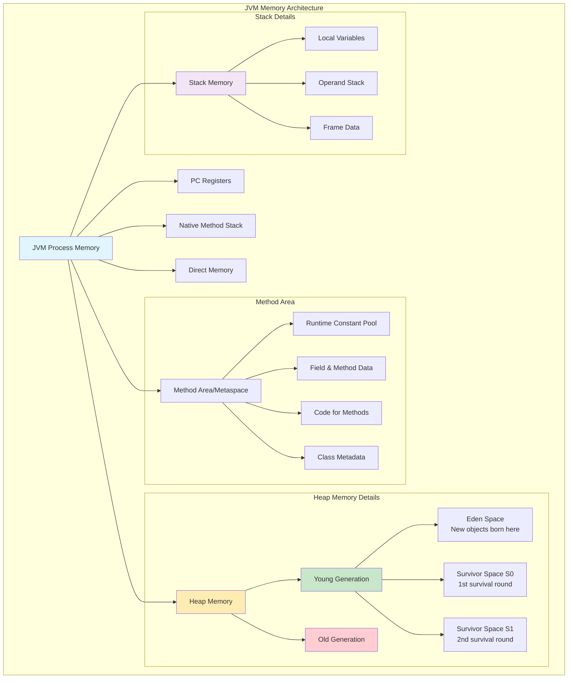
```mermaid
graph TB
    subgraph "JVM Memory Architecture"
        A["JVM Process Memory"] --> B["Method Area/Metaspace"]
        A --> C["Heap Memory"]
        A --> D["Stack Memory"]
        A --> E["PC Registers"]
        A --> F["Native Method Stack"]
        A --> G["Direct Memory"]
        
        subgraph "Heap Memory Details"
            C --> H["Young Generation"]
            C --> I["Old Generation"]
            H --> J["Eden Space<br/>New objects born here"]
            H --> K["Survivor Space S0<br/>1st survival round"]
            H --> L["Survivor Space S1<br/>2nd survival round"]
        end
        
        subgraph "Method Area"
            B --> M["Runtime Constant Pool"]
            B --> N["Field & Method Data"]
            B --> O["Code for Methods"]
            B --> P["Class Metadata"]
        end
        
        subgraph "Stack Details"
            D --> Q["Local Variables"]
            D --> R["Operand Stack"]
            D --> S["Frame Data"]
        end
    end
    
    style A fill:#e1f5fe
    style C fill:#ffecb3
    style H fill:#c8e6c9
    style I fill:#ffcdd2
    style D fill:#f3e5f5
```

### 1.1 Stack Memory - Thread-Specific Storage

**Detailed Characteristics:**
- **Thread Isolation**: Each thread maintains its own stack memory space
- **LIFO Structure**: Follows Last-In-First-Out principle for method calls
- **Frame Structure**: Each method call creates a new stack frame
- **Size Limitations**: Limited by JVM configuration (-Xss flag)
- **Speed**: Fastest memory allocation and deallocation
- **Scope Management**: Automatic cleanup when method execution completes

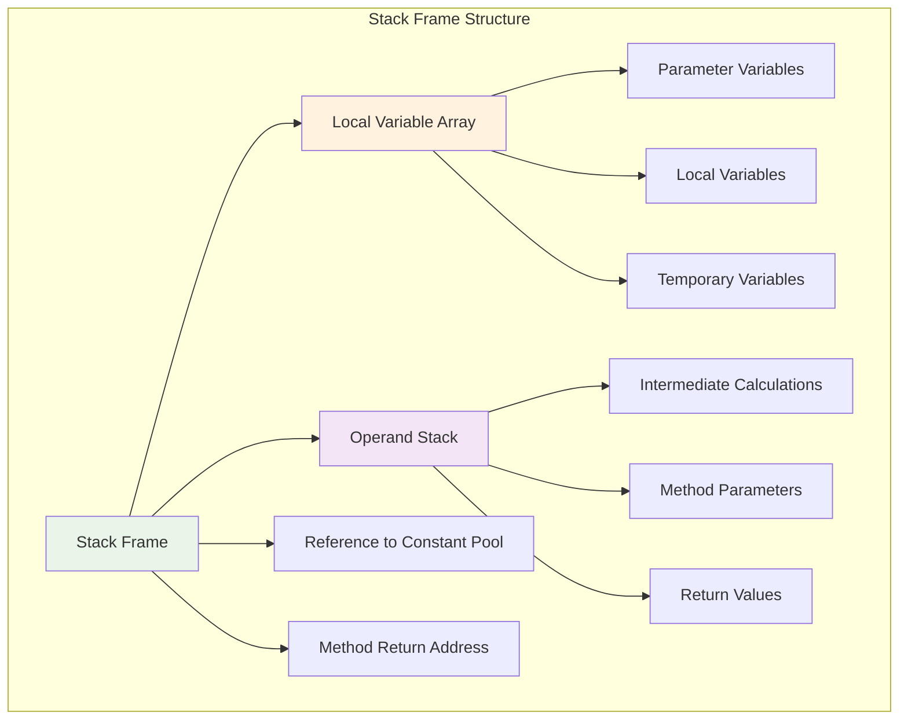
```mermaid
graph TD
    subgraph "Stack Frame Structure"
        A["Stack Frame"] --> B["Local Variable Array"]
        A --> C["Operand Stack"]
        A --> D["Reference to Constant Pool"]
        A --> E["Method Return Address"]
        
        B --> F["Parameter Variables"]
        B --> G["Local Variables"]
        B --> H["Temporary Variables"]
        
        C --> I["Intermediate Calculations"]
        C --> J["Method Parameters"]
        C --> K["Return Values"]
    end
    
    style A fill:#e8f5e8
    style B fill:#fff3e0
    style C fill:#f3e5f5
```

**Stack Memory Example:**
```java
public class StackExample {
    public static void main(String[] args) {     // Frame 1
        int x = 10;                              // Local variable in Frame 1
        calculateSum(x, 20);                     // Creates Frame 2
    }
    
    public static int calculateSum(int a, int b) { // Frame 2
        int result = a + b;                        // Local variable in Frame 2
        return result;                             // Frame 2 destroyed after return
    }
}
```

### 1.2 Heap Memory - Object Storage Universe

**Advanced Heap Architecture:**

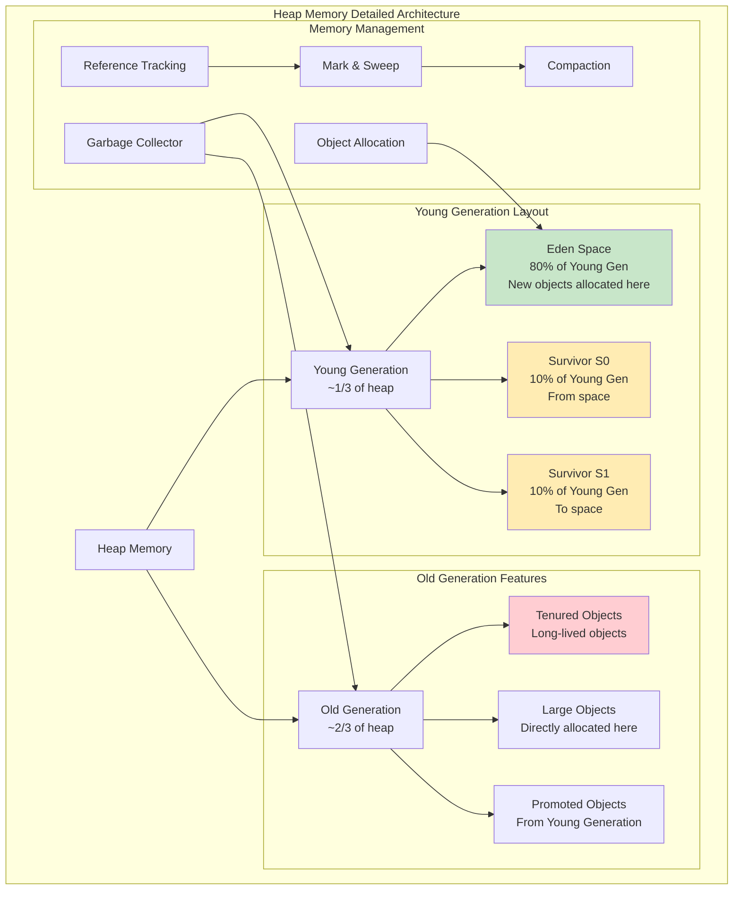
```mermaid
graph TB
    subgraph "Heap Memory Detailed Architecture"
        A["Heap Memory"] --> B["Young Generation<br/>~1/3 of heap"]
        A --> C["Old Generation<br/>~2/3 of heap"]
        
        subgraph "Young Generation Layout"
            B --> D["Eden Space<br/>80% of Young Gen<br/>New objects allocated here"]
            B --> E["Survivor S0<br/>10% of Young Gen<br/>From space"]
            B --> F["Survivor S1<br/>10% of Young Gen<br/>To space"]
        end
        
        subgraph "Old Generation Features"
            C --> G["Tenured Objects<br/>Long-lived objects"]
            C --> H["Large Objects<br/>Directly allocated here"]
            C --> I["Promoted Objects<br/>From Young Generation"]
        end
        
        subgraph "Memory Management"
            J["Garbage Collector"] --> B
            J --> C
            K["Object Allocation"] --> D
            L["Reference Tracking"] --> M["Mark & Sweep"]
            M --> N["Compaction"]
        end
    end
    
    style D fill:#c8e6c9
    style E fill:#ffecb3
    style F fill:#ffecb3
    style G fill:#ffcdd2
```

## 2. Comprehensive Memory Allocation Example - Step by Step

Let's trace through a complete program execution to see how memory allocation works at each stage:

### Sample Program for Analysis

```java
public class MemoryAllocationDemo {
    private static String companyName = "TechCorp";     // Metaspace
    private int instanceCounter;                         // Heap (with object)
    
    public static void main(String[] args) {            // Stack Frame 1
        System.out.println("=== Program Start ===");
        
        // Stage 1: Local variables
        int numberOfEmployees = 5;                      // Stack
        String departmentName = "Engineering";          // Stack ref -> String Pool
        
        // Stage 2: Object creation
        MemoryAllocationDemo demo = new MemoryAllocationDemo();  // Stack ref -> Heap
        
        // Stage 3: Array creation
        Employee[] employees = new Employee[numberOfEmployees];  // Stack ref -> Heap array
        
        // Stage 4: Populating array with objects
        for (int i = 0; i < numberOfEmployees; i++) {
            employees[i] = new Employee("Employee" + i, 25000 + i * 1000);
        }
        
        // Stage 5: Method calls creating new stack frames
        demo.processEmployees(employees);
        
        // Stage 6: Creating temporary objects
        StringBuilder report = new StringBuilder();
        for (Employee emp : employees) {
            report.append(emp.generateReport());
        }
        
        System.out.println("=== Program End ===");
    }  // Stack Frame 1 destroyed here
    
    public void processEmployees(Employee[] emps) {     // Stack Frame 2
        this.instanceCounter = emps.length;
        
        for (Employee emp : emps) {                     // Stack Frame 3 (enhanced for loop)
            emp.calculateTax();
        }
    }  // Stack Frames 2 & 3 destroyed here
}

class Employee {
    private String name;        // Heap
    private double salary;      // Heap
    private static int count;   // Metaspace
    
    public Employee(String name, double salary) {
        this.name = name;
        this.salary = salary;
        count++;
    }
    
    public double calculateTax() {                      // Stack Frame for method
        double taxRate = 0.15;                          // Stack
        return salary * taxRate;                        // Stack calculation
    }
    
    public String generateReport() {                    // Stack Frame for method
        return name + ": $" + salary;                   // String concatenation -> new String objects
    }
}
```

### Stage-by-Stage Memory Allocation Visualization

#### Stage 1: Program Initialization
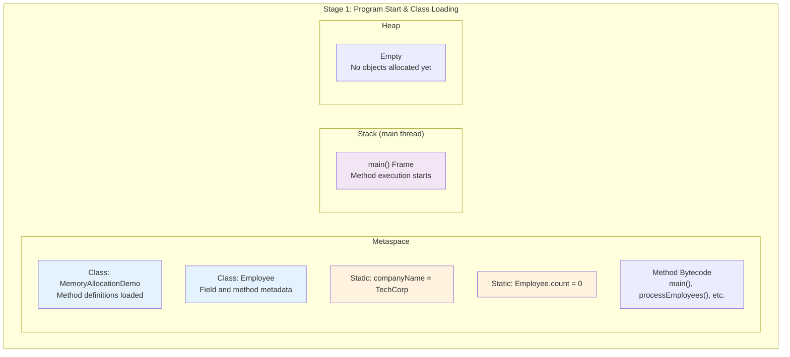
```mermaid
graph TB
    subgraph "Stage 1: Program Start & Class Loading"
        subgraph "Metaspace"
            A["Class: MemoryAllocationDemo<br/>Method definitions loaded"]
            B["Class: Employee<br/>Field and method metadata"]
            C["Static: companyName = TechCorp"]
            D["Static: Employee.count = 0"]
            E["Method Bytecode<br/>main(), processEmployees(), etc."]
        end
        
        subgraph "Stack (main thread)"
            F["main() Frame<br/>Method execution starts"]
        end
        
        subgraph "Heap"
            G["Empty<br/>No objects allocated yet"]
        end
    end
    
    style A fill:#e3f2fd
    style B fill:#e3f2fd
    style C fill:#fff3e0
    style D fill:#fff3e0
    style F fill:#f3e5f5
```

#### Stage 2: Local Variables Creation
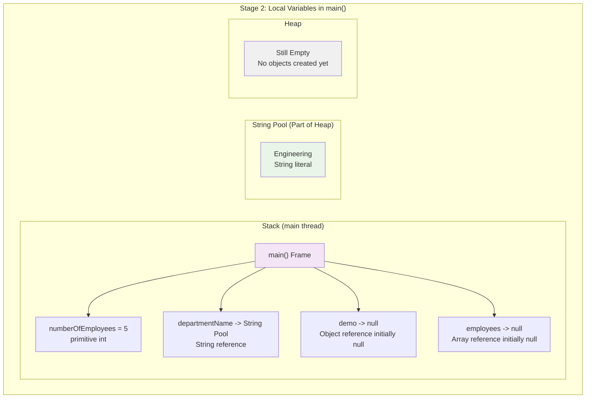
```mermaid
graph TB
    subgraph "Stage 2: Local Variables in main()"
        subgraph "Stack (main thread)"
            A["main() Frame"] --> B["numberOfEmployees = 5<br/>primitive int"]
            A --> C["departmentName -> String Pool<br/>String reference"]
            A --> D["demo -> null<br/>Object reference initially null"]
            A --> E["employees -> null<br/>Array reference initially null"]
        end
        
        subgraph "String Pool (Part of Heap)"
            F["Engineering<br/>String literal"]
        end
        
        subgraph "Heap"
            G["Still Empty<br/>No objects created yet"]
        end
    end
    
    style A fill:#f3e5f5
    style F fill:#e8f5e8
    style G fill:#f0f0f0
```

#### Stage 3: First Object Creation
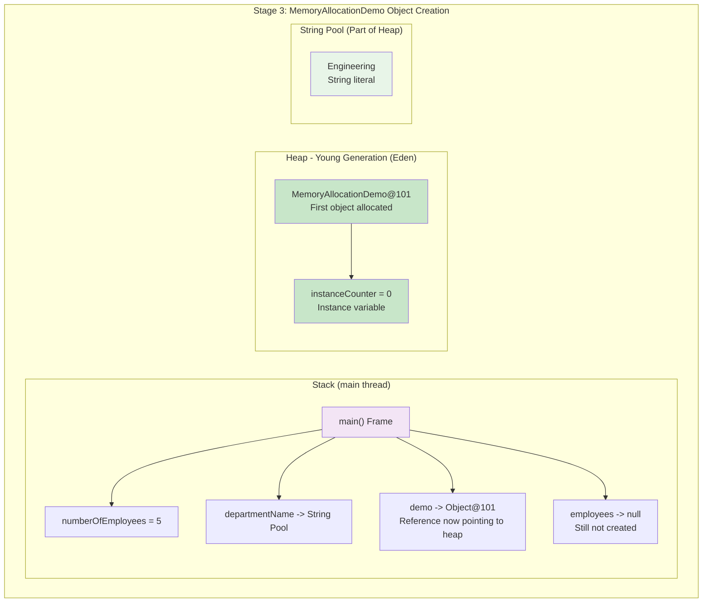
```mermaid
graph TB
    subgraph "Stage 3: MemoryAllocationDemo Object Creation"
        subgraph "Stack (main thread)"
            A["main() Frame"] --> B["numberOfEmployees = 5"]
            A --> C["departmentName -> String Pool"]
            A --> D["demo -> Object@101<br/>Reference now pointing to heap"]
            A --> E["employees -> null<br/>Still not created"]
        end
        
        subgraph "Heap - Young Generation (Eden)"
            F["MemoryAllocationDemo@101<br/>First object allocated"] --> G["instanceCounter = 0<br/>Instance variable"]
        end
        
        subgraph "String Pool (Part of Heap)"
            H["Engineering<br/>String literal"]
        end
    end
    
    style F fill:#c8e6c9
    style G fill:#c8e6c9
    style A fill:#f3e5f5
    style H fill:#e8f5e8
```

#### Stage 4: Array and Employee Objects Creation
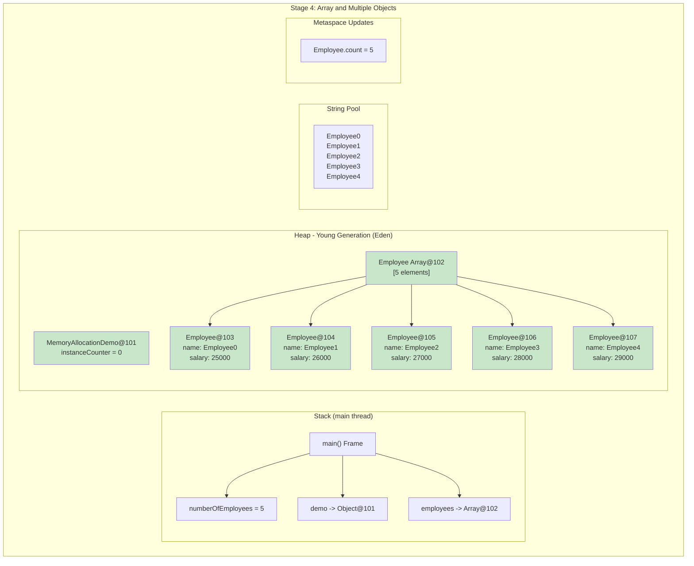
```mermaid
graph TB
    subgraph "Stage 4: Array and Multiple Objects"
        subgraph "Stack (main thread)"
            A["main() Frame"] --> B["numberOfEmployees = 5"]
            A --> C["demo -> Object@101"]
            A --> D["employees -> Array@102"]
        end
        
        subgraph "Heap - Young Generation (Eden)"
            E["MemoryAllocationDemo@101<br/>instanceCounter = 0"]
            F["Employee Array@102<br/>[5 elements]"]
            G["Employee@103<br/>name: Employee0<br/>salary: 25000"]
            H["Employee@104<br/>name: Employee1<br/>salary: 26000"]
            I["Employee@105<br/>name: Employee2<br/>salary: 27000"]
            J["Employee@106<br/>name: Employee3<br/>salary: 28000"]
            K["Employee@107<br/>name: Employee4<br/>salary: 29000"]
            
            F --> G
            F --> H
            F --> I
            F --> J
            F --> K
        end
        
        subgraph "String Pool"
            L["Employee0<br/>Employee1<br/>Employee2<br/>Employee3<br/>Employee4"]
        end
        
        subgraph "Metaspace Updates"
            M["Employee.count = 5"]
        end
    end
    
    style E fill:#c8e6c9
    style F fill:#c8e6c9
    style G fill:#c8e6c9
    style H fill:#c8e6c9
    style I fill:#c8e6c9
    style J fill:#c8e6c9
    style K fill:#c8e6c9
```

#### Stage 5: Method Call Stack Frames
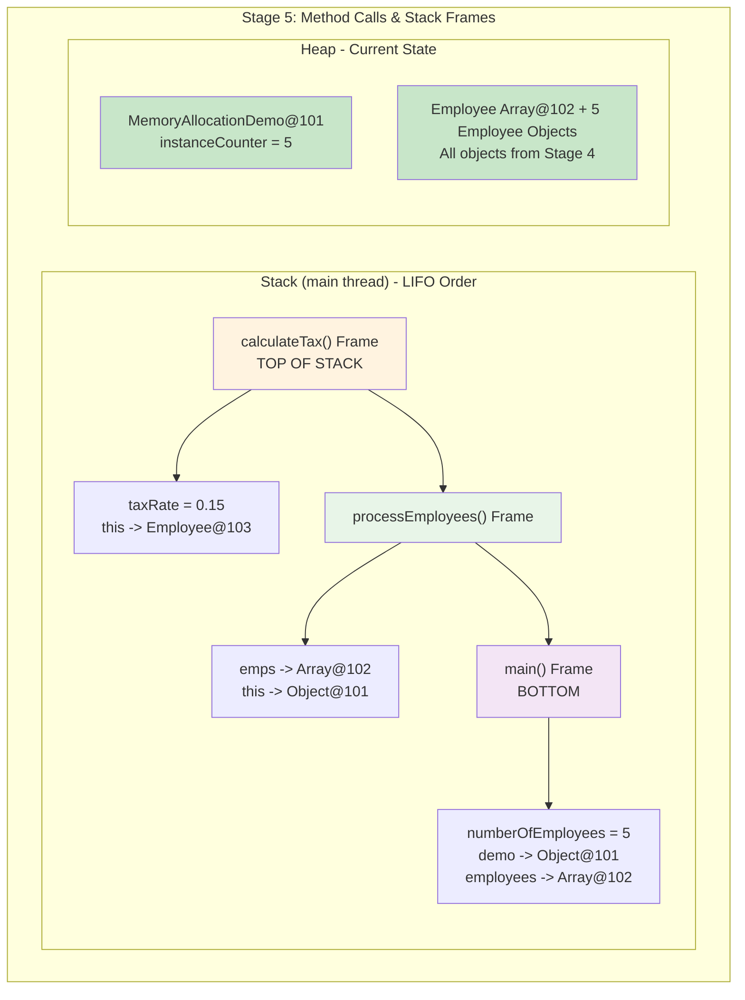
```mermaid
graph TB
    subgraph "Stage 5: Method Calls & Stack Frames"
        subgraph "Stack (main thread) - LIFO Order"
            A["calculateTax() Frame<br/>TOP OF STACK"] --> B["taxRate = 0.15<br/>this -> Employee@103"]
            C["processEmployees() Frame"] --> D["emps -> Array@102<br/>this -> Object@101"]
            E["main() Frame<br/>BOTTOM"] --> F["numberOfEmployees = 5<br/>demo -> Object@101<br/>employees -> Array@102"]
            
            A --> C
            C --> E
        end
        
        subgraph "Heap - Current State"
            G["MemoryAllocationDemo@101<br/>instanceCounter = 5"]
            H["Employee Array@102 + 5 Employee Objects<br/>All objects from Stage 4"]
        end
    end
    
    style A fill:#fff3e0
    style C fill:#e8f5e8
    style E fill:#f3e5f5
    style G fill:#c8e6c9
    style H fill:#c8e6c9
```

#### Stage 6: Garbage Collection Trigger
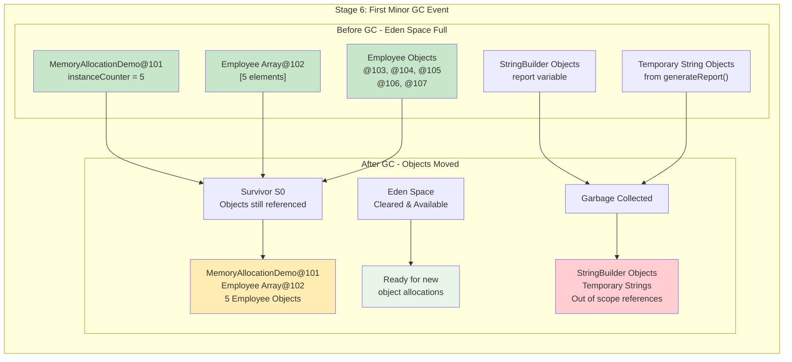
```mermaid
graph LR
    subgraph "Stage 6: First Minor GC Event"
        subgraph "Before GC - Eden Space Full"
            A["MemoryAllocationDemo@101<br/>instanceCounter = 5"]
            B["Employee Array@102<br/>[5 elements]"]
            C["Employee Objects<br/>@103, @104, @105<br/>@106, @107"]
            D["StringBuilder Objects<br/>report variable"]
            E["Temporary String Objects<br/>from generateReport()"]
        end
        
        subgraph "After GC - Objects Moved"
            F["Survivor S0<br/>Objects still referenced"] --> G["MemoryAllocationDemo@101<br/>Employee Array@102<br/>5 Employee Objects"]
            H["Eden Space<br/>Cleared & Available"] --> I["Ready for new<br/>object allocations"]
            J["Garbage Collected"] --> K["StringBuilder Objects<br/>Temporary Strings<br/>Out of scope references"]
        end
        
        A --> F
        B --> F
        C --> F
        D --> J
        E --> J
    end
    
    style A fill:#c8e6c9
    style B fill:#c8e6c9
    style C fill:#c8e6c9
    style G fill:#ffecb3
    style I fill:#e8f5e8
    style K fill:#ffcdd2
```

#### Stage 7: Program Completion
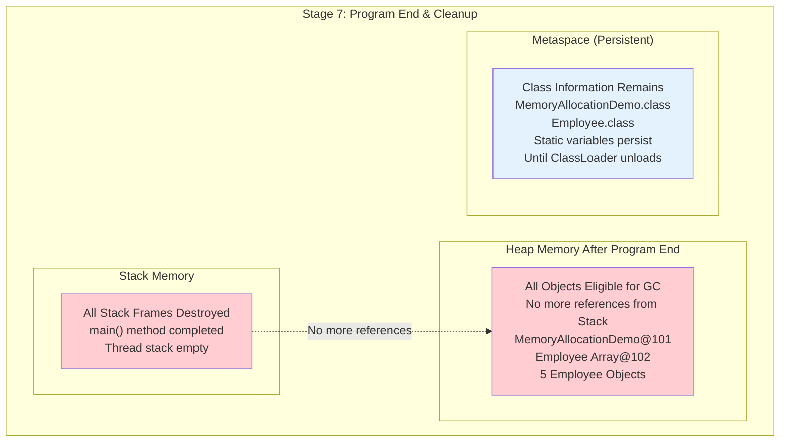
```mermaid
graph TB
    subgraph "Stage 7: Program End & Cleanup"
        subgraph "Stack Memory"
            A["All Stack Frames Destroyed<br/>main() method completed<br/>Thread stack empty"]
        end
        
        subgraph "Heap Memory After Program End"
            B["All Objects Eligible for GC<br/>No more references from Stack<br/>MemoryAllocationDemo@101<br/>Employee Array@102<br/>5 Employee Objects"]
        end
        
        subgraph "Metaspace (Persistent)"
            C["Class Information Remains<br/>MemoryAllocationDemo.class<br/>Employee.class<br/>Static variables persist<br/>Until ClassLoader unloads"]
        end
        
        A -.->|"No more references"| B
    end
    
    style A fill:#ffcdd2
    style B fill:#ffcdd2
    style C fill:#e3f2fd
```

## 3. Advanced Garbage Collection Deep Dive

### 3.1 Generational Hypothesis Visualization

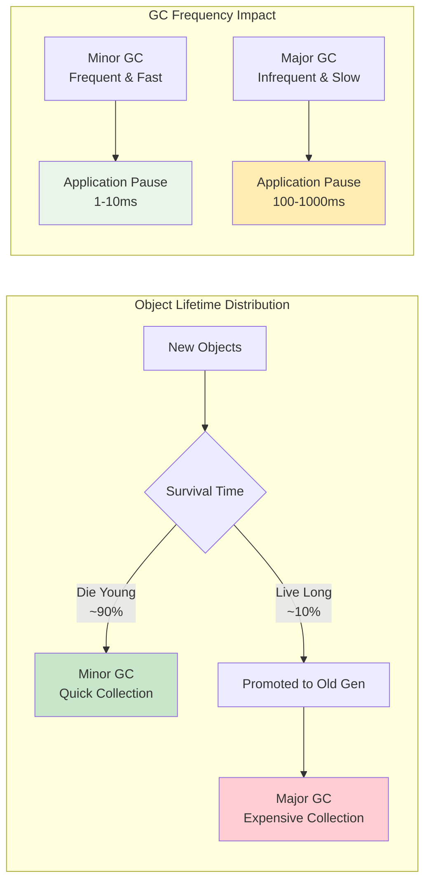
```mermaid
graph LR
    subgraph "Object Lifetime Distribution"
        A["New Objects"] --> B{Survival Time}
        B -->|Die Young<br/>~90%| C["Minor GC<br/>Quick Collection"]
        B -->|Live Long<br/>~10%| D["Promoted to Old Gen"]
        D --> E["Major GC<br/>Expensive Collection"]
    end
    
    subgraph "GC Frequency Impact"
        F["Minor GC<br/>Frequent & Fast"] --> G["Application Pause<br/>1-10ms"]
        H["Major GC<br/>Infrequent & Slow"] --> I["Application Pause<br/>100-1000ms"]
    end
    
    style C fill:#c8e6c9
    style E fill:#ffcdd2
    style G fill:#e8f5e8
    style I fill:#ffecb3
```

### 3.2 Complete GC Algorithm Walkthrough

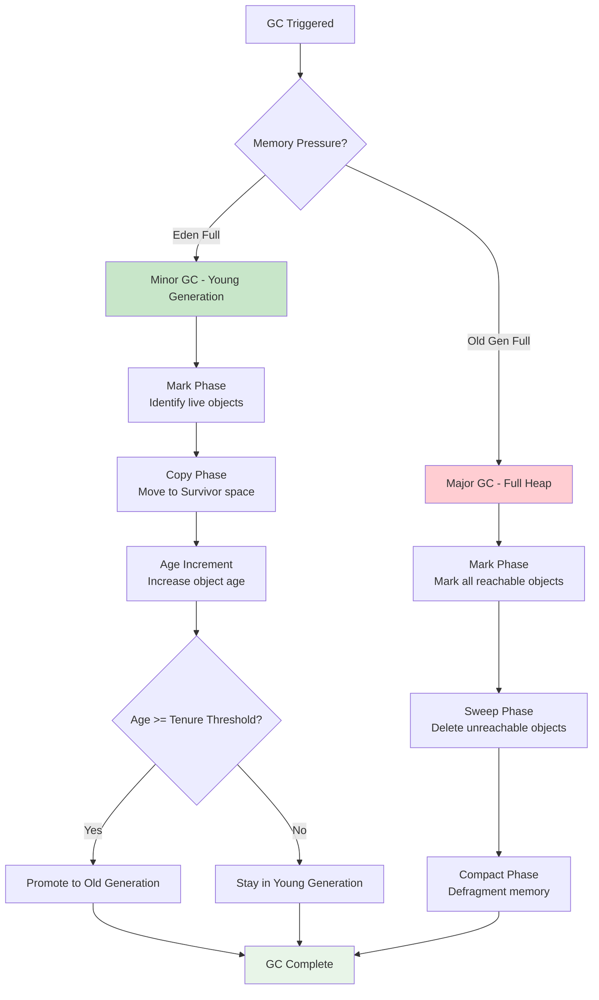
```mermaid
flowchart TD
    A["GC Triggered"] --> B{Memory Pressure?}
    B -->|Eden Full| C["Minor GC - Young Generation"]
    B -->|Old Gen Full| D["Major GC - Full Heap"]
    
    C --> E["Mark Phase<br/>Identify live objects"]
    E --> F["Copy Phase<br/>Move to Survivor space"]
    F --> G["Age Increment<br/>Increase object age"]
    G --> H{Age >= Tenure Threshold?}
    H -->|Yes| I["Promote to Old Generation"]
    H -->|No| J["Stay in Young Generation"]
    
    D --> K["Mark Phase<br/>Mark all reachable objects"]
    K --> L["Sweep Phase<br/>Delete unreachable objects"]
    L --> M["Compact Phase<br/>Defragment memory"]
    
    I --> N["GC Complete"]
    J --> N
    M --> N
    
    style C fill:#c8e6c9
    style D fill:#ffcdd2
    style N fill:#e8f5e8
```

## 4. Advanced Reference Types and Memory Leaks

### 4.1 Reference Hierarchy and GC Behavior

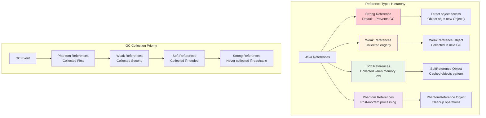
```mermaid
graph TB
    subgraph "Reference Types Hierarchy"
        A["Java References"] --> B["Strong Reference<br/>Default - Prevents GC"]
        A --> C["Weak References<br/>Collected eagerly"]
        A --> D["Soft References<br/>Collected when memory low"]
        A --> E["Phantom References<br/>Post-mortem processing"]
        
        B --> F["Direct object access<br/>Object obj = new Object()"]
        C --> G["WeakReference Object<br/>Collected in next GC"]
        D --> H["SoftReference Object<br/>Cached objects pattern"]
        E --> I["PhantomReference Object<br/>Cleanup operations"]
    end
    
    subgraph "GC Collection Priority"
        J["GC Event"] --> K["Phantom References<br/>Collected First"]
        K --> L["Weak References<br/>Collected Second"]
        L --> M["Soft References<br/>Collected if needed"]
        M --> N["Strong References<br/>Never collected if reachable"]
    end
    
    style B fill:#ffcdd2
    style C fill:#fff3e0
    style D fill:#e8f5e8
    style E fill:#f3e5f5
```

### 4.2 Memory Leak Patterns and Prevention

```java
// Common Memory Leak Patterns

// 1. Static Collection Leak
public class StaticCollectionLeak {
    private static List<Object> staticList = new ArrayList<>();
    
    public void addToStaticList(Object obj) {
        staticList.add(obj);  // Objects never removed - LEAK!
    }
}

// 2. Listener Leak Pattern
public class ListenerLeak {
    private List<EventListener> listeners = new ArrayList<>();
    
    public void addListener(EventListener listener) {
        listeners.add(listener);
        // Forgot to provide removeListener() method - POTENTIAL LEAK!
    }
}

// 3. Inner Class Leak
public class OuterClass {
    private String data = "Large data structure";
    
    public class InnerClass {
        // Implicitly holds reference to OuterClass - POTENTIAL LEAK!
        public void doSomething() {
            // Even if we don't use 'data', reference is maintained
        }
    }
}
```

## 5. Performance Optimization Strategies

### 5.1 GC Tuning Parameters

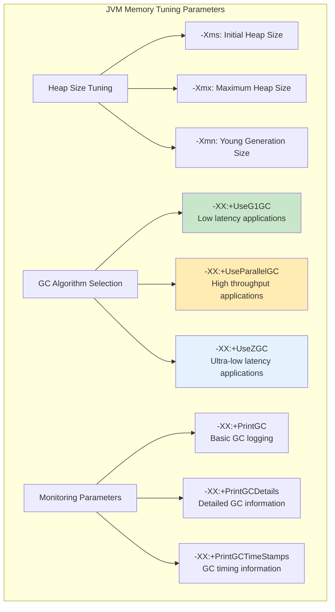
```mermaid
graph TB
    subgraph "JVM Memory Tuning Parameters"
        A["Heap Size Tuning"] --> B["-Xms: Initial Heap Size"]
        A --> C["-Xmx: Maximum Heap Size"]
        A --> D["-Xmn: Young Generation Size"]
        
        E["GC Algorithm Selection"] --> F["-XX:+UseG1GC<br/>Low latency applications"]
        E --> G["-XX:+UseParallelGC<br/>High throughput applications"]
        E --> H["-XX:+UseZGC<br/>Ultra-low latency applications"]
        
        I["Monitoring Parameters"] --> J["-XX:+PrintGC<br/>Basic GC logging"]
        I --> K["-XX:+PrintGCDetails<br/>Detailed GC information"]
        I --> L["-XX:+PrintGCTimeStamps<br/>GC timing information"]
    end
    
    style F fill:#c8e6c9
    style G fill:#ffecb3
    style H fill:#e3f2fd
```

### 5.2 Memory Allocation Best Practices

```java
public class MemoryOptimizationTechniques {
    
    // 1. Object Pool Pattern for expensive objects
    private static final ObjectPool<ExpensiveObject> objectPool = 
        new ObjectPool<>(() -> new ExpensiveObject());
    
    // 2. StringBuilder for string concatenation
    public String buildLargeString(List<String> parts) {
        StringBuilder sb = new StringBuilder(parts.size() * 20); // Pre-size
        for (String part : parts) {
            sb.append(part);
        }
        return sb.toString();
    }
    
    // 3. Primitive arrays over Object arrays when possible
    private int[] primitiveArray;      // More memory efficient
    private Integer[] objectArray;     // Boxing overhead
    
    // 4. Weak references for caches
    private Map<String, WeakReference<CachedObject>> cache = 
        new ConcurrentHashMap<>();
    
    // 5. Proper resource management
    public void processFile(String fileName) {
        try (FileInputStream fis = new FileInputStream(fileName);
             BufferedInputStream bis = new BufferedInputStream(fis)) {
            // Process file - resources automatically closed
        } catch (IOException e) {
            // Handle exception
        }
    }
}
```

## 6. Key Takeaways

1. **Stack** is thread-specific, fast, and scope-based
2. **Heap** is shared, stores objects, and managed by GC
3. **Generational GC** improves efficiency by separating short-lived and long-lived objects
4. **Reference types** offer different levels of GC control
5. **Metaspace** provides flexible class metadata storage
6. Different **GC algorithms** optimize for different use cases

Understanding Java memory management is crucial for writing efficient applications and troubleshooting memory-related issues like leaks or excessive GC overhead.

## 6. Original Memory Structure Deep Dive

### 6.1 Object Lifecycle in Heap - Enhanced Visualization

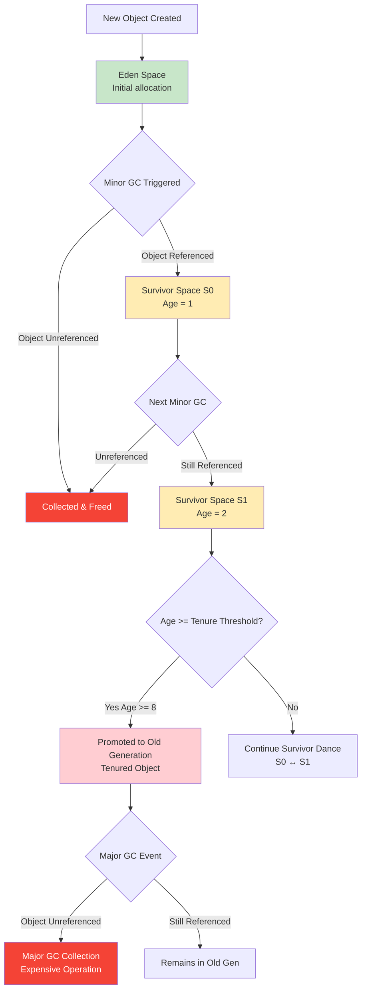
```mermaid
flowchart TD
    A["New Object Created"] --> B["Eden Space<br/>Initial allocation"]
    B --> C{Minor GC Triggered}
    C -->|Object Referenced| D["Survivor Space S0<br/>Age = 1"]
    C -->|Object Unreferenced| E["Collected & Freed"]
    D --> F{Next Minor GC}
    F -->|Still Referenced| G["Survivor Space S1<br/>Age = 2"]
    F -->|Unreferenced| E
    G --> H{Age >= Tenure Threshold?}
    H -->|Yes Age >= 8| I["Promoted to Old Generation<br/>Tenured Object"]
    H -->|No| J["Continue Survivor Dance<br/>S0 ↔ S1"]
    I --> K{Major GC Event}
    K -->|Object Unreferenced| L["Major GC Collection<br/>Expensive Operation"]
    K -->|Still Referenced| M["Remains in Old Gen"]
    
    style B fill:#c8e6c9
    style D fill:#ffecb3
    style G fill:#ffecb3
    style I fill:#ffcdd2
    style E fill:#f44336,color:#ffffff
    style L fill:#f44336,color:#ffffff
```

### 6.2 Generational GC Process - Before and After States

**Visual Representation of GC Cycles:**

```
Cycle 1 - Before Minor GC:
+----------------------------------+
| Eden Space (8MB)                 |
| [Obj1] [Obj2] [Obj3] [Obj4]     |
| [Obj5] [Obj6] [Obj7] [Obj8]     |
+----------------------------------+
| S0 (1MB)    | S1 (1MB)           |
| [Empty]     | [Empty]            |
+----------------------------------+
| Old Generation (20MB)            |
| [Long-lived objects]             |
+----------------------------------+

Cycle 1 - After Minor GC (Obj2, Obj5, Obj7 unreachable):
+----------------------------------+
| Eden Space (8MB)                 |
| [Empty - Available for new]     |
+----------------------------------+
| S0 (1MB)    | S1 (1MB)           |
| [Obj1(age=1)| [Empty]            |
| [Obj3(age=1)|                    |
| [Obj4(age=1)|                    |
| [Obj6(age=1)|                    |
| [Obj8(age=1)|                    |
+----------------------------------+
| Old Generation (20MB)            |
| [Long-lived objects]             |
+----------------------------------+

Cycle 2 - After Next Minor GC (Obj4 unreachable):
+----------------------------------+
| Eden Space (8MB)                 |
| [Empty]                          |
+----------------------------------+
| S0 (1MB)    | S1 (1MB)           |
| [Empty]     | [Obj1(age=2)]      |
|             | [Obj3(age=2)]      |
|             | [Obj6(age=2)]      |
|             | [Obj8(age=2)]      |
+----------------------------------+
```

## 7. Metaspace vs PermGen - Evolution Story

### 7.1 The Transition from PermGen to Metaspace

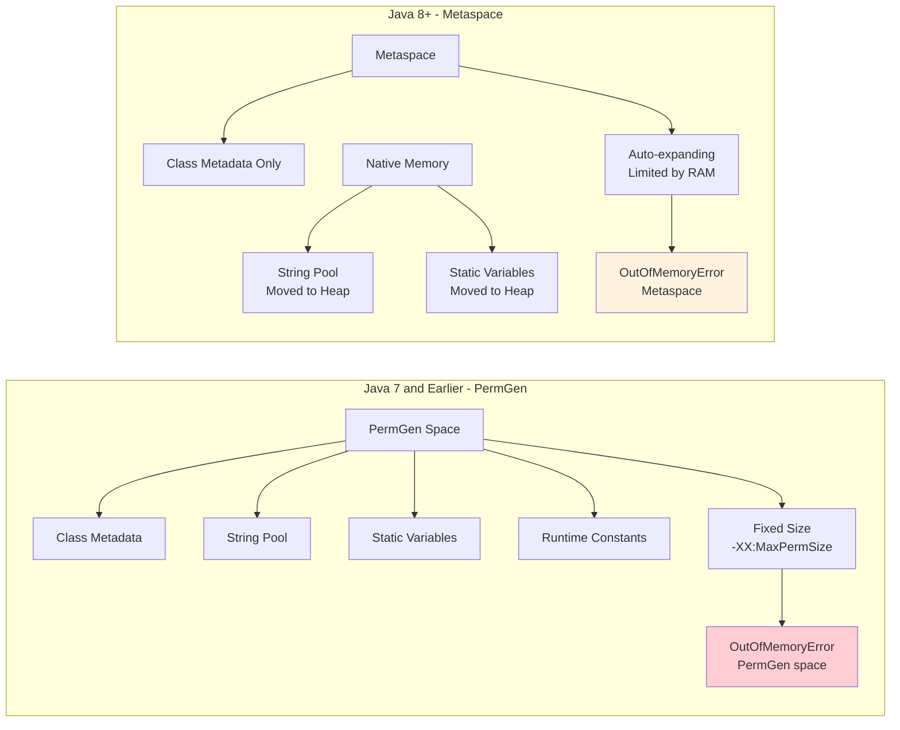
```mermaid
graph LR
    subgraph "Java 7 and Earlier - PermGen"
        A["PermGen Space"] --> B["Class Metadata"]
        A --> C["String Pool"]
        A --> D["Static Variables"]
        A --> E["Runtime Constants"]
        A --> F["Fixed Size<br/>-XX:MaxPermSize"]
        F --> G["OutOfMemoryError<br/>PermGen space"]
    end
    
    subgraph "Java 8+ - Metaspace"
        H["Metaspace"] --> I["Class Metadata Only"]
        J["Native Memory"] --> K["String Pool<br/>Moved to Heap"]
        J --> L["Static Variables<br/>Moved to Heap"]
        H --> M["Auto-expanding<br/>Limited by RAM"]
        M --> N["OutOfMemoryError<br/>Metaspace"]
    end
    
    style G fill:#ffcdd2
    style N fill:#fff3e0
```

### 7.2 Metaspace Architecture Details

```
+-------------------------------------------+
| JVM Process Memory Layout                 |
| +---------------------+                   |
| | Heap Memory         |                   |
| | +---------+         |                   |
| | | Young   |         |                   |
| | | Gen     |         |                   |
| | +---------+         |                   |
| | | Old Gen |         |                   |
| | +---------+         |                   |
| | | String  |         |                   |
| | | Pool    |         |                   |
| | +---------+         |                   |
| +---------------------+                   |
|                                           |
| Native Memory (Outside Heap)             |
| +---------------------+                   |
| | Metaspace           |                   |
| | +---Class Loaders---+                   |
| | | Bootstrap CL      |                   |
| | | Extension CL      |                   |
| | | Application CL    |                   |
| | +---Class Metadata--+                   |
| | | Field info        |                   |
| | | Method info       |                   |
| | | Constant pool     |                   |
| | | Annotations       |                   |
| | +---JIT Compilation-+                   |
| | | Compiled methods  |                   |
| | +-------------------+                   |
| +---------------------+                   |
+-------------------------------------------+
```

## 8. Garbage Collector Types - Comprehensive Comparison

### 8.1 GC Algorithm Performance Matrix

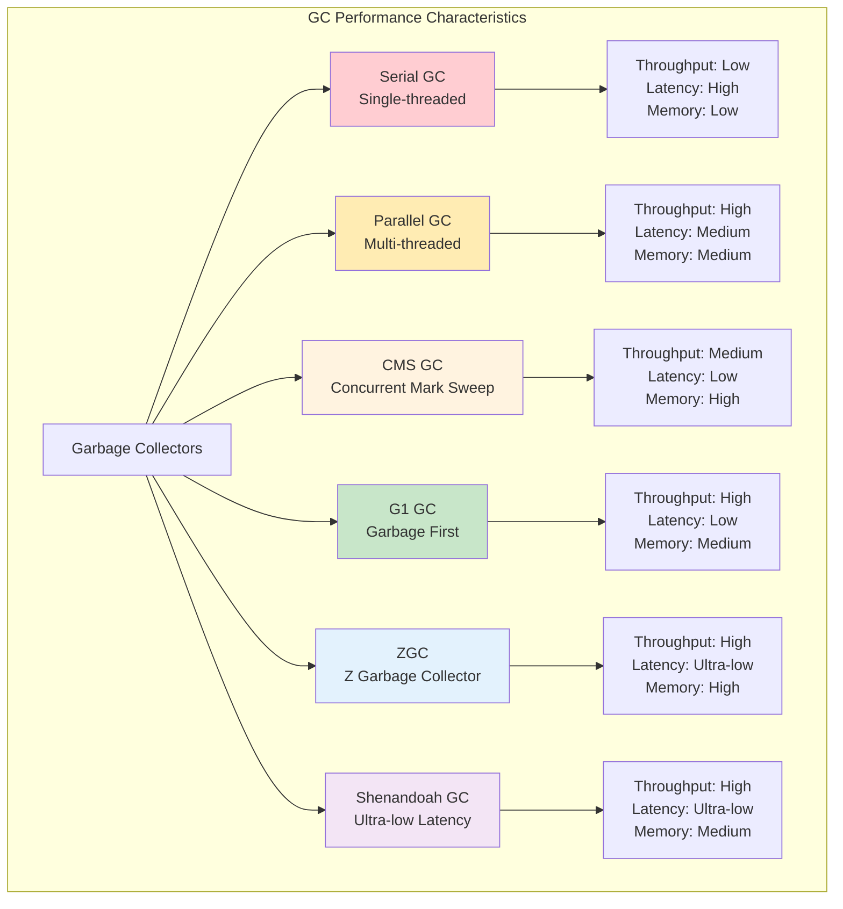
```mermaid
graph TB
    subgraph "GC Performance Characteristics"
        A["Garbage Collectors"] --> B["Serial GC<br/>Single-threaded"]
        A --> C["Parallel GC<br/>Multi-threaded"]
        A --> D["CMS GC<br/>Concurrent Mark Sweep"]
        A --> E["G1 GC<br/>Garbage First"]
        A --> F["ZGC<br/>Z Garbage Collector"]
        A --> G["Shenandoah GC<br/>Ultra-low Latency"]
        
        B --> H["Throughput: Low<br/>Latency: High<br/>Memory: Low"]
        C --> I["Throughput: High<br/>Latency: Medium<br/>Memory: Medium"]
        D --> J["Throughput: Medium<br/>Latency: Low<br/>Memory: High"]
        E --> K["Throughput: High<br/>Latency: Low<br/>Memory: Medium"]
        F --> L["Throughput: High<br/>Latency: Ultra-low<br/>Memory: High"]
        G --> M["Throughput: High<br/>Latency: Ultra-low<br/>Memory: Medium"]
    end
    
    style B fill:#ffcdd2
    style C fill:#ffecb3
    style D fill:#fff3e0
    style E fill:#c8e6c9
    style F fill:#e3f2fd
    style G fill:#f3e5f5
```

### 8.2 GC Selection Decision Tree

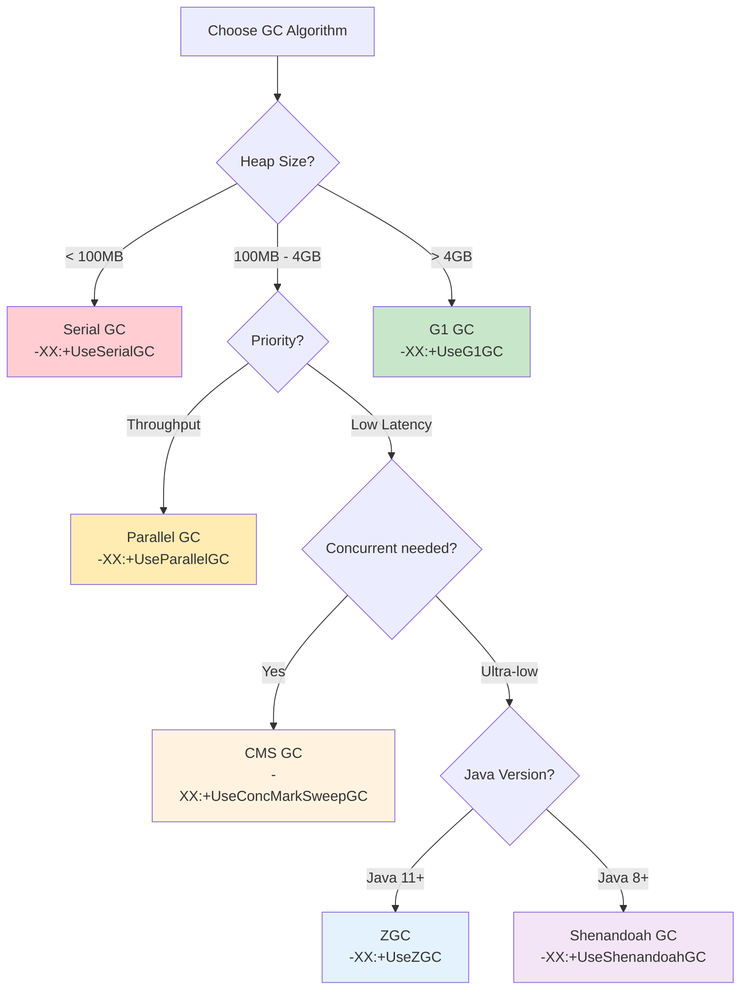
```mermaid
flowchart TD
    A["Choose GC Algorithm"] --> B{Heap Size?}
    B -->|< 100MB| C["Serial GC<br/>-XX:+UseSerialGC"]
    B -->|100MB - 4GB| D{Priority?}
    B -->|> 4GB| E["G1 GC<br/>-XX:+UseG1GC"]
    
    D -->|Throughput| F["Parallel GC<br/>-XX:+UseParallelGC"]
    D -->|Low Latency| G{Concurrent needed?}
    
    G -->|Yes| H["CMS GC<br/>-XX:+UseConcMarkSweepGC"]
    G -->|Ultra-low| I{Java Version?}
    
    I -->|Java 11+| J["ZGC<br/>-XX:+UseZGC"]
    I -->|Java 8+| K["Shenandoah GC<br/>-XX:+UseShenandoahGC"]
    
    style C fill:#ffcdd2
    style F fill:#ffecb3
    style H fill:#fff3e0
    style E fill:#c8e6c9
    style J fill:#e3f2fd
    style K fill:#f3e5f5
```

## 9. Memory Allocation Practical Example - Original Enhanced

```java
public class EnhancedMemoryExample {
    // Metaspace - Class-level static data
    private static final String COMPANY = "TechCorp";
    private static int instanceCount = 0;
    
    // Instance variables - stored in heap with object
    private int id;
    private String name;
    
    public static void main(String[] args) {
        // Stack Frame: main()
        // Stack variables
        int localNumber = 42;                    // Stack: primitive
        String localString = "Hello World";     // Stack: reference → String Pool
        
        // Heap allocation
        EnhancedMemoryExample obj1 = new EnhancedMemoryExample("Object1");  // Stack: reference → Heap
        EnhancedMemoryExample obj2 = new EnhancedMemoryExample("Object2");  // Stack: reference → Heap
        
        // Array allocation - reference in stack, array object in heap
        int[] numbers = {1, 2, 3, 4, 5};        // Stack: reference → Heap array
        
        // Collection allocation
        List<String> list = new ArrayList<>();  // Stack: reference → Heap ArrayList
        list.add("Item1");                      // Heap: String objects
        list.add("Item2");
        
        // Weak reference example
        WeakReference<EnhancedMemoryExample> weakRef = 
            new WeakReference<>(new EnhancedMemoryExample("WeakObject"));
            
        // Soft reference example  
        SoftReference<byte[]> softRef = 
            new SoftReference<>(new byte[1024 * 1024]); // 1MB byte array
            
        // Method call - creates new stack frame
        obj1.processData(numbers);
        
        // Force garbage collection for demonstration
        System.gc();
        
        // Check if weak reference object was collected
        if (weakRef.get() == null) {
            System.out.println("Weak reference object was garbage collected");
        }
    }
    
    public EnhancedMemoryExample(String name) {
        this.id = ++instanceCount;  // Metaspace static variable access
        this.name = name;           // Heap instance variable
    }
    
    public void processData(int[] data) {
        // New stack frame created
        // Stack variables
        int sum = 0;
        int count = data.length;
        
        // Local calculation
        for (int value : data) {    // Enhanced for-loop creates iterator (heap)
            sum += value;
        }
        
        // Create temporary object
        String result = "Sum: " + sum + ", Count: " + count;  // String concatenation → new String objects
        System.out.println(result);
        
        // Stack frame destroyed when method returns
    }
}
```

### 9.1 Enhanced Memory Layout Visualization

```
Final Memory State After Execution:

Stack Memory (Thread-specific):
+--------------------------------+
| main() Frame                   |
| ├─ localNumber = 42           |
| ├─ localString → String Pool  |
| ├─ obj1 → Heap@Object1        |
| ├─ obj2 → Heap@Object2        |
| ├─ numbers → Heap@IntArray    |
| ├─ list → Heap@ArrayList      |
| ├─ weakRef → Heap@WeakRef     |
| └─ softRef → Heap@SoftRef     |
+--------------------------------+

Heap Memory:
+--------------------------------+
| Young Generation (Eden)        |
| ├─ EnhancedMemoryExample@Obj1  |
| │  ├─ id = 1                  |
| │  └─ name → "Object1"        |
| ├─ EnhancedMemoryExample@Obj2  |
| │  ├─ id = 2                  |
| │  └─ name → "Object2"        |
| ├─ int[] {1,2,3,4,5}          |
| ├─ ArrayList object           |
| ├─ WeakReference object       |
| ├─ SoftReference object       |
| └─ byte[1MB] array            |
+--------------------------------+

String Pool (Part of Heap):
+--------------------------------+
| "Hello World"                  |
| "Object1"                      |
| "Object2"                      |
| "Item1"                        |
| "Item2"                        |
| "Sum: 15, Count: 5"           |
+--------------------------------+

Metaspace (Native Memory):
+--------------------------------+
| Class: EnhancedMemoryExample   |
| ├─ COMPANY = "TechCorp"       |
| ├─ instanceCount = 2          |
| ├─ Method bytecode            |
| └─ Class metadata             |
| Class: ArrayList               |
| Class: WeakReference           |
| Class: SoftReference           |
| ... (other system classes)    |
+--------------------------------+
```

## 10. Advanced Memory Optimization Techniques

### 10.1 Memory Profiling and Monitoring

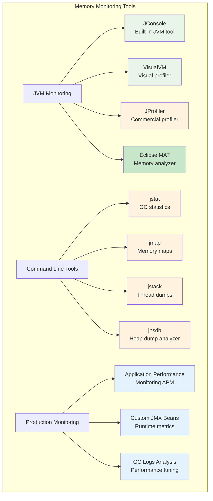
```mermaid
graph TB
    subgraph "Memory Monitoring Tools"
        A["JVM Monitoring"] --> B["JConsole<br/>Built-in JVM tool"]
        A --> C["VisualVM<br/>Visual profiler"]
        A --> D["JProfiler<br/>Commercial profiler"]
        A --> E["Eclipse MAT<br/>Memory analyzer"]
        
        F["Command Line Tools"] --> G["jstat<br/>GC statistics"]
        F --> H["jmap<br/>Memory maps"]
        F --> I["jstack<br/>Thread dumps"]
        F --> J["jhsdb<br/>Heap dump analyzer"]
        
        K["Production Monitoring"] --> L["Application Performance<br/>Monitoring APM"]
        K --> M["Custom JMX Beans<br/>Runtime metrics"]
        K --> N["GC Logs Analysis<br/>Performance tuning"]
    end
    
    style B fill:#e8f5e8
    style C fill:#e8f5e8
    style D fill:#fff3e0
    style E fill:#c8e6c9
    style G fill:#fff3e0
    style H fill:#fff3e0
    style I fill:#fff3e0
    style J fill:#fff3e0
    style L fill:#e3f2fd
    style M fill:#e3f2fd
    style N fill:#e3f2fd
```

### 10.2 Memory Leak Detection Strategies

```java
public class MemoryLeakDetectionExample {
    
    // 1. Using WeakHashMap to prevent memory leaks
    private Map<String, Object> cache = new WeakHashMap<>();
    
    // 2. Proper listener management
    private List<PropertyChangeListener> listeners = new CopyOnWriteArrayList<>();
    
    public void addListener(PropertyChangeListener listener) {
        listeners.add(listener);
    }
    
    public void removeListener(PropertyChangeListener listener) {
        listeners.remove(listener);  // CRITICAL: Always provide removal method
    }
    
    // 3. Using try-with-resources for automatic cleanup
    public void processLargeFile(String fileName) throws IOException {
        try (BufferedReader reader = Files.newBufferedReader(Paths.get(fileName));
             BufferedWriter writer = Files.newBufferedWriter(Paths.get(fileName + ".processed"))) {
            
            String line;
            while ((line = reader.readLine()) != null) {
                writer.write(processLine(line));
                writer.newLine();
            }
            // Resources automatically closed
        }
    }
    
    // 4. Static collection cleanup
    private static final Map<String, Object> staticCache = new ConcurrentHashMap<>();
    
    public static void clearStaticCache() {
        staticCache.clear();  // Provide cleanup method for static collections
    }
    
    // 5. Inner class best practices
    public class OuterClass {
        private String data = "Important data";
        
        // Static inner class doesn't hold reference to outer class
        public static class StaticInnerClass {
            public void doWork() {
                // No implicit reference to OuterClass
            }
        }
        
        // Non-static inner class holds implicit reference
        public class InnerClass {
            public void doWork() {
                // Can access 'data' - holds reference to OuterClass
                System.out.println(data);
            }
        }
    }
    
    private String processLine(String line) {
        return line.toUpperCase().trim();
    }
}
```

## 11. Key Takeaways and Best Practices

### 11.1 Memory Management Principles

1. **Stack Memory Characteristics:**
   - Thread-specific and fast
   - Automatic scope-based cleanup
   - Stores method parameters, local variables, and return addresses
   - Limited in size (configurable with -Xss)

2. **Heap Memory Management:**
   - Shared among all threads
   - Managed by Garbage Collector
   - Generational design optimizes for object lifespan patterns
   - Divided into Young Generation (Eden + Survivors) and Old Generation

3. **Garbage Collection Optimization:**
   - Choose appropriate GC algorithm based on application requirements
   - Monitor GC performance and tune parameters
   - Understand the trade-offs between throughput and latency

4. **Memory Leak Prevention:**
   - Always provide cleanup methods for listeners and callbacks
   - Use weak references for caches and temporary associations
   - Be cautious with static collections and long-lived objects
   - Prefer static inner classes when outer class reference is not needed

5. **Performance Best Practices:**
   - Pre-size collections when possible to avoid resizing overhead
   - Use primitive collections when appropriate to avoid boxing
   - Implement object pooling for expensive-to-create objects
   - Monitor memory usage in production environments

Understanding Java memory management is crucial for writing efficient applications and troubleshooting memory-related issues like leaks or excessive GC overhead. The visual representations and step-by-step execution examples provide a comprehensive foundation for mastering these concepts.