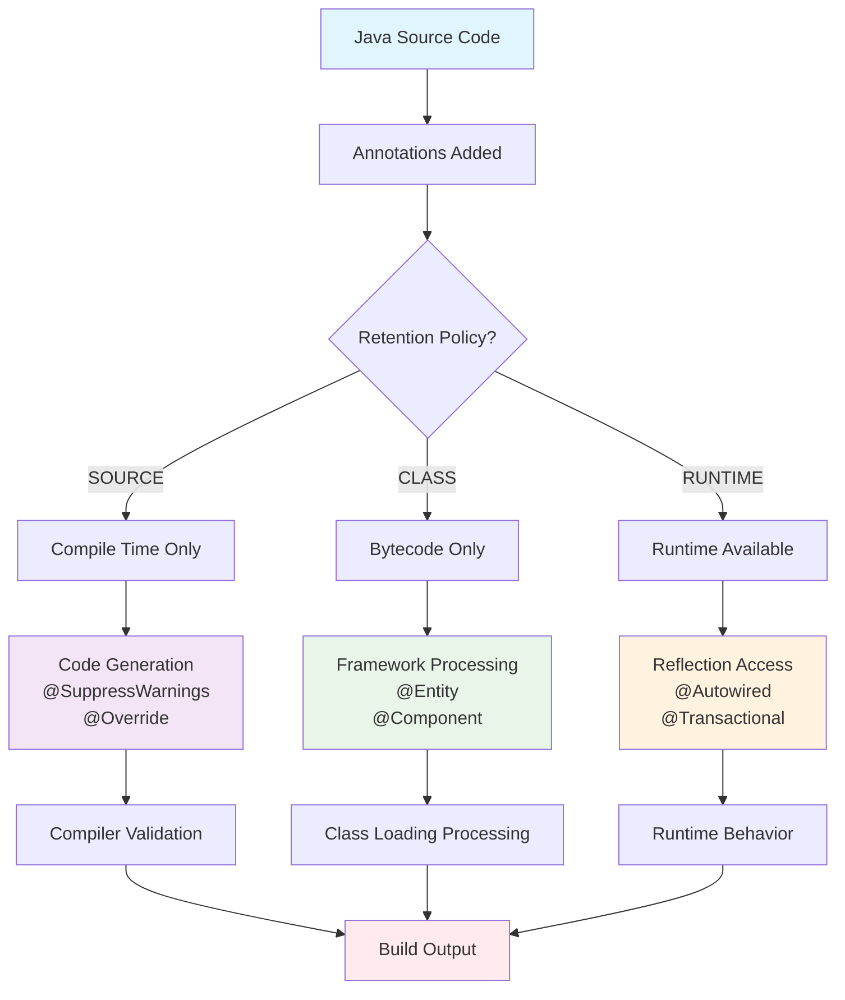
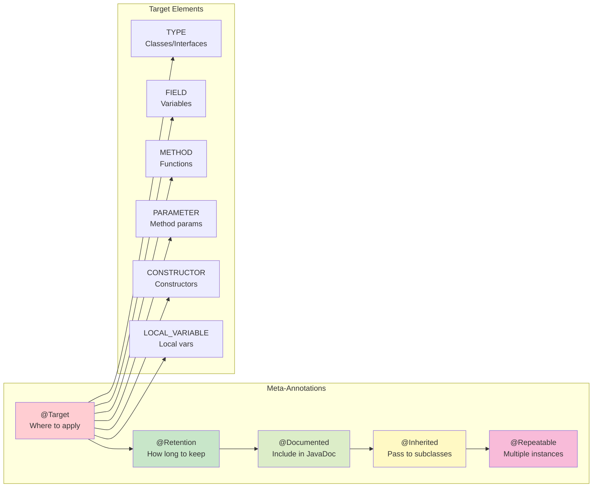
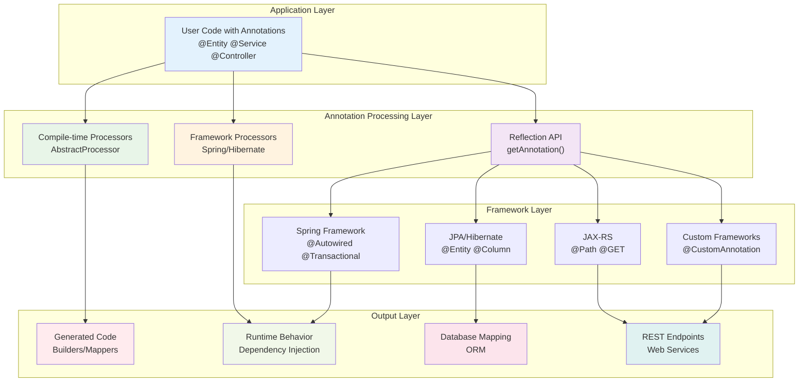
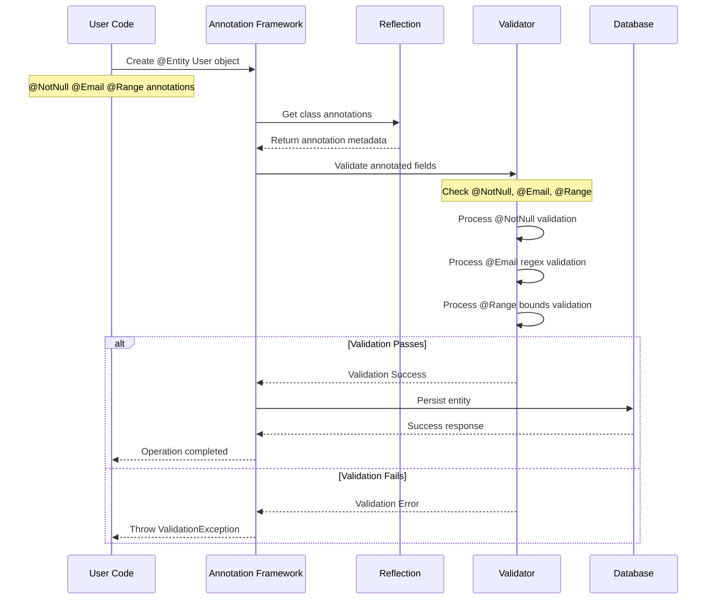
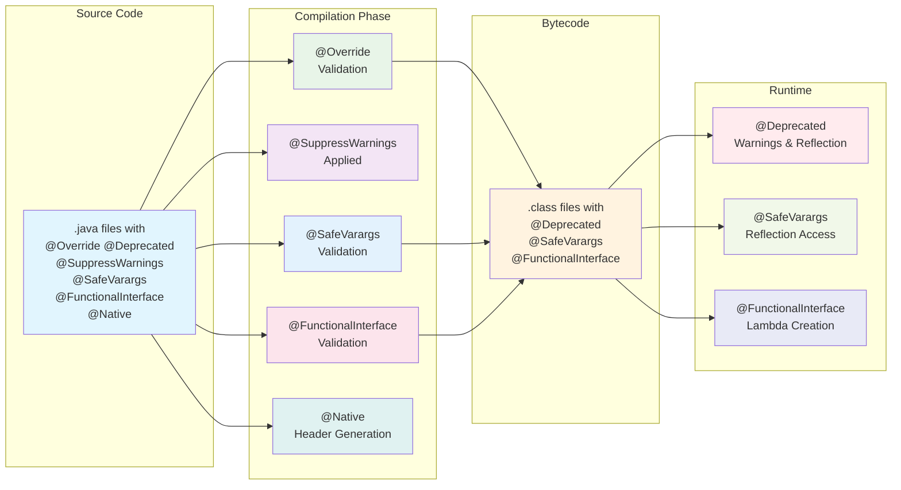
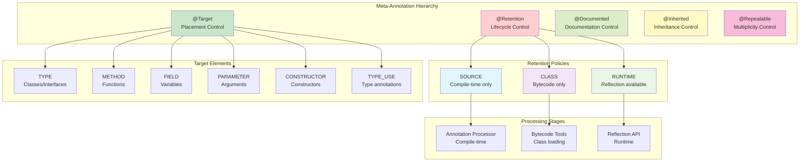
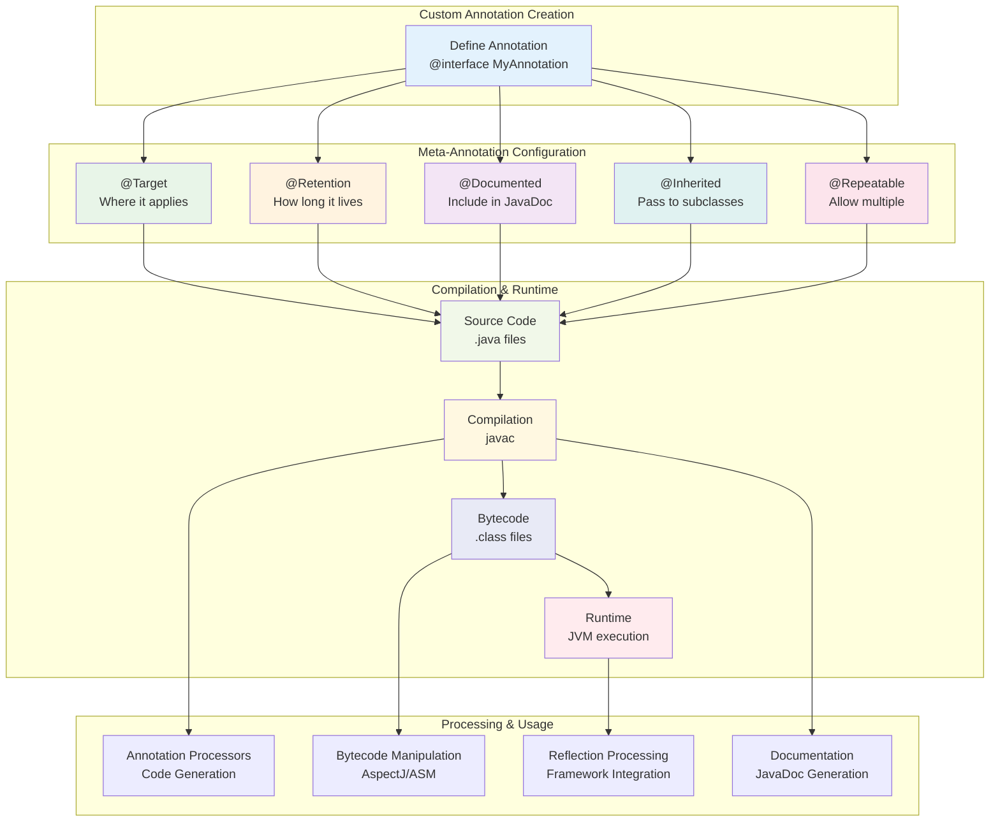
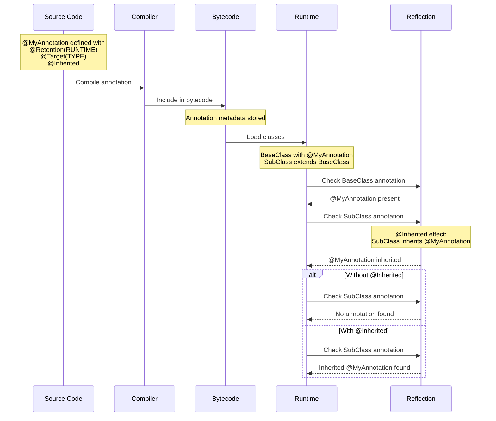

# **Java Annotations - Comprehensive Guide with Visual Illustrations**

## **Table of Contents**
1. [Visual Diagrams for Better Understanding](#visual-diagrams-for-better-understanding)
2. [Introduction to Annotations](#1-introduction-to-annotations)
3. [Anatomy of Annotations](#2-anatomy-of-annotations)
4. [Built-in Annotations](#3-built-in-annotations)
5. [Meta-Annotations](#4-meta-annotations)
6. [Custom Annotations](#5-custom-annotations)
7. [Annotation Processing](#6-annotation-processing)
8. [Runtime vs Compile-time Processing](#7-runtime-vs-compile-time-processing)
9. [Advanced Annotation Concepts](#8-advanced-annotation-concepts)
10. [Framework Integration](#9-framework-integration)
11. [Best Practices and Design Patterns](#10-best-practices-and-design-patterns)
12. [Performance Considerations](#11-performance-considerations)
13. [Real-world Examples](#12-real-world-examples)

---

## **Visual Diagrams for Better Understanding**

### **📊 Annotation Processing Lifecycle**
The following diagram shows how annotations flow through different stages from source code to runtime:



### **🎯 Meta-Annotations and Target Elements**
This diagram illustrates how meta-annotations control annotation behavior and where they can be applied:



### **🏗️ Enterprise Framework Architecture**
Shows how annotations are processed across different layers in enterprise applications:



### **✅ Validation Processing Flow**
This sequence diagram shows how annotation-based validation works in practice:



---

## **1. Introduction to Annotations**

### **What are Annotations?**
Annotations are a form of **metadata** that provide data about a program without affecting the program's behavior directly. They are a powerful feature introduced in Java 5 that allows developers to:

- Add metadata to code elements
- Enable compile-time checking
- Support runtime processing
- Reduce boilerplate code
- Enable framework integration

```java
// Simple annotation usage
@Override
public String toString() {
    return "Example";
}
```

### **Annotation Lifecycle**
```
┌─────────────────┐    ┌──────────────────┐    ┌─────────────────┐
│   Source Code   │───▶│   Compilation    │───▶│    Runtime      │
│   (.java)       │    │   (.class)       │    │   (JVM)         │
└─────────────────┘    └──────────────────┘    └─────────────────┘
         │                       │                       │
         ▼                       ▼                       ▼
  @SOURCE/@CLASS          @CLASS/@RUNTIME          @RUNTIME
  annotations             annotations             annotations
```

### **Key Characteristics**
✅ **Non-intrusive**: Don't change program logic  
✅ **Declarative**: Describe what, not how  
✅ **Processable**: Can be read at compile-time or runtime  
✅ **Flexible**: Can be applied to various code elements  

---

## **2. Anatomy of Annotations**

### **Annotation Structure**
```java
@Target(ElementType.METHOD)           // Where it can be applied
@Retention(RetentionPolicy.RUNTIME)   // How long it's retained
@Documented                           // Include in JavaDoc
@Inherited                            // Inherited by subclasses
public @interface MyAnnotation {
    String value() default "default";  // Element with default value
    int priority() default 1;          // Another element
    Class<?>[] types() default {};     // Array element
}
```

### **Annotation Elements**
```
┌─────────────────────────────────────┐
│           Annotation                │
│  ┌─────────────────────────────────┐│
│  │         Elements                ││
│  │  ┌─────────────────────────────┐││
│  │  │    • Primitives             │││
│  │  │    • String                 │││
│  │  │    • Class                  │││
│  │  │    • Enum                   │││
│  │  │    • Other Annotations      │││
│  │  │    • Arrays of above        │││
│  │  └─────────────────────────────┘││
│  └─────────────────────────────────┘│
└─────────────────────────────────────┘
```

### **Usage Patterns**
```java
// Marker annotation (no elements)
@Entity
public class User { }

// Single-value annotation
@RequestMapping("/api/users")
public class UserController { }

// Multi-value annotation
@Column(name = "user_name", nullable = false, length = 50)
private String userName;

// Array values
@RequestMapping(value = {"/users", "/people"}, method = RequestMethod.GET)
public List<User> getUsers() { }
```

---

## **3. Built-in Annotations**

### **Core Java Annotations**

#### **@Override**
The `@Override` annotation ensures that a method is properly overriding a superclass method.

```java
public class Animal {
    public void makeSound() {
        System.out.println("Animal sound");
    }
    
    protected void sleep() {
        System.out.println("Animal sleeping");
    }
}

public class Dog extends Animal {
    @Override  // Ensures method overrides parent method
    public void makeSound() {
        System.out.println("Woof!");
    }
    
    @Override  // Also works with protected methods
    protected void sleep() {
        System.out.println("Dog sleeping");
    }
    
    // @Override  // Compile error - typo in method name
    // public void makeSond() { }
    
    // @Override  // Compile error - wrong signature
    // public void makeSound(String sound) { }
}

// Interface implementation
interface Flyable {
    void fly();
    default void glide() {
        System.out.println("Gliding...");
    }
}

public class Bird implements Flyable {
    @Override  // Required for interface methods
    public void fly() {
        System.out.println("Bird flying");
    }
    
    @Override  // Optional for default methods
    public void glide() {
        System.out.println("Bird gliding gracefully");
    }
}
```

**🎯 Benefits:**
- **Compile-time verification** - Catches typos and signature mismatches
- **Refactoring safety** - IDE warns when parent method signature changes
- **Code documentation** - Makes inheritance relationships explicit
- **Maintenance ease** - Helps identify breaking changes in parent classes

**⚠️ Common Pitfalls:**
```java
public class CommonMistakes extends Animal {
    // ❌ Wrong - missing @Override annotation
    public void makeSound() {  // Silent failure if parent method changes
        System.out.println("Sound");
    }
    
    // ❌ Wrong - @Override on non-overriding method
    // @Override
    // public void newMethod() { }  // Compile error
    
    // ❌ Wrong - case sensitivity matters
    // @Override  
    // public void makesound() { }  // Compile error - wrong case
}
```

#### **@Deprecated**
Marks code elements as deprecated, indicating they should not be used.

```java
public class Calculator {
    // Basic deprecation
    @Deprecated
    public int oldAdd(int a, int b) {
        return a + b;
    }
    
    // Advanced deprecation (Java 9+)
    @Deprecated(since = "2.0", forRemoval = true)
    public int legacyMultiply(int a, int b) {
        return a * b;
    }
    
    // Deprecation with alternative
    /**
     * @deprecated Use {@link #preciseAdd(BigDecimal, BigDecimal)} instead
     */
    @Deprecated
    public double impreciseAdd(double a, double b) {
        return a + b;
    }
    
    public BigDecimal preciseAdd(BigDecimal a, BigDecimal b) {
        return a.add(b);
    }
    
    // Class-level deprecation
    @Deprecated(since = "3.0")
    public static class OldUtility {
        public static void doSomething() {
            // Old implementation
        }
    }
}

// Enum deprecation
public enum Status {
    ACTIVE,
    @Deprecated(since = "1.5", forRemoval = true)
    INACTIVE,  // Use DISABLED instead
    DISABLED,
    PENDING
}

// Field deprecation
public class Configuration {
    @Deprecated(since = "2.1")
    public static final String OLD_CONFIG_FILE = "old.properties";
    
    public static final String CONFIG_FILE = "application.properties";
}
```

**📈 Migration Strategy:**
```
Phase 1: Mark as @Deprecated          ──▶  Phase 2: Add forRemoval=true
   │                                            │
   ▼                                            ▼
• Add @Deprecated annotation                • Update @Deprecated annotation  
• Provide JavaDoc alternatives             • Log warnings in implementation
• Keep functionality intact                • Create migration guides
   │                                            │
   ▼                                            ▼
Phase 3: Remove deprecated code         ──▶  Phase 4: Clean up references
   │                                            │
   ▼                                            ▼
• Remove deprecated methods               • Update documentation
• Update major version                   • Remove migration guides
• Test thoroughly                        • Celebrate! 🎉
```

**🔍 Advanced Usage:**
```java
public class AdvancedDeprecation {
    // Conditional deprecation
    @Deprecated(since = "2.0")
    public void processLegacyFormat() {
        if (isLegacyModeEnabled()) {
            // Still supported in legacy mode
            processInternal();
        } else {
            throw new UnsupportedOperationException(
                "Legacy format no longer supported. Use processNewFormat()");
        }
    }
    
    // Deprecation with automatic migration
    @Deprecated(since = "1.5")
    public void oldMethod(String input) {
        System.out.println("WARNING: oldMethod is deprecated. Use newMethod instead.");
        newMethod(input);  // Delegate to new implementation
    }
    
    public void newMethod(String input) {
        // New implementation
        System.out.println("Processing: " + input);
    }
}
```

#### **@SuppressWarnings**
Suppresses specific compiler warnings for cleaner code.

```java
public class WarningExample {
    // Suppress unchecked cast warnings
    @SuppressWarnings("unchecked")
    public List<String> getNames() {
        List rawList = getRawList();
        return (List<String>) rawList;  // Unchecked cast
    }
    
    // Suppress multiple warning types
    @SuppressWarnings({"unused", "deprecation"})
    private void helperMethod() {
        Date date = new Date();  // Deprecated constructor
        String unusedVariable = "might not be used";  // Unused variable
    }
    
    // Suppress serial version UID warnings
    @SuppressWarnings("serial")
    public class CustomException extends Exception {
        // No serialVersionUID defined
        private String customMessage;
        
        public CustomException(String message) {
            super(message);
            this.customMessage = message;
        }
    }
    
    // Suppress resource leak warnings
    @SuppressWarnings("resource")
    public void readFileUnsafely() throws IOException {
        FileInputStream fis = new FileInputStream("file.txt");
        // Not closing stream (bad practice, but sometimes necessary)
        int data = fis.read();
    }
    
    // Method-level suppression
    @SuppressWarnings({"rawtypes", "unchecked"})
    public void workWithRawTypes() {
        Map map = new HashMap();  // Raw type
        map.put("key", "value");  // Unchecked operation
        
        List list = new ArrayList();  // Raw type
        list.add("item");  // Unchecked operation
    }
}
```

**📋 Common Warning Types:**
```java
public class AllWarningTypes {
    @SuppressWarnings("unchecked")     // Unchecked generic operations
    @SuppressWarnings("rawtypes")      // Raw type usage
    @SuppressWarnings("unused")        // Unused variables/methods
    @SuppressWarnings("deprecation")   // Deprecated API usage
    @SuppressWarnings("serial")        // Missing serialVersionUID
    @SuppressWarnings("resource")      // Resource leak warnings
    @SuppressWarnings("null")          // Null pointer warnings
    @SuppressWarnings("fallthrough")   // Switch fallthrough
    @SuppressWarnings("finally")       // finally block issues
    @SuppressWarnings("cast")          // Unnecessary casts
    @SuppressWarnings("static-access") // Static access issues
    @SuppressWarnings("synthetic-access") // Synthetic accessor methods
    @SuppressWarnings("all")           // All warnings (use sparingly!)
    public void demonstrateWarningTypes() {
        // Implementation details...
    }
}
```

**⚠️ Best Practices:**
```java
public class SuppressWarningsBestPractices {
    // ✅ Good - Specific and localized
    @SuppressWarnings("unchecked")
    private List<String> castToStringList(List<?> list) {
        return (List<String>) list;
    }
    
    // ❌ Bad - Too broad
    @SuppressWarnings("all")
    public void doComplexStuff() {
        // This suppresses ALL warnings - dangerous!
    }
    
    // ✅ Good - With explanatory comment
    @SuppressWarnings("deprecation")  // Legacy API required for compatibility
    public void integrateWithLegacySystem() {
        LegacyAPI.process();  // Must use deprecated API
    }
    
    // ✅ Good - Multiple specific warnings
    @SuppressWarnings({"unchecked", "rawtypes"})
    public void workWithLegacyCode() {
        // Dealing with old code that can't be changed
    }
}
```

#### **@SafeVarargs**
Suppresses heap pollution warnings for generic varargs methods.

```java
public class VarargsExample {
    // ✅ Safe usage - no heap pollution
    @SafeVarargs
    public static <T> List<T> asList(T... elements) {
        List<T> list = new ArrayList<>();
        for (T element : elements) {
            list.add(element);
        }
        return list;
    }
    
    // ✅ Safe usage - immutable operations
    @SafeVarargs
    public static <T> Set<T> asSet(T... elements) {
        return Collections.unmodifiableSet(
            new HashSet<>(Arrays.asList(elements))
        );
    }
    
    // ✅ Safe usage - no modification of varargs array
    @SafeVarargs
    public final <T> void printAll(T... items) {
        for (T item : items) {
            System.out.println(item);
        }
    }
    
    // ❌ Unsafe - don't use @SafeVarargs here
    // @SafeVarargs  // This would be wrong!
    public static <T> T[] toArray(T... elements) {
        return elements;  // Returns the varargs array directly - unsafe!
    }
    
    // Complex example with explanation
    @SafeVarargs
    public static <T> Collector<T, ?, List<T>> toListCollector(T... additionalElements) {
        return Collector.of(
            ArrayList::new,
            List::add,
            (list1, list2) -> { list1.addAll(list2); return list1; },
            list -> {
                // Add additional elements safely
                Collections.addAll(list, additionalElements);
                return list;
            }
        );
    }
}

// Real-world example
public class DatabaseQuery {
    @SafeVarargs
    public final <T> List<T> findByIds(Class<T> entityClass, Long... ids) {
        String query = "SELECT e FROM " + entityClass.getSimpleName() + 
                      " e WHERE e.id IN :ids";
        
        return entityManager.createQuery(query, entityClass)
                           .setParameter("ids", Arrays.asList(ids))
                           .getResultList();
    }
    
    @SafeVarargs
    public static <T> Predicate<T> anyOf(Predicate<T>... predicates) {
        return item -> Arrays.stream(predicates)
                            .anyMatch(predicate -> predicate.test(item));
    }
}
```

**⚠️ When NOT to use @SafeVarargs:**
```java
public class UnsafeVarargsExamples {
    // ❌ DON'T use @SafeVarargs - heap pollution possible
    public static <T> T[] unsafe(T... elements) {
        return elements;  // Exposes internal array
    }
    
    // ❌ DON'T use @SafeVarargs - modifies varargs array
    public static <T> void modifyVarargs(T... elements) {
        if (elements.length > 0) {
            elements[0] = null;  // Modifies caller's data!
        }
    }
    
    // ❌ DON'T use @SafeVarargs - passes array to unsafe method
    public static <T> T[] chainUnsafe(T... elements) {
        return unsafe(elements);  // Chains to unsafe method
    }
}
```

#### **@FunctionalInterface**
Marks interfaces as functional interfaces for lambda expressions.

```java
// Basic functional interface
@FunctionalInterface
public interface Calculator {
    int calculate(int a, int b);
    
    // default and static methods are allowed
    default void print(int result) {
        System.out.println("Result: " + result);
    }
    
    static Calculator add() {
        return (a, b) -> a + b;
    }
    
    static Calculator multiply() {
        return (a, b) -> a * b;
    }
}

// Generic functional interface
@FunctionalInterface
public interface Transformer<T, R> {
    R transform(T input);
    
    // Chaining transformers
    default <V> Transformer<T, V> andThen(Transformer<? super R, ? extends V> after) {
        return (T t) -> after.transform(transform(t));
    }
    
    // Static factory methods
    static <T> Transformer<T, T> identity() {
        return t -> t;
    }
    
    static <T, R> Transformer<T, R> constant(R value) {
        return t -> value;
    }
}

// Exception-throwing functional interface
@FunctionalInterface
public interface ThrowingFunction<T, R, E extends Exception> {
    R apply(T input) throws E;
    
    // Convert to regular Function
    default Function<T, R> unchecked() {
        return input -> {
            try {
                return apply(input);
            } catch (Exception e) {
                throw new RuntimeException(e);
            }
        };
    }
}

// Complex functional interface example
@FunctionalInterface
public interface ValidationRule<T> {
    boolean validate(T object);
    
    // Combining validation rules
    default ValidationRule<T> and(ValidationRule<T> other) {
        return obj -> this.validate(obj) && other.validate(obj);
    }
    
    default ValidationRule<T> or(ValidationRule<T> other) {
        return obj -> this.validate(obj) || other.validate(obj);
    }
    
    default ValidationRule<T> negate() {
        return obj -> !this.validate(obj);
    }
    
    // Static factory methods
    static <T> ValidationRule<T> alwaysTrue() {
        return obj -> true;
    }
    
    static <T> ValidationRule<T> alwaysFalse() {
        return obj -> false;
    }
    
    static <T> ValidationRule<T> notNull() {
        return Objects::nonNull;
    }
}
```

**🎯 Advanced Usage Examples:**
```java
public class FunctionalInterfaceUsage {
    public static void main(String[] args) {
        // Using Calculator
        Calculator add = (a, b) -> a + b;
        Calculator multiply = Calculator.multiply();
        
        System.out.println(add.calculate(5, 3));      // 8
        System.out.println(multiply.calculate(5, 3)); // 15
        
        // Using Transformer
        Transformer<String, Integer> stringLength = String::length;
        Transformer<Integer, String> intToString = Object::toString;
        
        Transformer<String, String> lengthToString = stringLength.andThen(intToString);
        System.out.println(lengthToString.transform("Hello")); // "5"
        
        // Using ValidationRule
        ValidationRule<String> notEmpty = s -> s != null && !s.isEmpty();
        ValidationRule<String> hasValidLength = s -> s.length() >= 3 && s.length() <= 50;
        ValidationRule<String> validName = ValidationRule.<String>notNull()
                                                        .and(notEmpty)
                                                        .and(hasValidLength);
        
        System.out.println(validName.validate("John"));    // true
        System.out.println(validName.validate("Jo"));      // false
        System.out.println(validName.validate(null));      // false
    }
}
```

#### **@Native**
Indicates that a field is referenced from native code.

```java
public class NativeExample {
    // Fields referenced by native code
    @Native public static final int MAX_PRIORITY = 10;
    @Native public static final int MIN_PRIORITY = 1;
    @Native public static final int NORM_PRIORITY = 5;
    
    // Native method declarations
    public native void nativeMethod();
    public native String getNativeString();
    public native int[] processNativeArray(int[] input);
    
    // Static block to load native library
    static {
        System.loadLibrary("nativelib");
    }
}
```

#### **@Generated**
Marks code as generated by tools (not part of core Java, but commonly used).

```java
import javax.annotation.Generated;

@Generated(
    value = "com.example.codegen.PojoGenerator",
    date = "2023-06-22T10:15:30.00Z",
    comments = "Generated from schema.xsd"
)
public class User {
    private String name;
    private String email;
    
    @Generated("com.example.codegen.PojoGenerator")
    public String getName() {
        return name;
    }
    
    @Generated("com.example.codegen.PojoGenerator")
    public void setName(String name) {
        this.name = name;
    }
    
    // More generated methods...
}
```

### **📊 Built-in Annotations Comparison Table**

| Annotation | Target | Retention | Purpose | When to Use |
|------------|--------|-----------|---------|-------------|
| `@Override` | METHOD | SOURCE | Method overriding verification | Always when overriding |
| `@Deprecated` | TYPE, FIELD, METHOD, etc. | RUNTIME | Mark obsolete code | When phasing out APIs |
| `@SuppressWarnings` | TYPE, FIELD, METHOD, etc. | SOURCE | Suppress compiler warnings | When warnings are unavoidable |
| `@SafeVarargs` | METHOD, CONSTRUCTOR | RUNTIME | Suppress varargs warnings | For safe generic varargs |
| `@FunctionalInterface` | TYPE | RUNTIME | Mark functional interfaces | For lambda-compatible interfaces |
| `@Native` | FIELD | SOURCE | Mark native-referenced fields | JNI integration |

### **📊 Built-in Annotations Visual Overview**

The following diagram shows the relationship between built-in annotations and their processing:

```mermaid
graph TB
    subgraph "Built-in Annotations Overview"
        A["@Override<br/>Method Overriding"]
        B["@Deprecated<br/>Obsolete Code"]
        C["@SuppressWarnings<br/>Warning Suppression"]
        D["@SafeVarargs<br/>Safe Generic Varargs"]
        E["@FunctionalInterface<br/>Lambda Compatibility"]
        F["@Native<br/>JNI Integration"]
    end
    
    subgraph "Compile-time Processing"
        G["Compiler Validation"]
        H["Warning Management"]
        I["Code Generation"]
    end
    
    subgraph "Runtime Processing"
        J["Framework Integration"]
        K["Documentation"]
        L["Reflection Access"]
    end
    
    subgraph "Common Use Cases"
        M["Method Safety<br/>@Override"]
        N["API Evolution<br/>@Deprecated"]
        O["Clean Builds<br/>@SuppressWarnings"]
        P["Generic Safety<br/>@SafeVarargs"]
        Q["Lambda Support<br/>@FunctionalInterface"]
        R["Native Binding<br/>@Native"]
    end
    
    A --> G
    A --> M
    B --> K
    B --> N
    C --> H
    C --> O
    D --> G
    D --> P
    E --> L
    E --> Q
    F --> I
    F --> R
    
    style A fill:#e8f5e8
    style B fill:#fff3e0
    style C fill:#f3e5f5
    style D fill:#e3f2fd
    style E fill:#fce4ec
    style F fill:#e0f2f1
```



### **🔄 Annotation Processing Lifecycle**

This diagram illustrates when each built-in annotation is processed during the development lifecycle:



### **🎯 Best Practices Summary**

1. **@Override**: Always use when overriding methods
2. **@Deprecated**: Include migration path in JavaDoc
3. **@SuppressWarnings**: Be specific, use minimally
4. **@SafeVarargs**: Only use when truly safe
5. **@FunctionalInterface**: Use for single abstract method interfaces
6. **@Native**: Use for JNI field constants

---

## **4. Meta-Annotations**

Meta-annotations are **annotations that annotate other annotations**. They control how annotations behave, where they can be applied, how long they persist, and how they're processed. Understanding meta-annotations is crucial for creating robust custom annotations.

### **📋 Complete Meta-Annotations Overview**

| Meta-Annotation | Purpose | Default Behavior | Impact |
|-----------------|---------|------------------|--------|
| `@Retention` | Controls annotation lifetime | `RetentionPolicy.CLASS` | When annotation is available |
| `@Target` | Defines where annotation can be applied | All locations | Compile-time validation |
| `@Documented` | Includes annotation in JavaDoc | Not documented | Documentation generation |
| `@Inherited` | Allows subclass inheritance | Not inherited | Runtime behavior |
| `@Repeatable` | Enables multiple instances | Not repeatable | Usage flexibility |

### **🎨 Meta-Annotations Visual Architecture**

The following diagram shows the comprehensive relationship between meta-annotations and their effects:



### **🔄 Meta-Annotation Processing Flow**

This diagram illustrates how meta-annotations influence the annotation lifecycle:



---

### **🕐 @Retention - Annotation Lifetime Management**

The `@Retention` meta-annotation determines how long annotations are retained during the compilation and execution process.

#### **RetentionPolicy Deep Dive**

```java
public enum RetentionPolicy {
    SOURCE,   // Discarded by compiler - useful for compile-time tools
    CLASS,    // Recorded in class file, not available at runtime - bytecode tools
    RUNTIME   // Available at runtime via reflection - frameworks
}
```

#### **SOURCE Retention - Compile-time Only**
```java
@Retention(RetentionPolicy.SOURCE)
@Target(ElementType.METHOD)
public @interface CompileTimeCheck {
    String value();
}

// Usage - processed by annotation processors
public class SourceRetentionExample {
    @CompileTimeCheck("Validate method signature")
    public void processData(String input) {
        // This annotation is discarded after compilation
        // Used by tools like code generators, linters
    }
}

// Annotation Processor for SOURCE retention
@SupportedAnnotationTypes("com.example.CompileTimeCheck")
@SupportedSourceVersion(SourceVersion.RELEASE_11)
public class CompileTimeProcessor extends AbstractProcessor {
    @Override
    public boolean process(Set<? extends TypeElement> annotations, RoundEnvironment roundEnv) {
        for (Element element : roundEnv.getElementsAnnotatedWith(CompileTimeCheck.class)) {
            CompileTimeCheck annotation = element.getAnnotation(CompileTimeCheck.class);
            // Process at compile time
            processingEnv.getMessager().printMessage(
                Diagnostic.Kind.NOTE, 
                "Processing: " + annotation.value()
            );
        }
        return true;
    }
}
```

#### **CLASS Retention - Bytecode Analysis**
```java
@Retention(RetentionPolicy.CLASS)
@Target(ElementType.TYPE)
public @interface BytecodeProcessed {
    String tool() default "unknown";
    String version() default "1.0";
}

// Usage - available in .class files but not at runtime
@BytecodeProcessed(tool = "AspectWeaver", version = "2.1")
public class ClassRetentionExample {
    public void businessMethod() {
        // Bytecode manipulation tools can read this annotation
        // But it's not available via reflection at runtime
    }
}

// Bytecode processing example (conceptual)
public class BytecodeAnalyzer {
    public void analyzeClass(String className) throws Exception {
        ClassReader classReader = new ClassReader(className);
        ClassVisitor visitor = new ClassVisitor(ASM9) {
            @Override
            public AnnotationVisitor visitAnnotation(String desc, boolean visible) {
                if (desc.contains("BytecodeProcessed")) {
                    System.out.println("Found bytecode annotation in: " + className);
                    // Process the annotation at bytecode level
                }
                return super.visitAnnotation(desc, visible);
            }
        };
        classReader.accept(visitor, 0);
    }
}
```

#### **RUNTIME Retention - Reflection Access**
```java
@Retention(RetentionPolicy.RUNTIME)
@Target({ElementType.TYPE, ElementType.METHOD})
public @interface RuntimeProcessed {
    String value();
    int priority() default 1;
    String[] tags() default {};
}

// Usage - available at runtime
@RuntimeProcessed(value = "Service Layer", priority = 5, tags = {"business", "critical"})
public class RuntimeRetentionExample {
    
    @RuntimeProcessed("Data processing method")
    public void processData() {
        // This annotation can be accessed at runtime
    }
}

// Runtime processing via reflection
public class RuntimeAnnotationProcessor {
    public static void processAnnotations(Class<?> clazz) {
        // Class-level annotation
        if (clazz.isAnnotationPresent(RuntimeProcessed.class)) {
            RuntimeProcessed annotation = clazz.getAnnotation(RuntimeProcessed.class);
            System.out.println("Class: " + clazz.getSimpleName());
            System.out.println("Value: " + annotation.value());
            System.out.println("Priority: " + annotation.priority());
            System.out.println("Tags: " + Arrays.toString(annotation.tags()));
        }
        
        // Method-level annotations
        for (Method method : clazz.getDeclaredMethods()) {
            if (method.isAnnotationPresent(RuntimeProcessed.class)) {
                RuntimeProcessed annotation = method.getAnnotation(RuntimeProcessed.class);
                System.out.println("Method: " + method.getName() + " -> " + annotation.value());
            }
        }
    }
}
```

#### **🔄 Retention Policy Lifecycle Visualization**
```
SOURCE: .java ───▶ [Compiler] ───▶ .class ───▶ [JVM] ───▶ Runtime
         │                          │                      │
         ▼                          ▼                      ▼
    ✅ Available              ❌ Discarded           ❌ Not Available
    (Processors)              (Removed)              (Gone)
                               
CLASS:  .java ───▶ [Compiler] ───▶ .class ───▶ [JVM] ───▶ Runtime
         │                          │                      │
         ▼                          ▼                      ▼
    ✅ Available              ✅ Available            ❌ Not Available
    (Processors)              (Bytecode Tools)        (Reflection)
                                
RUNTIME: .java ───▶ [Compiler] ───▶ .class ───▶ [JVM] ───▶ Runtime
         │                          │                      │
         ▼                          ▼                      ▼
    ✅ Available              ✅ Available            ✅ Available
    (Processors)              (Bytecode Tools)        (Reflection)
```

---

### **🎯 @Target - Annotation Placement Control**

The `@Target` meta-annotation specifies where an annotation can be applied, providing compile-time validation.

#### **ElementType Complete Reference**

```java
public enum ElementType {
    TYPE,                 // Class, interface, enum, annotation
    FIELD,                // Field (including enum constants)
    METHOD,               // Method
    PARAMETER,            // Method parameter
    CONSTRUCTOR,          // Constructor
    LOCAL_VARIABLE,       // Local variable
    ANNOTATION_TYPE,      // Annotation type declaration
    PACKAGE,              // Package declaration
    TYPE_PARAMETER,       // Type parameter (Java 8+)
    TYPE_USE,             // Use of a type (Java 8+)
    MODULE,               // Module declaration (Java 9+)
    RECORD_COMPONENT      // Record component (Java 14+)
}
```

#### **Single Target Examples**

```java
// TYPE - Only on classes, interfaces, enums
@Target(ElementType.TYPE)
@Retention(RetentionPolicy.RUNTIME)
public @interface Entity {
    String table() default "";
}

@Entity(table = "users")
public class User { }  // ✅ Valid

// @Entity  // ❌ Compile error - cannot be applied to methods
// public void someMethod() { }

// FIELD - Only on fields
@Target(ElementType.FIELD)
@Retention(RetentionPolicy.RUNTIME)
public @interface Column {
    String name();
    boolean nullable() default true;
}

public class User {
    @Column(name = "user_name")  // ✅ Valid
    private String name;
    
    // @Column(name = "invalid")  // ❌ Compile error - cannot be applied to methods
    // public void getName() { return name; }
}

// METHOD - Only on methods
@Target(ElementType.METHOD)
@Retention(RetentionPolicy.RUNTIME)
public @interface Transactional {
    String value() default "";
}

public class UserService {
    @Transactional("READ_WRITE")  // ✅ Valid
    public void saveUser(User user) { }
    
    // @Transactional  // ❌ Compile error - cannot be applied to fields
    // private UserRepository repository;
}

// PARAMETER - Only on method parameters
@Target(ElementType.PARAMETER)
@Retention(RetentionPolicy.RUNTIME)
public @interface Valid {
}

public class UserController {
    public void createUser(@Valid User user) { }  // ✅ Valid
    
    // @Valid  // ❌ Compile error - cannot be applied to methods
    // public void someMethod() { }
}
```

#### **Multiple Target Examples**

```java
// Multiple targets - flexible usage
@Target({ElementType.TYPE, ElementType.METHOD, ElementType.FIELD})
@Retention(RetentionPolicy.RUNTIME)
public @interface Auditable {
    String value() default "";
    AuditLevel level() default AuditLevel.INFO;
}

@Auditable("User entity")  // ✅ Valid on class
public class User {
    
    @Auditable("Sensitive field")  // ✅ Valid on field
    private String socialSecurityNumber;
    
    @Auditable("Critical method")  // ✅ Valid on method
    public void updateSensitiveData() { }
    
    // @Auditable  // ❌ Compile error - cannot be applied to parameters
    // public void method(@Auditable String param) { }
}

// Constructor and method targeting
@Target({ElementType.CONSTRUCTOR, ElementType.METHOD})
@Retention(RetentionPolicy.RUNTIME)
public @interface Timed {
    String value() default "";
}

public class TimedExample {
    
    @Timed("Object creation")  // ✅ Valid on constructor
    public TimedExample() { }
    
    @Timed("Business logic")  // ✅ Valid on method
    public void processData() { }
    
    // @Timed  // ❌ Compile error - cannot be applied to fields
    // private String data;
}
```

#### **Advanced Target Usage - Java 8+ Features**

```java
// TYPE_PARAMETER - Generic type parameters
@Target(ElementType.TYPE_PARAMETER)
@Retention(RetentionPolicy.RUNTIME)
public @interface NonNull {
}

public class GenericExample<@NonNull T> {  // ✅ Valid on type parameter
    public <@NonNull U> void method(U item) { }  // ✅ Valid on method type parameter
}

// TYPE_USE - Anywhere a type is used
@Target(ElementType.TYPE_USE)
@Retention(RetentionPolicy.RUNTIME)
public @interface Nullable {
}

public class TypeUseExample {
    private @Nullable String name;  // ✅ Valid on type usage
    private List<@Nullable String> items;  // ✅ Valid on generic type usage
    
    public @Nullable String getName() {  // ✅ Valid on return type
        return name;
    }
    
    public void setName(@Nullable String name) {  // ✅ Valid on parameter type
        this.name = name;
    }
    
    public void processArray(@Nullable String @Nullable [] items) {  // ✅ Both array and elements
        // Complex type usage
    }
}

// RECORD_COMPONENT - Java 14+ Records
@Target(ElementType.RECORD_COMPONENT)
@Retention(RetentionPolicy.RUNTIME)
public @interface JsonProperty {
    String value();
}

public record User(
    @JsonProperty("user_name") String name,      // ✅ Valid on record component
    @JsonProperty("user_email") String email     // ✅ Valid on record component
) { }
```

#### **Target Combination Strategies**

```java
// Strategy 1: Broad targeting for flexibility
@Target({ElementType.TYPE, ElementType.METHOD, ElementType.FIELD, ElementType.PARAMETER})
@Retention(RetentionPolicy.RUNTIME)
public @interface Validated {
    String message() default "Validation failed";
}

// Strategy 2: Specific targeting for type safety
@Target(ElementType.METHOD)
@Retention(RetentionPolicy.RUNTIME)
public @interface GET {
    String value() default "";
}

@Target(ElementType.TYPE)
@Retention(RetentionPolicy.RUNTIME)
public @interface RestController {
    String value() default "";
}

// Strategy 3: Logical grouping
@Target({ElementType.CONSTRUCTOR, ElementType.METHOD})  // Executable elements
@Retention(RetentionPolicy.RUNTIME)
public @interface Benchmark {
    int iterations() default 1000;
}

@Target({ElementType.FIELD, ElementType.PARAMETER})  // Data elements
@Retention(RetentionPolicy.RUNTIME)
public @interface Inject {
    String value() default "";
}
```

---

### **📖 @Documented - JavaDoc Integration**

The `@Documented` meta-annotation includes the annotation in the generated JavaDoc documentation.

#### **Without @Documented**
```java
@Target(ElementType.TYPE)
@Retention(RetentionPolicy.RUNTIME)
public @interface Internal {  // Not documented by default
    String value();
}

@Internal("For internal use only")
public class InternalService {
    // This annotation will NOT appear in JavaDoc
}
```

#### **With @Documented**
```java
@Target(ElementType.TYPE)
@Retention(RetentionPolicy.RUNTIME)
@Documented  // This annotation will appear in JavaDoc
public @interface PublicAPI {
    String since() default "1.0";
    String description() default "";
}

/**
 * User service providing CRUD operations.
 * This service is part of the public API.
 */
@PublicAPI(since = "2.0", description = "Core user management service")
public class UserService {
    // The @PublicAPI annotation will appear in generated JavaDoc
}
```

#### **Advanced Documentation Patterns**

```java
// Self-documenting annotation
@Target({ElementType.TYPE, ElementType.METHOD})
@Retention(RetentionPolicy.RUNTIME)
@Documented
public @interface ApiStatus {
    Status value();
    String since() default "";
    String note() default "";
    
    enum Status {
        STABLE, EXPERIMENTAL, DEPRECATED, INTERNAL
    }
}

/**
 * Experimental feature for advanced user management.
 * Subject to change in future versions.
 */
@ApiStatus(value = ApiStatus.Status.EXPERIMENTAL, 
           since = "3.0", 
           note = "This API may change without notice")
public class AdvancedUserService {
    
    /**
     * Batch user processing method.
     * Currently in experimental phase.
     */
    @ApiStatus(value = ApiStatus.Status.EXPERIMENTAL, since = "3.1")
    public void batchProcess(List<User> users) { }
}

// Quality assurance annotation
@Target({ElementType.TYPE, ElementType.METHOD})
@Retention(RetentionPolicy.RUNTIME)
@Documented
public @interface QualityAssurance {
    String reviewer();
    String dateReviewed();
    QualityLevel level();
    String[] testCoverage() default {};
    
    enum QualityLevel {
        BASIC, THOROUGH, COMPREHENSIVE
    }
}

/**
 * Production-ready user repository.
 * Thoroughly tested and reviewed.
 */
@QualityAssurance(
    reviewer = "John Doe", 
    dateReviewed = "2023-06-22", 
    level = QualityAssurance.QualityLevel.COMPREHENSIVE,
    testCoverage = {"unit", "integration", "performance"}
)
public class UserRepository { }
```

---

### **🧬 @Inherited - Annotation Inheritance**

The `@Inherited` meta-annotation allows annotations to be automatically inherited by subclasses.

#### **Without @Inherited - No Inheritance**
```java
@Target(ElementType.TYPE)
@Retention(RetentionPolicy.RUNTIME)
public @interface NonInherited {  // No @Inherited
    String value();
}

@NonInherited("Base class annotation")
public class BaseService { }

public class ExtendedService extends BaseService {
    // Does NOT inherit @NonInherited annotation
}

// Testing inheritance
public class InheritanceTest {
    public static void main(String[] args) {
        System.out.println("BaseService has annotation: " + 
            BaseService.class.isAnnotationPresent(NonInherited.class));  // true
        
        System.out.println("ExtendedService has annotation: " + 
            ExtendedService.class.isAnnotationPresent(NonInherited.class));  // false
    }
}
```

#### **With @Inherited - Automatic Inheritance**
```java
@Target(ElementType.TYPE)
@Retention(RetentionPolicy.RUNTIME)
@Inherited  // This annotation will be inherited
public @interface ServiceLayer {
    String value() default "";
    int priority() default 1;
}

@ServiceLayer(value = "Base Service", priority = 5)
public class BaseService { }

public class ExtendedService extends BaseService {
    // Automatically inherits @ServiceLayer annotation
}

public class SpecializedService extends ExtendedService {
    // Also inherits @ServiceLayer annotation (transitive inheritance)
}

// Override inherited annotation
@ServiceLayer(value = "Specialized Service", priority = 10)
public class CustomService extends BaseService {
    // Overrides the inherited annotation with new values
}

// Testing inheritance
public class InheritanceTest {
    public static void main(String[] args) {
        // Base class
        ServiceLayer baseAnnotation = BaseService.class.getAnnotation(ServiceLayer.class);
        System.out.println("BaseService: " + baseAnnotation.value() + ", Priority: " + baseAnnotation.priority());
        
        // Extended class (inherits annotation)
        ServiceLayer extendedAnnotation = ExtendedService.class.getAnnotation(ServiceLayer.class);
        System.out.println("ExtendedService: " + extendedAnnotation.value() + ", Priority: " + extendedAnnotation.priority());
        
        // Specialized class (transitive inheritance)
        ServiceLayer specializedAnnotation = SpecializedService.class.getAnnotation(ServiceLayer.class);
        System.out.println("SpecializedService: " + specializedAnnotation.value() + ", Priority: " + specializedAnnotation.priority());
        
        // Custom class (overridden annotation)
        ServiceLayer customAnnotation = CustomService.class.getAnnotation(ServiceLayer.class);
        System.out.println("CustomService: " + customAnnotation.value() + ", Priority: " + customAnnotation.priority());
    }
}
```

#### **Advanced Inheritance Patterns**

```java
// Security context inheritance
@Target(ElementType.TYPE)
@Retention(RetentionPolicy.RUNTIME)
@Inherited
@Documented
public @interface SecureContext {
    String[] roles() default {};
    SecurityLevel level() default SecurityLevel.NORMAL;
    boolean auditEnabled() default true;
    
    enum SecurityLevel {
        LOW, NORMAL, HIGH, CRITICAL
    }
}

@SecureContext(roles = {"ADMIN", "MANAGER"}, level = SecurityLevel.HIGH)
public abstract class SecureBaseService {
    // All subclasses inherit security context
}

public class UserManagementService extends SecureBaseService {
    // Inherits: roles={"ADMIN", "MANAGER"}, level=HIGH, auditEnabled=true
}

public class ReportingService extends SecureBaseService {
    // Also inherits the same security context
}

// Override specific security requirements
@SecureContext(roles = {"SUPER_ADMIN"}, level = SecurityLevel.CRITICAL)
public class SystemAdminService extends SecureBaseService {
    // Overrides inherited annotation with stricter security
}

// Framework integration example
@Target(ElementType.TYPE)
@Retention(RetentionPolicy.RUNTIME)
@Inherited
public @interface Transactional {
    String value() default "";
    boolean readOnly() default false;
    int timeout() default -1;
}

@Transactional(readOnly = true, timeout = 30)
public abstract class ReadOnlyService {
    // All read-only operations inherit transaction settings
}

public class UserQueryService extends ReadOnlyService {
    // Inherits: readOnly=true, timeout=30
    
    public User findById(Long id) {
        // This method runs in inherited transactional context
        return userRepository.findById(id);
    }
}

public class ReportQueryService extends ReadOnlyService {
    // Also inherits the same transactional settings
    
    @Transactional(timeout = 60)  // Override timeout for long-running reports
    public Report generateReport() {
        // This method uses overridden timeout but keeps readOnly=true
        return reportGenerator.generate();
    }
}
```

#### **⚠️ @Inherited Limitations and Considerations**

```java
// Limitation 1: Only works with class inheritance, not interface implementation
@Target(ElementType.TYPE)
@Retention(RetentionPolicy.RUNTIME)
@Inherited
public @interface BusinessLogic {
    String domain();
}

@BusinessLogic(domain = "USER_MANAGEMENT")
public interface UserService {
    // Interface annotation
}

public class UserServiceImpl implements UserService {
    // Does NOT inherit @BusinessLogic annotation from interface
    // @Inherited only works with class extends, not implements
}

// Limitation 2: Method and field annotations are never inherited
@Target(ElementType.METHOD)
@Retention(RetentionPolicy.RUNTIME)
@Inherited  // This has no effect on method annotations
public @interface CachedMethod {
    int ttl() default 300;
}

public class BaseService {
    @CachedMethod(ttl = 600)
    public String getData() {
        return "data";
    }
}

public class ExtendedService extends BaseService {
    @Override
    public String getData() {
        // This method does NOT inherit @CachedMethod annotation
        // Method annotations are never inherited regardless of @Inherited
        return "extended data";
    }
}

// Best Practice: Explicit annotation checking
public class AnnotationInheritanceChecker {
    public static void checkInheritance(Class<?> clazz) {
        // Check direct annotation
        BusinessLogic direct = clazz.getDeclaredAnnotation(BusinessLogic.class);
        if (direct != null) {
            System.out.println("Direct annotation: " + direct.domain());
        }
        
        // Check inherited annotation
        BusinessLogic inherited = clazz.getAnnotation(BusinessLogic.class);
        if (inherited != null) {
            System.out.println("Inherited annotation: " + inherited.domain());
        }
        
        // Check if annotation is inherited
        boolean isInherited = (direct == null && inherited != null);
        System.out.println("Is inherited: " + isInherited);
    }
}
```

#### **🧬 @Inherited Behavior Visualization**

The following sequence diagram shows exactly how @Inherited annotation works during runtime:



---

### **🔄 @Repeatable - Multiple Annotation Instances**

The `@Repeatable` meta-annotation allows multiple instances of the same annotation type on a single element.

#### **Traditional Approach - Container Annotation**
```java
// Before Java 8 - container pattern
@Target(ElementType.METHOD)
@Retention(RetentionPolicy.RUNTIME)
public @interface Schedule {
    String cron();
    String timezone() default "UTC";
}

@Target(ElementType.METHOD)
@Retention(RetentionPolicy.RUNTIME)
public @interface Schedules {
    Schedule[] value();  // Container for multiple Schedule annotations
}

// Usage before @Repeatable
public class OldScheduleExample {
    @Schedules({
        @Schedule(cron = "0 0 8 * * ?", timezone = "EST"),
        @Schedule(cron = "0 0 20 * * ?", timezone = "PST")
    })
    public void sendDailyReport() {
        // Complex container syntax
    }
}
```

#### **Modern Approach - @Repeatable**
```java
// Java 8+ with @Repeatable
@Target(ElementType.METHOD)
@Retention(RetentionPolicy.RUNTIME)
@Repeatable(Schedules.class)  // Points to container annotation
public @interface Schedule {
    String cron();
    String timezone() default "UTC";
    String description() default "";
}

@Target(ElementType.METHOD)
@Retention(RetentionPolicy.RUNTIME)
public @interface Schedules {
    Schedule[] value();
}

// Clean usage with @Repeatable
public class ModernScheduleExample {
    @Schedule(cron = "0 0 8 * * ?", timezone = "EST", description = "Morning report")
    @Schedule(cron = "0 0 20 * * ?", timezone = "PST", description = "Evening report")
    @Schedule(cron = "0 0 12 * * SAT", timezone = "UTC", description = "Weekly summary")
    public void sendReports() {
        // Much cleaner syntax!
    }
}
```

#### **Advanced @Repeatable Examples**

```java
// Validation rules
@Target({ElementType.FIELD, ElementType.PARAMETER})
@Retention(RetentionPolicy.RUNTIME)
@Repeatable(ValidationRules.class)
public @interface ValidationRule {
    String rule();
    String message() default "";
    int priority() default 1;
}

@Target({ElementType.FIELD, ElementType.PARAMETER})
@Retention(RetentionPolicy.RUNTIME)
public @interface ValidationRules {
    ValidationRule[] value();
}

// Usage
public class User {
    @ValidationRule(rule = "NOT_NULL", message = "Email is required")
    @ValidationRule(rule = "EMAIL_FORMAT", message = "Invalid email format")
    @ValidationRule(rule = "MAX_LENGTH:255", message = "Email too long", priority = 2)
    private String email;
    
    @ValidationRule(rule = "NOT_NULL", message = "Age is required")
    @ValidationRule(rule = "MIN_VALUE:0", message = "Age must be positive")
    @ValidationRule(rule = "MAX_VALUE:150", message = "Invalid age")
    private Integer age;
}

// Security permissions
@Target({ElementType.TYPE, ElementType.METHOD})
@Retention(RetentionPolicy.RUNTIME)
@Repeatable(RequiredPermissions.class)
public @interface RequiredPermission {
    String value();
    PermissionType type() default PermissionType.READ;
    String resource() default "";
    
    enum PermissionType {
        READ, WRITE, DELETE, ADMIN
    }
}

@Target({ElementType.TYPE, ElementType.METHOD})
@Retention(RetentionPolicy.RUNTIME)
public @interface RequiredPermissions {
    RequiredPermission[] value();
}

// Usage
@RequiredPermission(value = "USER_MANAGEMENT", type = PermissionType.READ)
@RequiredPermission(value = "SYSTEM_CONFIG", type = PermissionType.ADMIN)
public class AdminController {
    
    @RequiredPermission(value = "USER_CREATE", type = PermissionType.WRITE)
    @RequiredPermission(value = "EMAIL_SEND", type = PermissionType.WRITE, resource = "NOTIFICATION_SERVICE")
    public void createUser(User user) {
        // Multiple permission checks
    }
}

// Database indexing
@Target(ElementType.TYPE)
@Retention(RetentionPolicy.RUNTIME)
@Repeatable(DatabaseIndexes.class)
public @interface DatabaseIndex {
    String[] columns();
    boolean unique() default false;
    String name() default "";
}

@Target(ElementType.TYPE)
@Retention(RetentionPolicy.RUNTIME)
public @interface DatabaseIndexes {
    DatabaseIndex[] value();
}

// Usage
@DatabaseIndex(columns = {"email"}, unique = true, name = "idx_user_email")
@DatabaseIndex(columns = {"lastName", "firstName"}, name = "idx_user_name")
@DatabaseIndex(columns = {"createdDate"}, name = "idx_user_created")
@DatabaseIndex(columns = {"status", "role"}, name = "idx_user_status_role")
public class User {
    private String email;
    private String firstName;
    private String lastName;
    private Date createdDate;
    private UserStatus status;
    private UserRole role;
}
```

#### **Processing @Repeatable Annotations**

```java
public class RepeatableAnnotationProcessor {
    
    public static void processSchedules(Method method) {
        // Method 1: Get individual annotations
        Schedule[] schedules = method.getAnnotationsByType(Schedule.class);
        System.out.println("Found " + schedules.length + " schedules:");
        
        for (Schedule schedule : schedules) {
            System.out.println("  Cron: " + schedule.cron() + 
                             ", Timezone: " + schedule.timezone() + 
                             ", Description: " + schedule.description());
        }
        
        // Method 2: Get container annotation
        Schedules schedulesContainer = method.getAnnotation(Schedules.class);
        if (schedulesContainer != null) {
            System.out.println("Container has " + schedulesContainer.value().length + " schedules");
        }
    }
    
    public static void processValidationRules(Field field) {
        ValidationRule[] rules = field.getAnnotationsByType(ValidationRule.class);
        
        // Sort by priority
        Arrays.sort(rules, Comparator.comparingInt(ValidationRule::priority));
        
        System.out.println("Validation rules for " + field.getName() + ":");
        for (ValidationRule rule : rules) {
            System.out.println("  Rule: " + rule.rule() + 
                             ", Message: " + rule.message() + 
                             ", Priority: " + rule.priority());
        }
    }
    
    public static void processPermissions(Class<?> clazz) {
        RequiredPermission[] permissions = clazz.getAnnotationsByType(RequiredPermission.class);
        
        Map<PermissionType, List<RequiredPermission>> grouped = 
            Arrays.stream(permissions)
                  .collect(Collectors.groupingBy(RequiredPermission::type));
        
        System.out.println("Permissions for " + clazz.getSimpleName() + ":");
        grouped.forEach((type, perms) -> {
            System.out.println("  " + type + ": " + 
                perms.stream()
                     .map(RequiredPermission::value)
                     .collect(Collectors.joining(", ")));
        });
    }
}
```

#### **Best Practices for @Repeatable**

```java
// ✅ Good: Consistent container naming
@Repeatable(Roles.class)  // Container: annotation name + 's'
public @interface Role { }

@Repeatable(DatabaseIndexes.class)  // Container: annotation name + 'es'
public @interface DatabaseIndex { }

// ✅ Good: Logical grouping
@Repeatable(SecurityConstraints.class)
public @interface SecurityConstraint {
    String permission();
    String resource();
    ConstraintType type();
}

// ✅ Good: Processing-friendly design
@Repeatable(ConfigurationProperties.class)
public @interface ConfigurationProperty {
    String key();
    String defaultValue() default "";
    boolean required() default false;
    
    // Make processing easier with utility methods
    default boolean hasDefaultValue() {
        return !defaultValue().isEmpty();
    }
}

// ❌ Avoid: Overusing @Repeatable
@Repeatable(Names.class)  // Bad: Simple values don't need repetition
public @interface Name {
    String value();
}

// Better: Use array directly
public @interface Names {
    String[] value();
}
```

---

### **🔧 Meta-Annotation Combinations and Patterns**

#### **Common Combination Patterns**

```java
// Pattern 1: Framework annotation (Runtime + Inherited + Documented)
@Target(ElementType.TYPE)
@Retention(RetentionPolicy.RUNTIME)
@Inherited
@Documented
public @interface Service {
    String value() default "";
    ServiceScope scope() default ServiceScope.SINGLETON;
    
    enum ServiceScope {
        SINGLETON, PROTOTYPE, REQUEST, SESSION
    }
}

// Pattern 2: Validation annotation (Runtime + Multiple targets + Repeatable)
@Target({ElementType.FIELD, ElementType.PARAMETER, ElementType.METHOD})
@Retention(RetentionPolicy.RUNTIME)
@Repeatable(Constraints.class)
@Documented
public @interface Constraint {
    String validator();
    String message() default "";
    String[] groups() default {};
}

// Pattern 3: Code generation annotation (Source + Specific target)
@Target(ElementType.TYPE)
@Retention(RetentionPolicy.SOURCE)
@Documented
public @interface GenerateBuilder {
    String className() default "";
    boolean fluent() default true;
    String[] excludeFields() default {};
}

// Pattern 4: Development annotation (Class + Documented + Not inherited)
@Target({ElementType.TYPE, ElementType.METHOD})
@Retention(RetentionPolicy.CLASS)
@Documented
public @interface Experimental {
    String since() default "";
    String description() default "";
    boolean deprecated() default false;
}
```

#### **Anti-Patterns to Avoid**

```java
// ❌ Bad: Inconsistent meta-annotations
@Target(ElementType.TYPE)
@Retention(RetentionPolicy.SOURCE)  // SOURCE retention...
@Inherited  // ...but @Inherited has no effect at source level
public @interface BadExample1 {
}

// ❌ Bad: Over-broad targeting
@Target({ElementType.TYPE, ElementType.FIELD, ElementType.METHOD, 
         ElementType.PARAMETER, ElementType.CONSTRUCTOR, 
         ElementType.LOCAL_VARIABLE, ElementType.ANNOTATION_TYPE})
@Retention(RetentionPolicy.RUNTIME)
public @interface TooGeneric {  // Too many targets = unclear purpose
}

// ❌ Bad: Repeatable without container
@Repeatable(NonExistentContainer.class)  // Container doesn't exist
public @interface BrokenRepeatable {
}

// ✅ Good: Clear, focused annotations
@Target(ElementType.METHOD)
@Retention(RetentionPolicy.RUNTIME)
public @interface CacheEvict {
    String[] cacheNames();
    boolean allEntries() default false;
}
```

### **📊 Meta-Annotations Decision Matrix**

| Use Case | @Retention | @Target | @Documented | @Inherited | @Repeatable |
|----------|------------|---------|-------------|------------|-------------|
| Framework Integration | RUNTIME | TYPE, METHOD | ✅ | ✅ | ❌ |
| Validation | RUNTIME | FIELD, PARAMETER | ✅ | ❌ | ✅ |
| Code Generation | SOURCE | TYPE | ✅ | ❌ | ❌ |
| Documentation | RUNTIME | TYPE, METHOD | ✅ | ✅ | ❌ |
| Testing | RUNTIME | METHOD | ❌ | ❌ | ✅ |
| Build Tools | CLASS | TYPE | ❌ | ❌ | ❌ |
| Security | RUNTIME | TYPE, METHOD | ✅ | ✅ | ✅ |

### **🏆 Complete Meta-Annotation Example**

Here's a comprehensive example that demonstrates all meta-annotations working together:

```java
@Target({ElementType.TYPE, ElementType.METHOD})
@Retention(RetentionPolicy.RUNTIME)
@Documented
@Inherited
public @interface Auditable {
    String value() default "";
    AuditLevel level() default AuditLevel.INFO;
    String[] tags() default {};
    boolean includeParameters() default false;
    boolean includeReturnValue() default false;
}

enum AuditLevel {
    DEBUG, INFO, WARN, ERROR
}

// Usage example
@Auditable(value = "Core Service", level = AuditLevel.WARN, tags = {"security", "business"})
public abstract class BaseService {
    
    @Auditable(value = "Critical operation", level = AuditLevel.ERROR, includeParameters = true)
    public abstract void criticalOperation(String data);
}

// Inherits @Auditable annotation from BaseService
public class UserService extends BaseService {
    
    @Override
    public void criticalOperation(String data) {
        // Implementation inherits class-level audit settings
        // Method-level settings override as needed
    }
}

// Complete processing example
public class AuditProcessor {
    public static void processAuditing(Class<?> clazz) {
        // Check inherited annotation
        Auditable classAudit = clazz.getAnnotation(Auditable.class);
        if (classAudit != null) {
            System.out.println("Class audit: " + classAudit.value() + 
                             " [" + classAudit.level() + "]");
        }
        
        // Process method-level auditing
        for (Method method : clazz.getDeclaredMethods()) {
            Auditable methodAudit = method.getAnnotation(Auditable.class);
            if (methodAudit != null) {
                System.out.println("Method audit: " + method.getName() + 
                                 " -> " + methodAudit.value());
            }
        }
    }
}
```

### **📝 Meta-Annotations Summary**

**Key Takeaways:**

1. **@Retention**: Controls **when** annotations are available (SOURCE → CLASS → RUNTIME)
2. **@Target**: Controls **where** annotations can be applied (TYPE, METHOD, FIELD, etc.)
3. **@Documented**: Controls **documentation** inclusion in JavaDoc
4. **@Inherited**: Controls **inheritance** behavior for subclasses
5. **@Repeatable**: Enables **multiple instances** of the same annotation

**Best Practices:**
- ✅ Choose appropriate retention policy based on usage
- ✅ Be specific with target elements for type safety
- ✅ Use @Documented for public APIs
- ✅ Consider @Inherited for framework annotations
- ✅ Use @Repeatable for logical groupings only

**Common Patterns:**
- **Framework annotations**: RUNTIME + INHERITED + DOCUMENTED
- **Validation annotations**: RUNTIME + REPEATABLE + specific targets
- **Code generation**: SOURCE + specific targets
- **Development tools**: CLASS + broad documentation

---

## **5. Custom Annotations**

### **Design Principles**
```
┌─────────────────────────────────────┐
│        Custom Annotation            │
│                                     │
│  1. Single Responsibility          │
│  2. Meaningful Names               │
│  3. Sensible Defaults              │
│  4. Proper Meta-Annotations        │
│  5. Documentation                  │
└─────────────────────────────────────┘
```

### **Validation Annotations**
```java
@Target(ElementType.FIELD)
@Retention(RetentionPolicy.RUNTIME)
@Documented
public @interface Email {
    String message() default "Invalid email format";
    String regex() default "^[A-Za-z0-9+_.-]+@[A-Za-z0-9.-]+\\.[A-Za-z]{2,}$";
}

@Target(ElementType.FIELD)
@Retention(RetentionPolicy.RUNTIME)
@Documented
public @interface Range {
    int min() default Integer.MIN_VALUE;
    int max() default Integer.MAX_VALUE;
    String message() default "Value out of range";
}

// Usage
public class User {
    @Email
    private String email;
    
    @Range(min = 18, max = 120, message = "Age must be between 18 and 120")
    private int age;
}
```

### **Configuration Annotations**
```java
@Target(ElementType.TYPE)
@Retention(RetentionPolicy.RUNTIME)
@Documented
public @interface Configuration {
    String profile() default "default";
    boolean lazy() default false;
    int priority() default 0;
}

@Target(ElementType.METHOD)
@Retention(RetentionPolicy.RUNTIME)
@Documented
public @interface Bean {
    String name() default "";
    String[] aliases() default {};
    boolean singleton() default true;
}

// Usage
@Configuration(profile = "production", priority = 1)
public class DatabaseConfig {
    
    @Bean(name = "dataSource", aliases = {"ds", "database"})
    public DataSource createDataSource() {
        // Configuration logic
        return new HikariDataSource();
    }
}
```

---

## **6. Annotation Processing**

### **Reflection-based Processing**
```java
public class AnnotationProcessor {
    
    public static void processObject(Object obj) {
        Class<?> clazz = obj.getClass();
        
        // Process class-level annotations
        if (clazz.isAnnotationPresent(Auditable.class)) {
            Auditable audit = clazz.getAnnotation(Auditable.class);
            System.out.println("Auditing class: " + clazz.getSimpleName());
            System.out.println("Audit level: " + audit.level());
        }
        
        // Process field annotations
        for (Field field : clazz.getDeclaredFields()) {
            processField(field, obj);
        }
        
        // Process method annotations
        for (Method method : clazz.getDeclaredMethods()) {
            processMethod(method, obj);
        }
    }
    
    private static void processField(Field field, Object obj) {
        if (field.isAnnotationPresent(Email.class)) {
            Email emailAnnotation = field.getAnnotation(Email.class);
            try {
                field.setAccessible(true);
                String value = (String) field.get(obj);
                if (!value.matches(emailAnnotation.regex())) {
                    throw new ValidationException(emailAnnotation.message());
                }
            } catch (IllegalAccessException e) {
                throw new RuntimeException(e);
            }
        }
        
        if (field.isAnnotationPresent(Range.class)) {
            Range rangeAnnotation = field.getAnnotation(Range.class);
            try {
                field.setAccessible(true);
                int value = field.getInt(obj);
                if (value < rangeAnnotation.min() || value > rangeAnnotation.max()) {
                    throw new ValidationException(rangeAnnotation.message());
                }
            } catch (IllegalAccessException e) {
                throw new RuntimeException(e);
            }
        }
    }
}
```

### **Processing Flow**
```
Object ───▶ getClass() ───▶ Get Annotations ───▶ Process Logic
   │              │               │                    │
   ▼              ▼               ▼                    ▼
Fields        Methods        Annotations          Business
   │              │               │                 Logic
   ▼              ▼               ▼                    │
Field         Method         Extract                  ▼
Annotations   Annotations    Values               Result
```

---

## **7. Runtime vs Compile-time Processing**

### **Runtime Processing**
```java
// Runtime annotation
@Retention(RetentionPolicy.RUNTIME)
@Target(ElementType.METHOD)
public @interface Benchmark {
    int warmupIterations() default 5;
    int measurementIterations() default 10;
}

// Processor
public class BenchmarkProcessor {
    public static void runBenchmarks(Object testInstance) {
        Class<?> clazz = testInstance.getClass();
        
        for (Method method : clazz.getDeclaredMethods()) {
            if (method.isAnnotationPresent(Benchmark.class)) {
                Benchmark benchmark = method.getAnnotation(Benchmark.class);
                runBenchmark(method, testInstance, benchmark);
            }
        }
    }
    
    private static void runBenchmark(Method method, Object instance, Benchmark benchmark) {
        try {
            // Warmup
            for (int i = 0; i < benchmark.warmupIterations(); i++) {
                method.invoke(instance);
            }
            
            // Measurement
            long startTime = System.nanoTime();
            for (int i = 0; i < benchmark.measurementIterations(); i++) {
                method.invoke(instance);
            }
            long endTime = System.nanoTime();
            
            long avgTime = (endTime - startTime) / benchmark.measurementIterations();
            System.out.println(method.getName() + " average time: " + avgTime + " ns");
            
        } catch (Exception e) {
            throw new RuntimeException(e);
        }
    }
}
```

### **Compile-time Processing**
```java
@SupportedAnnotationTypes("com.example.Builder")
@SupportedSourceVersion(SourceVersion.RELEASE_11)
public class BuilderProcessor extends AbstractProcessor {
    
    @Override
    public boolean process(Set<? extends TypeElement> annotations, 
                          RoundEnvironment roundEnv) {
        
        for (Element element : roundEnv.getElementsAnnotatedWith(Builder.class)) {
            if (element.getKind() == ElementKind.CLASS) {
                TypeElement typeElement = (TypeElement) element;
                generateBuilderClass(typeElement);
            }
        }
        return true;
    }
    
    private void generateBuilderClass(TypeElement typeElement) {
        String className = typeElement.getSimpleName().toString();
        String builderClassName = className + "Builder";
        
        try {
            JavaFileObject builderFile = processingEnv.getFiler()
                .createSourceFile(builderClassName);
            
            try (PrintWriter writer = new PrintWriter(builderFile.openWriter())) {
                writer.println("public class " + builderClassName + " {");
                
                // Generate builder fields and methods
                List<? extends Element> enclosedElements = typeElement.getEnclosedElements();
                for (Element element : enclosedElements) {
                    if (element.getKind() == ElementKind.FIELD) {
                        generateBuilderField(writer, element);
                    }
                }
                
                writer.println("}");
            }
        } catch (IOException e) {
            throw new RuntimeException(e);
        }
    }
}
```

### **Processing Comparison**
```
┌─────────────────────┬─────────────────────┬─────────────────────┐
│    Aspect           │   Compile-time      │      Runtime        │
├─────────────────────┼─────────────────────┼─────────────────────┤
│ When processed      │ During compilation  │ During execution    │
│ Performance impact  │ Build time only     │ Runtime overhead    │
│ Code generation     │ Yes (source files)  │ Dynamic only        │
│ Reflection needed   │ No                  │ Yes                 │
│ Error detection     │ Early (compile)     │ Late (runtime)      │
│ Flexibility         │ Limited             │ High                │
└─────────────────────┴─────────────────────┴─────────────────────┘
```

---

## **8. Advanced Annotation Concepts**

### **Repeatable Annotations (Java 8+)**
```java
@Repeatable(Schedules.class)
@Target(ElementType.METHOD)
@Retention(RetentionPolicy.RUNTIME)
public @interface Schedule {
    String cron();
    String timezone() default "UTC";
}

@Target(ElementType.METHOD)
@Retention(RetentionPolicy.RUNTIME)
public @interface Schedules {
    Schedule[] value();
}

// Usage
public class TaskScheduler {
    @Schedule(cron = "0 0 8 * * ?", timezone = "EST")
    @Schedule(cron = "0 0 20 * * ?", timezone = "PST")
    public void sendDailyReport() {
        // Send report logic
    }
}
```

### **Type Annotations (Java 8+)**
```java
@Target(ElementType.TYPE_USE)
@Retention(RetentionPolicy.RUNTIME)
public @interface NonNull {
}

@Target(ElementType.TYPE_USE)
@Retention(RetentionPolicy.RUNTIME)
public @interface Readonly {
}

// Usage
public class TypeAnnotationExample {
    private @NonNull String name;
    private List<@NonNull String> items;
    private Map<@NonNull String, @Readonly String> config;
    
    public @NonNull String processData(@NonNull String input) {
        return input.toUpperCase();
    }
}
```

### **Annotation Inheritance**
```java
@Inherited
@Target(ElementType.TYPE)
@Retention(RetentionPolicy.RUNTIME)
public @interface Auditable {
    String value() default "";
}

@Auditable("BaseService")
public class BaseService {
    // Base implementation
}

// Inherits @Auditable annotation
public class UserService extends BaseService {
    // UserService is automatically @Auditable("BaseService")
}
```

---

## **9. Framework Integration**

### **Spring Framework Annotations**
```java
@Component
@Scope("singleton")
public class UserService {
    
    @Autowired
    private UserRepository userRepository;
    
    @Value("${app.max-users:1000}")
    private int maxUsers;
    
    @PostConstruct
    public void init() {
        System.out.println("UserService initialized");
    }
    
    @Cacheable(value = "users", key = "#id")
    public User findById(Long id) {
        return userRepository.findById(id);
    }
    
    @Transactional(propagation = Propagation.REQUIRED)
    public User saveUser(User user) {
        return userRepository.save(user);
    }
    
    @Async
    @Retryable(value = {Exception.class}, maxAttempts = 3)
    public CompletableFuture<String> processAsync(String data) {
        // Async processing
        return CompletableFuture.completedFuture("Processed: " + data);
    }
}
```

### **JPA/Hibernate Annotations**
```java
@Entity
@Table(name = "users", indexes = {
    @Index(name = "idx_email", columnList = "email"),
    @Index(name = "idx_created_date", columnList = "created_date")
})
@NamedQueries({
    @NamedQuery(name = "User.findByEmail", 
                query = "SELECT u FROM User u WHERE u.email = :email"),
    @NamedQuery(name = "User.findActiveUsers", 
                query = "SELECT u FROM User u WHERE u.active = true")
})
public class User {
    
    @Id
    @GeneratedValue(strategy = GenerationType.IDENTITY)
    private Long id;
    
    @Column(name = "email", nullable = false, unique = true, length = 255)
    @Email
    private String email;
    
    @Column(name = "first_name", length = 100)
    private String firstName;
    
    @Column(name = "last_name", length = 100)
    private String lastName;
    
    @Enumerated(EnumType.STRING)
    @Column(name = "status")
    private UserStatus status;
    
    @Temporal(TemporalType.TIMESTAMP)
    @Column(name = "created_date")
    private Date createdDate;
    
    @OneToMany(mappedBy = "user", cascade = CascadeType.ALL, fetch = FetchType.LAZY)
    private List<Order> orders = new ArrayList<>();
    
    @ManyToMany(fetch = FetchType.LAZY)
    @JoinTable(name = "user_roles",
               joinColumns = @JoinColumn(name = "user_id"),
               inverseJoinColumns = @JoinColumn(name = "role_id"))
    private Set<Role> roles = new HashSet<>();
}
```

### **JAX-RS REST Annotations**
```java
@Path("/api/users")
@Produces(MediaType.APPLICATION_JSON)
@Consumes(MediaType.APPLICATION_JSON)
public class UserResource {
    
    @GET
    @Path("/{id}")
    public Response getUser(@PathParam("id") Long id,
                           @Context UriInfo uriInfo) {
        User user = userService.findById(id);
        if (user != null) {
            return Response.ok(user).build();
        }
        return Response.status(Response.Status.NOT_FOUND).build();
    }
    
    @POST
    @Valid
    public Response createUser(@Valid User user,
                              @Context UriInfo uriInfo) {
        User savedUser = userService.save(user);
        URI location = uriInfo.getAbsolutePathBuilder()
                             .path(String.valueOf(savedUser.getId()))
                             .build();
        return Response.created(location).entity(savedUser).build();
    }
    
    @PUT
    @Path("/{id}")
    public Response updateUser(@PathParam("id") Long id,
                              @Valid User user) {
        user.setId(id);
        User updatedUser = userService.update(user);
        return Response.ok(updatedUser).build();
    }
    
    @DELETE
    @Path("/{id}")
    public Response deleteUser(@PathParam("id") Long id) {
        userService.delete(id);
        return Response.noContent().build();
    }
}
```

---

## **10. Best Practices and Design Patterns**

### **Annotation Design Principles**

#### **1. Single Responsibility**
```java
// Good - Single purpose
@Target(ElementType.METHOD)
@Retention(RetentionPolicy.RUNTIME)
public @interface Cached {
    String key() default "";
    int ttl() default 300; // seconds
}

// Bad - Multiple responsibilities
@Target(ElementType.METHOD)
@Retention(RetentionPolicy.RUNTIME)
public @interface CachedAndLogged {
    String cacheKey() default "";
    int cacheTtl() default 300;
    String logLevel() default "INFO";
    boolean logParameters() default true;
}
```

#### **2. Sensible Defaults**
```java
@Target(ElementType.TYPE)
@Retention(RetentionPolicy.RUNTIME)
public @interface RateLimited {
    int requestsPerMinute() default 60;
    TimeUnit timeUnit() default TimeUnit.MINUTES;
    String message() default "Rate limit exceeded";
}
```

#### **3. Validation and Error Handling**
```java
public class AnnotationValidator {
    
    public static void validateCacheAnnotation(Cached cached) {
        if (cached.ttl() < 0) {
            throw new IllegalArgumentException("TTL cannot be negative");
        }
        
        if (cached.key().isEmpty()) {
            System.out.println("Warning: Empty cache key, using default");
        }
    }
    
    public static void validateConfiguration(Object configObject) {
        Class<?> clazz = configObject.getClass();
        
        for (Field field : clazz.getDeclaredFields()) {
            if (field.isAnnotationPresent(Required.class)) {
                try {
                    field.setAccessible(true);
                    Object value = field.get(configObject);
                    if (value == null) {
                        throw new ConfigurationException(
                            "Required field '" + field.getName() + "' is null");
                    }
                } catch (IllegalAccessException e) {
                    throw new RuntimeException(e);
                }
            }
        }
    }
}
```

### **Common Patterns**

#### **Builder Pattern with Annotations**
```java
@Target(ElementType.TYPE)
@Retention(RetentionPolicy.SOURCE)
public @interface Builder {
    String builderClassName() default "";
    boolean fluent() default true;
}

@Builder
public class Person {
    private String firstName;
    private String lastName;
    private int age;
    private String email;
    
    // Constructor, getters, setters
}

// Generated at compile time:
// PersonBuilder class with fluent API
```

#### **Strategy Pattern with Annotations**
```java
@Target(ElementType.TYPE)
@Retention(RetentionPolicy.RUNTIME)
public @interface PaymentProcessor {
    PaymentType type();
    int priority() default 0;
}

@PaymentProcessor(type = PaymentType.CREDIT_CARD, priority = 1)
public class CreditCardProcessor implements PaymentService {
    @Override
    public boolean processPayment(Payment payment) {
        // Credit card processing logic
        return true;
    }
}

@PaymentProcessor(type = PaymentType.PAYPAL, priority = 2)
public class PayPalProcessor implements PaymentService {
    @Override
    public boolean processPayment(Payment payment) {
        // PayPal processing logic
        return true;
    }
}

// Factory using annotations
public class PaymentProcessorFactory {
    private static final Map<PaymentType, PaymentService> processors = new HashMap<>();
    
    static {
        // Scan classpath for @PaymentProcessor annotated classes
        loadProcessors();
    }
    
    public static PaymentService getProcessor(PaymentType type) {
        return processors.get(type);
    }
}
```

---

## **11. Performance Considerations**

### **Reflection Performance Impact**
```java
public class PerformanceComparison {
    
    // Direct method call
    @Benchmark
    public void directCall() {
        SampleClass obj = new SampleClass();
        obj.doSomething();
    }
    
    // Reflection-based call
    @Benchmark
    public void reflectionCall() throws Exception {
        SampleClass obj = new SampleClass();
        Method method = SampleClass.class.getMethod("doSomething");
        method.invoke(obj);
    }
    
    // Cached reflection call
    private static final Method cachedMethod;
    static {
        try {
            cachedMethod = SampleClass.class.getMethod("doSomething");
        } catch (NoSuchMethodException e) {
            throw new RuntimeException(e);
        }
    }
    
    @Benchmark
    public void cachedReflectionCall() throws Exception {
        SampleClass obj = new SampleClass();
        cachedMethod.invoke(obj);
    }
}
```

### **Performance Optimization Strategies**

#### **1. Caching Annotation Data**
```java
public class AnnotationCache {
    private static final Map<Class<?>, List<Field>> annotatedFieldsCache = 
        new ConcurrentHashMap<>();
    
    public static List<Field> getAnnotatedFields(Class<?> clazz, 
                                               Class<? extends Annotation> annotationType) {
        return annotatedFieldsCache.computeIfAbsent(clazz, c -> {
            return Arrays.stream(c.getDeclaredFields())
                        .filter(field -> field.isAnnotationPresent(annotationType))
                        .collect(Collectors.toList());
        });
    }
}
```

#### **2. Lazy Loading**
```java
public class LazyAnnotationProcessor {
    private volatile boolean initialized = false;
    private final Object initLock = new Object();
    private Map<String, Object> processedAnnotations;
    
    public void processAnnotations(Class<?> clazz) {
        if (!initialized) {
            synchronized (initLock) {
                if (!initialized) {
                    initializeAnnotationProcessing(clazz);
                    initialized = true;
                }
            }
        }
        // Use processed annotations
    }
}
```

#### **3. Compile-time vs Runtime Processing**
```
┌─────────────────────┬─────────────────────┬─────────────────────┐
│     Approach        │      Pros           │       Cons          │
├─────────────────────┼─────────────────────┼─────────────────────┤
│ Compile-time        │ • No runtime cost  │ • Complex setup     │
│ Processing          │ • Early validation  │ • Build tool dep.   │
│                     │ • Code generation   │ • Less flexibility  │
├─────────────────────┼─────────────────────┼─────────────────────┤
│ Runtime             │ • Simple setup     │ • Runtime overhead  │
│ Processing          │ • High flexibility  │ • Late error detect │
│                     │ • Dynamic behavior  │ • Reflection cost   │
└─────────────────────┴─────────────────────┴─────────────────────┘
```

---

## **12. Real-world Examples**

### **Validation Framework**
```java
public class ValidationFramework {
    
    public static <T> ValidationResult validate(T object) {
        ValidationResult result = new ValidationResult();
        Class<?> clazz = object.getClass();
        
        for (Field field : clazz.getDeclaredFields()) {
            field.setAccessible(true);
            try {
                Object value = field.get(object);
                validateField(field, value, result);
            } catch (IllegalAccessException e) {
                result.addError("Cannot access field: " + field.getName());
            }
        }
        
        return result;
    }
    
    private static void validateField(Field field, Object value, ValidationResult result) {
        if (field.isAnnotationPresent(NotNull.class) && value == null) {
            NotNull annotation = field.getAnnotation(NotNull.class);
            result.addError(field.getName() + ": " + annotation.message());
        }
        
        if (field.isAnnotationPresent(Size.class) && value instanceof String) {
            Size annotation = field.getAnnotation(Size.class);
            String strValue = (String) value;
            if (strValue.length() < annotation.min() || strValue.length() > annotation.max()) {
                result.addError(field.getName() + ": " + annotation.message());
            }
        }
        
        if (field.isAnnotationPresent(Pattern.class) && value instanceof String) {
            Pattern annotation = field.getAnnotation(Pattern.class);
            String strValue = (String) value;
            if (!strValue.matches(annotation.regexp())) {
                result.addError(field.getName() + ": " + annotation.message());
            }
        }
    }
}

// Usage
public class User {
    @NotNull(message = "Name cannot be null")
    @Size(min = 2, max = 50, message = "Name must be between 2 and 50 characters")
    private String name;
    
    @Email(message = "Invalid email format")
    private String email;
    
    @Pattern(regexp = "\\d{10}", message = "Phone must be 10 digits")
    private String phone;
}
```

### **Configuration Management**
```java
@Configuration
public class DatabaseConfiguration {
    
    @Bean
    @Profile("development")
    @Primary
    public DataSource devDataSource() {
        return new EmbeddedDatabaseBuilder()
            .setType(EmbeddedDatabaseType.H2)
            .build();
    }
    
    @Bean
    @Profile("production")
    public DataSource prodDataSource() {
        HikariConfig config = new HikariConfig();
        config.setJdbcUrl("jdbc:postgresql://localhost/proddb");
        config.setUsername("admin");
        config.setPassword("password");
        return new HikariDataSource(config);
    }
    
    @Bean
    @ConditionalOnProperty(name = "app.caching.enabled", havingValue = "true")
    public CacheManager cacheManager() {
        return new ConcurrentMapCacheManager("users", "products");
    }
}
```

### **Security Framework**
```java
@Target(ElementType.METHOD)
@Retention(RetentionPolicy.RUNTIME)
public @interface Secured {
    String[] roles() default {};
    String permission() default "";
}

@Component
@Aspect
public class SecurityAspect {
    
    @Around("@annotation(secured)")
    public Object checkSecurity(ProceedingJoinPoint joinPoint, Secured secured) throws Throwable {
        Authentication auth = SecurityContextHolder.getContext().getAuthentication();
        
        if (auth == null || !auth.isAuthenticated()) {
            throw new SecurityException("Authentication required");
        }
        
        // Check roles
        if (secured.roles().length > 0) {
            boolean hasRole = Arrays.stream(secured.roles())
                .anyMatch(role -> auth.getAuthorities().stream()
                    .anyMatch(authority -> authority.getAuthority().equals(role)));
            
            if (!hasRole) {
                throw new SecurityException("Insufficient privileges");
            }
        }
        
        // Check permission
        if (!secured.permission().isEmpty()) {
            if (!hasPermission(auth, secured.permission())) {
                throw new SecurityException("Permission denied: " + secured.permission());
            }
        }
        
        return joinPoint.proceed();
    }
    
    private boolean hasPermission(Authentication auth, String permission) {
        // Permission checking logic
        return true; // Simplified
    }
}

// Usage
@RestController
public class UserController {
    
    @GetMapping("/admin/users")
    @Secured(roles = {"ADMIN"})
    public List<User> getAllUsers() {
        return userService.findAll();
    }
    
    @DeleteMapping("/admin/users/{id}")
    @Secured(roles = {"ADMIN"}, permission = "USER_DELETE")
    public ResponseEntity<Void> deleteUser(@PathVariable Long id) {
        userService.delete(id);
        return ResponseEntity.noContent().build();
    }
}
```

---

## **Summary**

Java Annotations are a powerful metadata mechanism that enables:

### **Key Benefits:**
✅ **Declarative Programming**: Express what you want, not how  
✅ **Reduced Boilerplate**: Frameworks handle repetitive tasks  
✅ **Compile-time Safety**: Early error detection  
✅ **Framework Integration**: Seamless integration with Spring, JPA, etc.  
✅ **Code Documentation**: Self-documenting code  

### **Best Practices Recap:**
1. **Keep annotations simple** and focused
2. **Provide sensible defaults** for annotation elements
3. **Use appropriate retention policies** for your use case
4. **Cache reflection results** for performance
5. **Validate annotation usage** at development time
6. **Document custom annotations** thoroughly

### **When to Use:**
- Configuration and setup
- Validation and constraints
- Framework integration
- Code generation
- Aspect-oriented programming
- Dependency injection

### **When to Avoid:**
- Complex business logic
- Performance-critical paths (without caching)
- When simple inheritance would suffice
- Over-engineering simple solutions

Annotations are a cornerstone of modern Java development, enabling clean, maintainable, and expressive code while reducing boilerplate and improving developer productivity. 
