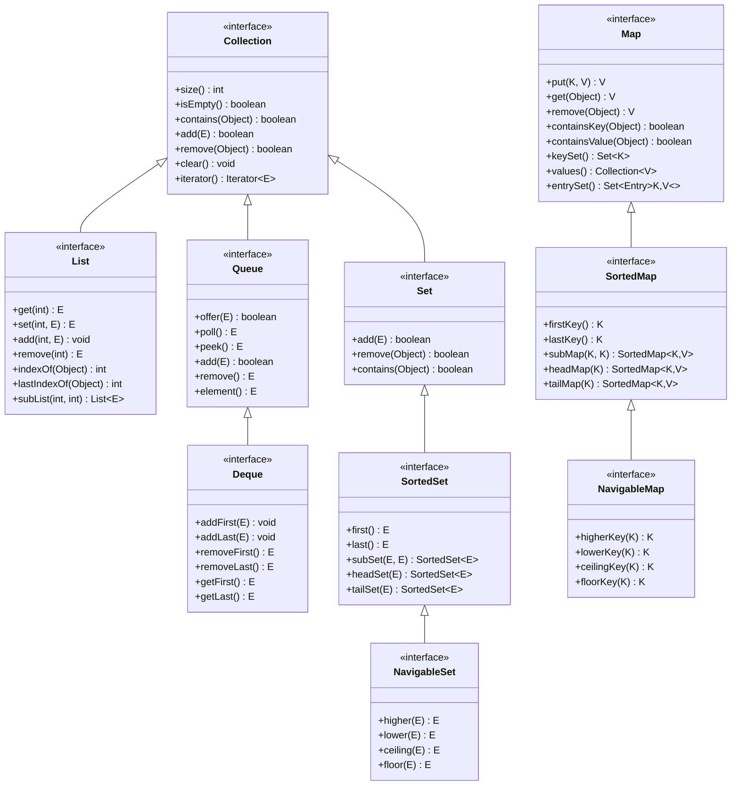
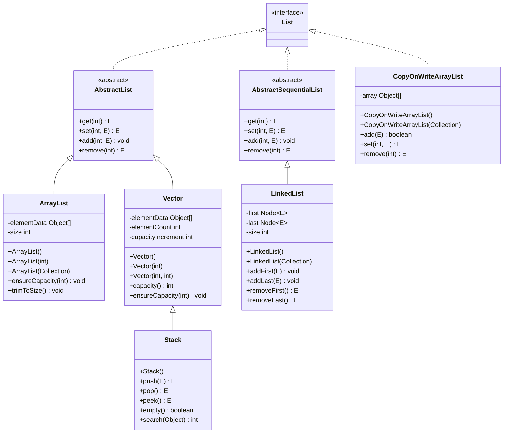
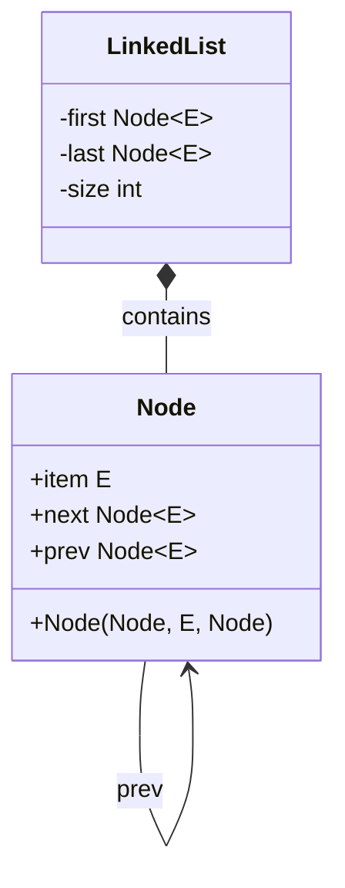

# Java Collections Framework - Part 1: Core Concepts and List Implementations

## Table of Contents
1. [Introduction to Collections Framework](#introduction-to-collections-framework)
2. [Collection Interface](#collection-interface)
3. [List Interface](#list-interface)
4. [ArrayList](#arraylist)
5. [LinkedList](#linkedlist)
6. [Vector](#vector)
7. [Stack](#stack)
8. [Performance Comparison](#performance-comparison)
9. [Best Practices](#best-practices)
10. [Common Pitfalls](#common-pitfalls)

---

## Introduction to Collections Framework

### What is Collections Framework?

The Java Collections Framework is a unified architecture for representing and manipulating collections. It provides:
- **Interfaces**: Define the contract for different types of collections
- **Implementations**: Concrete classes that implement the interfaces
- **Algorithms**: Methods for manipulating collections (sorting, searching, etc.)

### Key Benefits
- **Reduces programming effort**: Provides ready-to-use data structures
- **Increases program speed and quality**: Optimized implementations
- **Allows interoperability**: Standard interface across different implementations
- **Reduces effort to learn and use**: Consistent API design
- **Reduces effort to design new APIs**: Reuse existing interfaces
- **Fosters software reuse**: Standard implementations

### Core Interfaces Hierarchy



### List Implementation Hierarchy



### Node Structure (LinkedList)



---

## Collection Interface

### Overview
The `Collection` interface is the root of the collection hierarchy. It represents a group of objects known as its elements.

### Core Methods

```java
public interface Collection<E> extends Iterable<E> {
    // Basic operations
    int size();
    boolean isEmpty();
    boolean contains(Object o);
    boolean add(E e);
    boolean remove(Object o);
    
    // Bulk operations
    boolean containsAll(Collection<?> c);
    boolean addAll(Collection<? extends E> c);
    boolean removeAll(Collection<?> c);
    boolean retainAll(Collection<?> c);
    void clear();
    
    // Array operations
    Object[] toArray();
    <T> T[] toArray(T[] a);
    
    // Iteration
    Iterator<E> iterator();
}
```

### Detailed Method Explanations

#### Basic Operations
```java
Collection<String> collection = new ArrayList<>();

// size() - Returns the number of elements
int size = collection.size();

// isEmpty() - Returns true if collection has no elements
boolean empty = collection.isEmpty();

// contains(Object o) - Returns true if collection contains the specified element
boolean contains = collection.contains("element");

// add(E e) - Ensures collection contains the specified element
boolean added = collection.add("new element");

// remove(Object o) - Removes a single instance of the specified element
boolean removed = collection.remove("element");
```

#### Bulk Operations
```java
Collection<String> c1 = new ArrayList<>();
Collection<String> c2 = new ArrayList<>();

// containsAll(Collection<?> c) - Returns true if collection contains all elements
boolean containsAll = c1.containsAll(c2);

// addAll(Collection<? extends E> c) - Adds all elements from specified collection
boolean addedAll = c1.addAll(c2);

// removeAll(Collection<?> c) - Removes all elements that are also in specified collection
boolean removedAll = c1.removeAll(c2);

// retainAll(Collection<?> c) - Retains only elements that are also in specified collection
boolean retainedAll = c1.retainAll(c2);

// clear() - Removes all elements from collection
c1.clear();
```

#### Array Operations
```java
Collection<String> collection = new ArrayList<>();
collection.add("one");
collection.add("two");
collection.add("three");

// toArray() - Returns Object array
Object[] objArray = collection.toArray();

// toArray(T[] a) - Returns typed array
String[] strArray = collection.toArray(new String[0]);
String[] strArray2 = collection.toArray(new String[collection.size()]);
```

---

## List Interface

### Overview
The `List` interface extends `Collection` and represents an ordered collection (sequence). Lists allow duplicate elements and provide positional access to elements.

### Key Characteristics
- **Ordered**: Elements maintain insertion order
- **Indexed**: Access elements by integer index
- **Allows duplicates**: Same element can appear multiple times
- **Allows null**: Can contain null elements

### Core Methods

```java
public interface List<E> extends Collection<E> {
    // Positional access
    E get(int index);
    E set(int index, E element);
    void add(int index, E element);
    E remove(int index);
    
    // Search
    int indexOf(Object o);
    int lastIndexOf(Object o);
    
    // Range-view
    List<E> subList(int fromIndex, int toIndex);
    
    // ListIterator
    ListIterator<E> listIterator();
    ListIterator<E> listIterator(int index);
}
```

### Detailed Method Explanations

#### Positional Access
```java
List<String> list = new ArrayList<>();
list.add("first");
list.add("second");
list.add("third");

// get(int index) - Returns element at specified position
String element = list.get(1); // "second"

// set(int index, E element) - Replaces element at specified position
String oldElement = list.set(1, "new second");

// add(int index, E element) - Inserts element at specified position
list.add(1, "inserted");

// remove(int index) - Removes element at specified position
String removed = list.remove(1);
```

#### Search Operations
```java
List<String> list = new ArrayList<>();
list.add("apple");
list.add("banana");
list.add("apple");
list.add("cherry");

// indexOf(Object o) - Returns index of first occurrence
int firstIndex = list.indexOf("apple"); // 0

// lastIndexOf(Object o) - Returns index of last occurrence
int lastIndex = list.lastIndexOf("apple"); // 2
```

#### Range Operations
```java
List<String> list = new ArrayList<>();
list.add("a");
list.add("b");
list.add("c");
list.add("d");
list.add("e");

// subList(int fromIndex, int toIndex) - Returns view of portion of list
List<String> subList = list.subList(1, 4); // ["b", "c", "d"]

// Modifying subList affects original list
subList.set(0, "modified");
// Original list now contains "modified" at index 1
```

#### ListIterator
```java
List<String> list = new ArrayList<>();
list.add("one");
list.add("two");
list.add("three");

// Forward iteration
ListIterator<String> forward = list.listIterator();
while (forward.hasNext()) {
    String element = forward.next();
    System.out.println(element);
}

// Backward iteration
ListIterator<String> backward = list.listIterator(list.size());
while (backward.hasPrevious()) {
    String element = backward.previous();
    System.out.println(element);
}

// Bidirectional with modification
ListIterator<String> iterator = list.listIterator();
while (iterator.hasNext()) {
    String element = iterator.next();
    if ("two".equals(element)) {
        iterator.set("modified two");
    }
}
```

---

## ArrayList

### Overview
`ArrayList` is a resizable array implementation of the `List` interface. It provides fast random access and is the most commonly used List implementation.

### Key Characteristics
- **Resizable array**: Grows automatically as needed
- **Random access**: O(1) time complexity for get/set operations
- **Not synchronized**: Not thread-safe by default
- **Allows null**: Can contain null elements
- **Fast iteration**: Optimized for sequential access

### Internal Implementation

```java
public class ArrayList<E> extends AbstractList<E> 
    implements List<E>, RandomAccess, Cloneable, Serializable {
    
    private static final int DEFAULT_CAPACITY = 10;
    private static final Object[] EMPTY_ELEMENTDATA = {};
    private static final Object[] DEFAULTCAPACITY_EMPTY_ELEMENTDATA = {};
    
    transient Object[] elementData; // Non-private to simplify nested class access
    private int size;
}
```

### Constructor Examples

```java
// Default constructor - initial capacity 10
ArrayList<String> list1 = new ArrayList<>();

// Constructor with initial capacity
ArrayList<String> list2 = new ArrayList<>(50);

// Constructor with collection
Collection<String> collection = Arrays.asList("a", "b", "c");
ArrayList<String> list3 = new ArrayList<>(collection);
```

### Common Operations

#### Adding Elements
```java
ArrayList<String> list = new ArrayList<>();

// add(E e) - Appends element to end
list.add("first");
list.add("second");

// add(int index, E element) - Inserts at specific position
list.add(1, "inserted");

// addAll(Collection<? extends E> c) - Adds all elements
Collection<String> moreElements = Arrays.asList("third", "fourth");
list.addAll(moreElements);

// addAll(int index, Collection<? extends E> c) - Inserts all elements
list.addAll(1, Arrays.asList("before", "inserted"));
```

#### Removing Elements
```java
ArrayList<String> list = new ArrayList<>();
list.add("one");
list.add("two");
list.add("three");
list.add("two");

// remove(Object o) - Removes first occurrence
boolean removed = list.remove("two"); // true

// remove(int index) - Removes element at index
String removedElement = list.remove(1); // "three"

// removeAll(Collection<?> c) - Removes all occurrences
list.removeAll(Arrays.asList("one", "two"));

// clear() - Removes all elements
list.clear();
```

#### Accessing Elements
```java
ArrayList<String> list = new ArrayList<>();
list.add("first");
list.add("second");
list.add("third");

// get(int index) - Returns element at index
String element = list.get(1); // "second"

// set(int index, E element) - Replaces element at index
String oldElement = list.set(1, "new second");

// contains(Object o) - Checks if element exists
boolean contains = list.contains("first"); // true

// indexOf(Object o) - Returns index of first occurrence
int index = list.indexOf("third"); // 2
```

#### Iteration
```java
ArrayList<String> list = new ArrayList<>();
list.add("one");
list.add("two");
list.add("three");

// For-each loop (recommended)
for (String element : list) {
    System.out.println(element);
}

// Traditional for loop with index
for (int i = 0; i < list.size(); i++) {
    System.out.println(list.get(i));
}

// Iterator
Iterator<String> iterator = list.iterator();
while (iterator.hasNext()) {
    String element = iterator.next();
    if ("two".equals(element)) {
        iterator.remove(); // Safe removal during iteration
    }
}

// ListIterator (bidirectional)
ListIterator<String> listIterator = list.listIterator();
while (listIterator.hasNext()) {
    String element = listIterator.next();
    listIterator.set(element.toUpperCase());
}
```

### Performance Characteristics

| Operation | Time Complexity | Notes |
|-----------|----------------|-------|
| get(int index) | O(1) | Direct array access |
| set(int index, E element) | O(1) | Direct array access |
| add(E e) | O(1) amortized | May trigger resizing |
| add(int index, E element) | O(n) | Requires shifting |
| remove(int index) | O(n) | Requires shifting |
| remove(Object o) | O(n) | Linear search |
| contains(Object o) | O(n) | Linear search |
| size() | O(1) | Stored as field |

### Capacity Management

```java
ArrayList<String> list = new ArrayList<>();

// ensureCapacity(int minCapacity) - Ensures minimum capacity
list.ensureCapacity(100);

// trimToSize() - Trims capacity to current size
list.trimToSize();

// Default growth strategy
// When capacity is reached, new capacity = old capacity * 1.5
```

---

## LinkedList

### Overview
`LinkedList` is a doubly-linked list implementation of the `List` and `Deque` interfaces. It provides efficient insertion and deletion at both ends.

### Key Characteristics
- **Doubly-linked list**: Each node has references to previous and next nodes
- **Fast insertion/deletion**: O(1) at ends, O(n) in middle
- **Slow random access**: O(n) time complexity
- **Not synchronized**: Not thread-safe by default
- **Memory overhead**: Extra space for node references

### Internal Structure

```java
public class LinkedList<E> extends AbstractSequentialList<E> 
    implements List<E>, Deque<E>, Cloneable, Serializable {
    
    transient Node<E> first;
    transient Node<E> last;
    transient int size = 0;
    
    private static class Node<E> {
        E item;
        Node<E> next;
        Node<E> prev;
        
        Node(Node<E> prev, E element, Node<E> next) {
            this.item = element;
            this.next = next;
            this.prev = prev;
        }
    }
}
```

### Constructor Examples

```java
// Default constructor
LinkedList<String> list1 = new LinkedList<>();

// Constructor with collection
Collection<String> collection = Arrays.asList("a", "b", "c");
LinkedList<String> list2 = new LinkedList<>(collection);
```

### Common Operations

#### Adding Elements
```java
LinkedList<String> list = new LinkedList<>();

// add(E e) - Appends to end
list.add("first");
list.add("second");

// addFirst(E e) - Adds to beginning
list.addFirst("new first");

// addLast(E e) - Adds to end
list.addLast("new last");

// add(int index, E element) - Inserts at specific position
list.add(1, "inserted");

// addAll(Collection<? extends E> c) - Adds all elements
list.addAll(Arrays.asList("third", "fourth"));
```

#### Removing Elements
```java
LinkedList<String> list = new LinkedList<>();
list.add("first");
list.add("second");
list.add("third");

// remove() - Removes and returns first element
String first = list.remove(); // "first"

// removeFirst() - Removes and returns first element
String first2 = list.removeFirst(); // "second"

// removeLast() - Removes and returns last element
String last = list.removeLast(); // "third"

// remove(Object o) - Removes first occurrence
boolean removed = list.remove("second");

// remove(int index) - Removes element at index
String removedElement = list.remove(1);
```

#### Accessing Elements
```java
LinkedList<String> list = new LinkedList<>();
list.add("first");
list.add("second");
list.add("third");

// get(int index) - Returns element at index
String element = list.get(1); // "second"

// getFirst() - Returns first element
String first = list.getFirst(); // "first"

// getLast() - Returns last element
String last = list.getLast(); // "third"

// peek() - Returns first element without removing
String peek = list.peek(); // "first"

// peekFirst() - Returns first element without removing
String peekFirst = list.peekFirst(); // "first"

// peekLast() - Returns last element without removing
String peekLast = list.peekLast(); // "third"
```

#### Queue Operations (Deque Interface)
```java
LinkedList<String> queue = new LinkedList<>();

// Queue operations
queue.offer("first");    // add to end
queue.offer("second");
queue.offer("third");

String head = queue.peek();     // view head without removing
String removed = queue.poll();  // remove and return head

// Stack operations
LinkedList<String> stack = new LinkedList<>();
stack.push("first");     // push to top
stack.push("second");
stack.push("third");

String top = stack.peek();      // view top without removing
String popped = stack.pop();    // remove and return top
```

### Performance Characteristics

| Operation | Time Complexity | Notes |
|-----------|----------------|-------|
| get(int index) | O(n) | Traverse from head or tail |
| set(int index, E element) | O(n) | Traverse to index |
| add(E e) | O(1) | Add to end |
| add(int index, E element) | O(n) | Traverse to index |
| remove(int index) | O(n) | Traverse to index |
| remove(Object o) | O(n) | Linear search |
| addFirst(E e) | O(1) | Add to beginning |
| addLast(E e) | O(1) | Add to end |
| removeFirst() | O(1) | Remove from beginning |
| removeLast() | O(1) | Remove from end |

---

## Vector

### Overview
`Vector` is a legacy synchronized implementation of the `List` interface. It's similar to `ArrayList` but is thread-safe.

### Key Characteristics
- **Synchronized**: Thread-safe by default
- **Resizable array**: Similar to ArrayList
- **Legacy class**: Considered outdated
- **Performance overhead**: Synchronization adds overhead
- **Growth strategy**: Default growth factor is 2.0

### Constructor Examples

```java
// Default constructor - initial capacity 10
Vector<String> vector1 = new Vector<>();

// Constructor with initial capacity
Vector<String> vector2 = new Vector<>(50);

// Constructor with initial capacity and capacity increment
Vector<String> vector3 = new Vector<>(50, 10);

// Constructor with collection
Collection<String> collection = Arrays.asList("a", "b", "c");
Vector<String> vector4 = new Vector<>(collection);
```

### Common Operations

```java
Vector<String> vector = new Vector<>();

// Adding elements
vector.add("first");
vector.addElement("second"); // Legacy method

// Removing elements
vector.remove("first");
vector.removeElement("second"); // Legacy method

// Accessing elements
String element = vector.get(0);
String element2 = vector.elementAt(0); // Legacy method

// Size and capacity
int size = vector.size();
int capacity = vector.capacity();

// Capacity management
vector.ensureCapacity(100);
vector.trimToSize();
```

### Performance Characteristics

| Operation | Time Complexity | Notes |
|-----------|----------------|-------|
| get(int index) | O(1) | Synchronized array access |
| set(int index, E element) | O(1) | Synchronized array access |
| add(E e) | O(1) amortized | Synchronized, may trigger resizing |
| remove(int index) | O(n) | Synchronized, requires shifting |
| contains(Object o) | O(n) | Synchronized linear search |

---

## Stack

### Overview
`Stack` is a legacy class that extends `Vector` and implements a last-in-first-out (LIFO) stack of objects.

### Key Characteristics
- **LIFO**: Last in, first out
- **Extends Vector**: Inherits synchronization
- **Legacy class**: Considered outdated
- **Limited operations**: Only stack-specific methods

### Common Operations

```java
Stack<String> stack = new Stack<>();

// push(E item) - Pushes item onto top of stack
stack.push("first");
stack.push("second");
stack.push("third");

// pop() - Removes and returns top element
String top = stack.pop(); // "third"

// peek() - Returns top element without removing
String peek = stack.peek(); // "second"

// empty() - Tests if stack is empty
boolean isEmpty = stack.empty();

// search(Object o) - Returns 1-based position from top
int position = stack.search("first"); // 2 (second from top)
```

### Performance Characteristics

| Operation | Time Complexity | Notes |
|-----------|----------------|-------|
| push(E item) | O(1) | Add to end |
| pop() | O(1) | Remove from end |
| peek() | O(1) | Access last element |
| search(Object o) | O(n) | Linear search |
| empty() | O(1) | Check size |

---

## Performance Comparison

### ArrayList vs LinkedList

| Operation | ArrayList | LinkedList | Winner |
|-----------|-----------|------------|--------|
| get(int index) | O(1) | O(n) | ArrayList |
| set(int index, E element) | O(1) | O(n) | ArrayList |
| add(E e) | O(1) amortized | O(1) | Tie |
| add(int index, E element) | O(n) | O(n) | Tie |
| remove(int index) | O(n) | O(n) | Tie |
| remove(Object o) | O(n) | O(n) | Tie |
| Memory usage | Lower | Higher | ArrayList |

### When to Use Each

**Use ArrayList when:**
- Random access is frequent
- Adding/removing at the end is common
- Memory efficiency is important
- Iteration performance is critical

**Use LinkedList when:**
- Frequent insertion/deletion at beginning or middle
- Implementing queue or stack functionality
- Memory overhead is acceptable
- Random access is rare

### Vector vs ArrayList

| Aspect | Vector | ArrayList | Recommendation |
|--------|--------|-----------|----------------|
| Thread safety | Yes | No | Use ArrayList with Collections.synchronizedList() |
| Performance | Slower | Faster | ArrayList for single-threaded |
| Growth factor | 2.0 | 1.5 | ArrayList more memory efficient |
| Legacy | Yes | No | Prefer ArrayList |

---

## Best Practices

### 1. Choose the Right Implementation

```java
// For random access and iteration
List<String> list = new ArrayList<>();

// For frequent insertion/deletion at ends
List<String> list = new LinkedList<>();

// For thread safety (modern approach)
List<String> list = Collections.synchronizedList(new ArrayList<>());

// For concurrent access
List<String> list = new CopyOnWriteArrayList<>();
```

### 2. Initialize with Proper Capacity

```java
// Good: Specify initial capacity for large lists
List<String> largeList = new ArrayList<>(1000);

// Good: Use Arrays.asList for small fixed lists
List<String> smallList = Arrays.asList("a", "b", "c");

// Good: Use List.of for immutable lists (Java 9+)
List<String> immutableList = List.of("a", "b", "c");
```

### 3. Safe Iteration

```java
List<String> list = new ArrayList<>();
list.add("one");
list.add("two");
list.add("three");

// Safe: Use Iterator for removal during iteration
Iterator<String> iterator = list.iterator();
while (iterator.hasNext()) {
    String element = iterator.next();
    if ("two".equals(element)) {
        iterator.remove(); // Safe
    }
}

// Unsafe: ConcurrentModificationException
for (String element : list) {
    if ("two".equals(element)) {
        list.remove(element); // Throws exception
    }
}
```

### 4. Efficient Operations

```java
// Good: Use contains() before adding to avoid duplicates
if (!list.contains(element)) {
    list.add(element);
}

// Good: Use subList() for range operations
List<String> subList = list.subList(1, 4);
subList.clear(); // Efficiently removes range

// Good: Use clear() instead of removeAll()
list.clear(); // More efficient than list.removeAll(list)
```

### 5. Type Safety

```java
// Good: Use generics for type safety
List<String> stringList = new ArrayList<>();
stringList.add("hello"); // Compile-time type checking

// Bad: Raw types (avoid)
List rawList = new ArrayList();
rawList.add("hello");
rawList.add(123); // No type checking
```

---

## Common Pitfalls

### 1. Concurrent Modification

```java
List<String> list = new ArrayList<>();
list.add("one");
list.add("two");

// Pitfall: ConcurrentModificationException
for (String element : list) {
    if ("one".equals(element)) {
        list.remove(element); // Exception!
    }
}

// Solution: Use Iterator
Iterator<String> iterator = list.iterator();
while (iterator.hasNext()) {
    String element = iterator.next();
    if ("one".equals(element)) {
        iterator.remove(); // Safe
    }
}
```

### 2. Inefficient Operations

```java
// Pitfall: Inefficient removal
List<String> list = new ArrayList<>();
for (int i = 0; i < 1000; i++) {
    list.add("item" + i);
}

// Bad: O(n²) - removes from beginning repeatedly
while (!list.isEmpty()) {
    list.remove(0); // Shifts all remaining elements
}

// Solution: Clear all at once
list.clear(); // O(1)

// Solution: Remove from end
while (!list.isEmpty()) {
    list.remove(list.size() - 1); // O(1)
}
```

### 3. Memory Leaks

```java
// Pitfall: Keeping references unnecessarily
List<String> largeList = new ArrayList<>();
// ... add many elements
largeList = null; // Allow garbage collection

// Solution: Clear when done
largeList.clear();
largeList = null;
```

### 4. Null Handling

```java
// Pitfall: NullPointerException
List<String> list = new ArrayList<>();
list.add(null);
list.add("hello");

for (String element : list) {
    System.out.println(element.length()); // NPE on null
}

// Solution: Check for null
for (String element : list) {
    if (element != null) {
        System.out.println(element.length());
    }
}
```

### 5. Performance Issues

```java
// Pitfall: Inefficient string concatenation in loops
List<String> result = new ArrayList<>();
for (int i = 0; i < 1000; i++) {
    result.add("Item " + i); // Creates new String each time
}

// Solution: Use StringBuilder for complex concatenation
StringBuilder sb = new StringBuilder();
for (int i = 0; i < 1000; i++) {
    sb.append("Item ").append(i);
    result.add(sb.toString());
    sb.setLength(0); // Reset for next iteration
}
```

---

## Summary

The Java Collections Framework provides powerful and flexible data structures for managing groups of objects. Key points:

1. **Choose the right implementation** based on your use case
2. **Understand performance characteristics** of each implementation
3. **Use generics** for type safety
4. **Handle concurrent modification** safely
5. **Consider memory usage** and efficiency
6. **Follow best practices** for optimal performance

The List interface and its implementations (ArrayList, LinkedList, Vector, Stack) provide different trade-offs between performance, memory usage, and functionality. Choose wisely based on your specific requirements.
