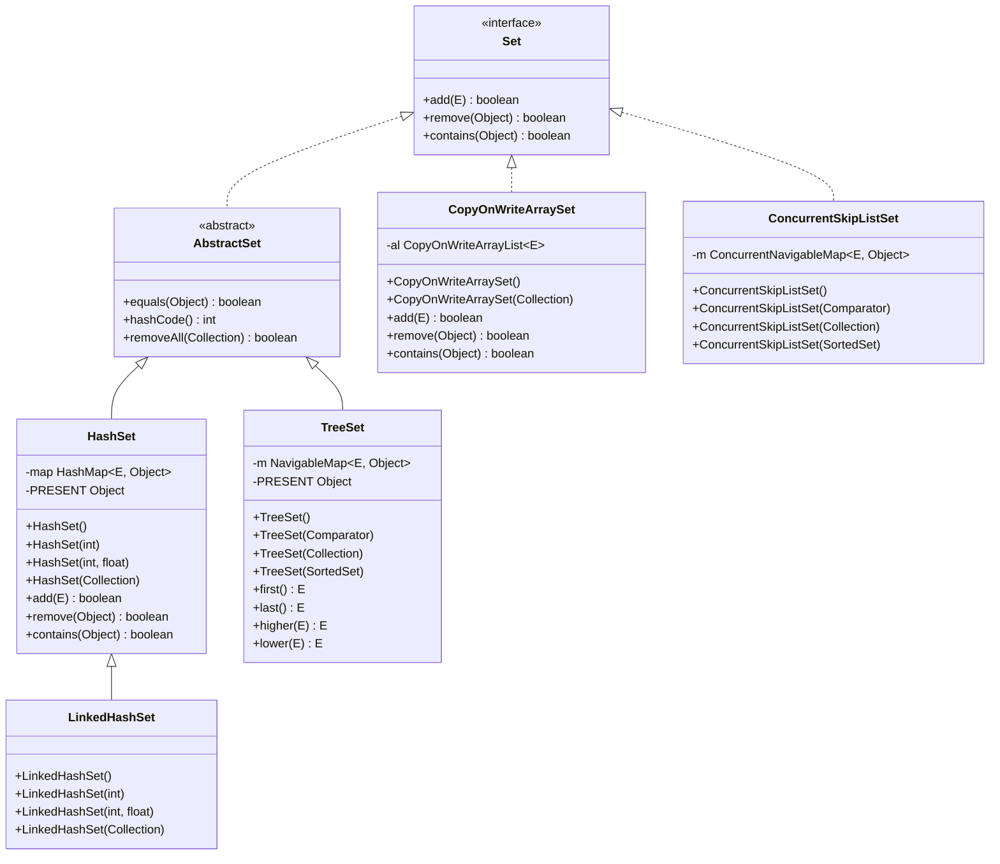
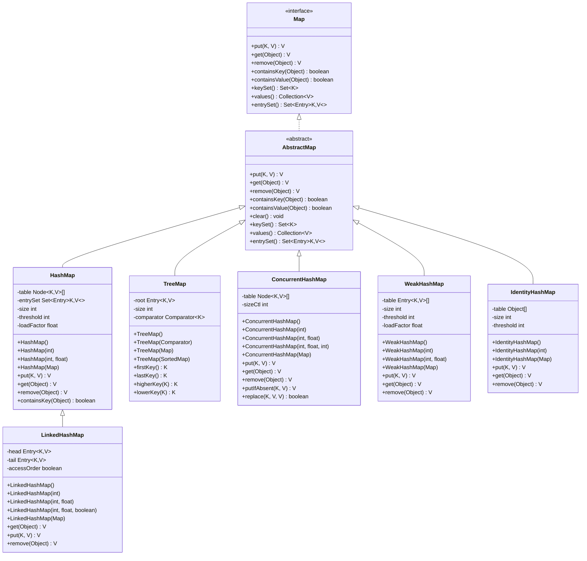
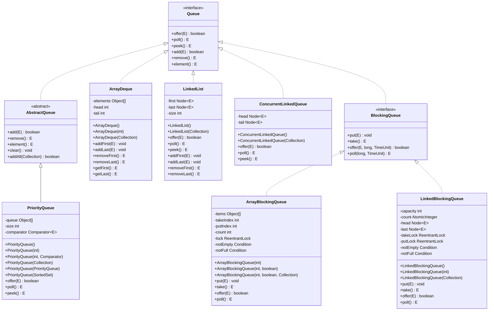
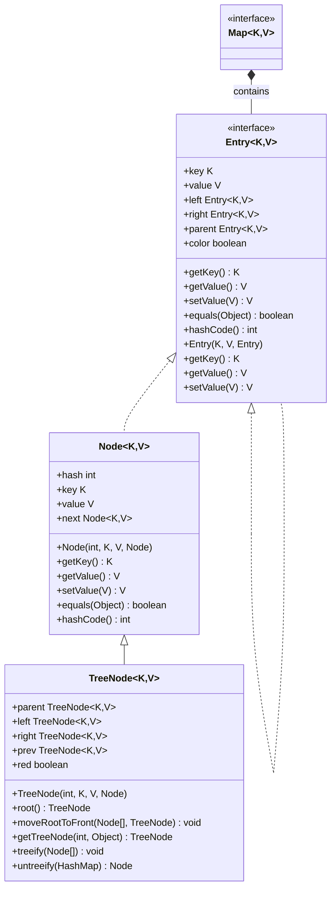

# Java Collections Framework - Part 2: Sets, Maps, and Advanced Concepts

## Complete Collections Framework Overview

```mermaid
classDiagram
    %% Core Interfaces
    class Collection {
        <<interface>>
        +size() int
        +isEmpty() boolean
        +contains(Object) boolean
        +add(E) boolean
        +remove(Object) boolean
        +clear() void
        +iterator() Iterator~E~
    }
    
    class Map {
        <<interface>>
        +put(K, V) V
        +get(Object) V
        +remove(Object) V
        +containsKey(Object) boolean
        +containsValue(Object) boolean
        +keySet() Set~K~
        +values() Collection~V~
        +entrySet() Set~Entry~K,V~~
    }
    
    %% Collection Hierarchy
    class List {
        <<interface>>
        +get(int) E
        +set(int, E) E
        +add(int, E) void
        +remove(int) E
        +indexOf(Object) int
        +lastIndexOf(Object) int
        +subList(int, int) List~E~
    }
    
    class Set {
        <<interface>>
        +add(E) boolean
        +remove(Object) boolean
        +contains(Object) boolean
    }
    
    class Queue {
        <<interface>>
        +offer(E) boolean
        +poll() E
        +peek() E
        +add(E) boolean
        +remove() E
        +element() E
    }
    
    class Deque {
        <<interface>>
        +addFirst(E) void
        +addLast(E) void
        +removeFirst() E
        +removeLast() E
        +getFirst() E
        +getLast() E
    }
    
    class SortedSet {
        <<interface>>
        +first() E
        +last() E
        +subSet(E, E) SortedSet~E~
        +headSet(E) SortedSet~E~
        +tailSet(E) SortedSet~E~
    }
    
    class NavigableSet {
        <<interface>>
        +higher(E) E
        +lower(E) E
        +ceiling(E) E
        +floor(E) E
    }
    
    class SortedMap {
        <<interface>>
        +firstKey() K
        +lastKey() K
        +subMap(K, K) SortedMap~K,V~
        +headMap(K) SortedMap~K,V~
        +tailMap(K) SortedMap~K,V~
    }
    
    class NavigableMap {
        <<interface>>
        +higherKey(K) K
        +lowerKey(K) K
        +ceilingKey(K) K
        +floorKey(K) K
    }
    
    class BlockingQueue {
        <<interface>>
        +put(E) void
        +take() E
        +offer(E, long, TimeUnit) boolean
        +poll(long, TimeUnit) E
    }
    
    %% Implementation Classes
    class ArrayList {
        -elementData Object[]
        -size int
        +ArrayList()
        +ArrayList(int)
        +ArrayList(Collection)
    }
    
    class LinkedList {
        -first Node~E~
        -last Node~E~
        -size int
        +LinkedList()
        +LinkedList(Collection)
    }
    
    class Vector {
        -elementData Object[]
        -elementCount int
        -capacityIncrement int
        +Vector()
        +Vector(int)
        +Vector(int, int)
    }
    
    class Stack {
        +Stack()
        +push(E) E
        +pop() E
        +peek() E
        +empty() boolean
        +search(Object) int
    }
    
    class HashSet {
        -map HashMap~E, Object~
        -PRESENT Object
        +HashSet()
        +HashSet(int)
        +HashSet(int, float)
        +HashSet(Collection)
    }
    
    class LinkedHashSet {
        +LinkedHashSet()
        +LinkedHashSet(int)
        +LinkedHashSet(int, float)
        +LinkedHashSet(Collection)
    }
    
    class TreeSet {
        -m NavigableMap~E, Object~
        -PRESENT Object
        +TreeSet()
        +TreeSet(Comparator)
        +TreeSet(Collection)
        +TreeSet(SortedSet)
    }
    
    class HashMap {
        -table Node~K,V~[]
        -entrySet Set~Entry~K,V~~
        -size int
        -threshold int
        -loadFactor float
        +HashMap()
        +HashMap(int)
        +HashMap(int, float)
        +HashMap(Map)
    }
    
    class LinkedHashMap {
        -head Entry~K,V~
        -tail Entry~K,V~
        -accessOrder boolean
        +LinkedHashMap()
        +LinkedHashMap(int)
        +LinkedHashMap(int, float)
        +LinkedHashMap(int, float, boolean)
        +LinkedHashMap(Map)
    }
    
    class TreeMap {
        -root Entry~K,V~
        -size int
        -comparator Comparator~K~
        +TreeMap()
        +TreeMap(Comparator)
        +TreeMap(Map)
        +TreeMap(SortedMap)
    }
    
    class PriorityQueue {
        -queue Object[]
        -size int
        -comparator Comparator~E~
        +PriorityQueue()
        +PriorityQueue(int)
        +PriorityQueue(int, Comparator)
        +PriorityQueue(Collection)
    }
    
    class ArrayDeque {
        -elements Object[]
        -head int
        -tail int
        +ArrayDeque()
        +ArrayDeque(int)
        +ArrayDeque(Collection)
    }
    
    class ConcurrentHashMap {
        -table Node~K,V~[]
        -sizeCtl int
        +ConcurrentHashMap()
        +ConcurrentHashMap(int)
        +ConcurrentHashMap(int, float)
        +ConcurrentHashMap(int, float, int)
        +ConcurrentHashMap(Map)
    }
    
    class CopyOnWriteArrayList {
        -array Object[]
        +CopyOnWriteArrayList()
        +CopyOnWriteArrayList(Collection)
    }
    
    class CopyOnWriteArraySet {
        -al CopyOnWriteArrayList~E~
        +CopyOnWriteArraySet()
        +CopyOnWriteArraySet(Collection)
    }
    
    class ConcurrentSkipListSet {
        -m ConcurrentNavigableMap~E, Object~
        +ConcurrentSkipListSet()
        +ConcurrentSkipListSet(Comparator)
        +ConcurrentSkipListSet(Collection)
        +ConcurrentSkipListSet(SortedSet)
    }
    
    class ArrayBlockingQueue {
        -items Object[]
        -takeIndex int
        -putIndex int
        -count int
        -lock ReentrantLock
        -notEmpty Condition
        -notFull Condition
        +ArrayBlockingQueue(int)
        +ArrayBlockingQueue(int, boolean)
        +ArrayBlockingQueue(int, boolean, Collection)
    }
    
    class LinkedBlockingQueue {
        -capacity int
        -count AtomicInteger
        -head Node~E~
        -last Node~E~
        -takeLock ReentrantLock
        -putLock ReentrantLock
        -notEmpty Condition
        -notFull Condition
        +LinkedBlockingQueue()
        +LinkedBlockingQueue(int)
        +LinkedBlockingQueue(Collection)
    }
    
    %% Relationships
    Collection <|-- List
    Collection <|-- Set
    Collection <|-- Queue
    Queue <|-- Deque
    Queue <|-- BlockingQueue
    Set <|-- SortedSet
    SortedSet <|-- NavigableSet
    Map <|-- SortedMap
    SortedMap <|-- NavigableMap
    
    %% List Implementations
    List <|.. ArrayList
    List <|.. LinkedList
    List <|.. Vector
    List <|.. CopyOnWriteArrayList
    Vector <|-- Stack
    Deque <|.. LinkedList
    Deque <|.. ArrayDeque
    
    %% Set Implementations
    Set <|.. HashSet
    Set <|.. LinkedHashSet
    Set <|.. TreeSet
    Set <|.. CopyOnWriteArraySet
    Set <|.. ConcurrentSkipListSet
    SortedSet <|.. TreeSet
    NavigableSet <|.. TreeSet
    NavigableSet <|.. ConcurrentSkipListSet
    HashSet <|-- LinkedHashSet
    
    %% Map Implementations
    Map <|.. HashMap
    Map <|.. LinkedHashMap
    Map <|.. TreeMap
    Map <|.. ConcurrentHashMap
    SortedMap <|.. TreeMap
    NavigableMap <|.. TreeMap
    HashMap <|-- LinkedHashMap
    
    %% Queue Implementations
    Queue <|.. PriorityQueue
    Queue <|.. ArrayDeque
    Queue <|.. LinkedList
    BlockingQueue <|.. ArrayBlockingQueue
    BlockingQueue <|.. LinkedBlockingQueue
```



## Table of Contents
1. [Set Interface](#set-interface)
2. [HashSet](#hashset)
3. [LinkedHashSet](#linkedhashset)
4. [TreeSet](#treeset)
5. [Map Interface](#map-interface)
6. [HashMap](#hashmap)
7. [LinkedHashMap](#linkedhashmap)
8. [TreeMap](#treemap)
9. [Queue Interface](#queue-interface)
10. [PriorityQueue](#priorityqueue)
11. [Concurrent Collections](#concurrent-collections)
12. [Collections Utility Class](#collections-utility-class)
13. [Performance Comparison](#performance-comparison)
14. [Best Practices](#best-practices)

---

## Set Interface

### Overview
The `Set` interface extends `Collection` and represents a collection that contains no duplicate elements. Sets model the mathematical set abstraction.

### Set Implementation Hierarchy



### Map Implementation Hierarchy



### Queue Implementation Hierarchy



### Entry Structure (HashMap/TreeMap)



### Key Characteristics
- **No duplicates**: Cannot contain duplicate elements
- **Unordered**: No guarantee of order (except LinkedHashSet and TreeSet)
- **Allows null**: Can contain at most one null element
- **Mathematical operations**: Union, intersection, difference

### Core Methods
```java
public interface Set<E> extends Collection<E> {
    // Inherits all Collection methods
    // No additional methods beyond Collection interface
}
```

### Set Operations
```java
Set<String> set1 = new HashSet<>();
Set<String> set2 = new HashSet<>();

// Union
set1.addAll(set2);

// Intersection
set1.retainAll(set2);

// Difference
set1.removeAll(set2);

// Subset check
boolean isSubset = set2.containsAll(set1);
```

---

## HashSet

### Overview
`HashSet` is a hash table implementation of the `Set` interface. It provides constant-time performance for basic operations.

### Key Characteristics
- **Hash table**: Uses hash codes for storage
- **Unordered**: No guarantee of iteration order
- **Fast operations**: O(1) average case for add, remove, contains
- **Not synchronized**: Not thread-safe by default
- **Allows null**: Can contain one null element

### Internal Implementation
```java
public class HashSet<E> extends AbstractSet<E> 
    implements Set<E>, Cloneable, Serializable {
    
    private transient HashMap<E, Object> map;
    private static final Object PRESENT = new Object();
}
```

### Constructor Examples
```java
// Default constructor - initial capacity 16, load factor 0.75
HashSet<String> set1 = new HashSet<>();

// Constructor with initial capacity
HashSet<String> set2 = new HashSet<>(50);

// Constructor with initial capacity and load factor
HashSet<String> set3 = new HashSet<>(50, 0.8f);

// Constructor with collection
Collection<String> collection = Arrays.asList("a", "b", "c");
HashSet<String> set4 = new HashSet<>(collection);
```

### Common Operations
```java
HashSet<String> set = new HashSet<>();

// Adding elements
set.add("apple");
set.add("banana");
set.add("apple"); // Duplicate - ignored

// Removing elements
set.remove("banana");

// Checking containment
boolean contains = set.contains("apple");

// Size and emptiness
int size = set.size();
boolean empty = set.isEmpty();

// Iteration
for (String element : set) {
    System.out.println(element);
}
```

### Performance Characteristics
| Operation | Time Complexity | Notes |
|-----------|----------------|-------|
| add(E e) | O(1) average | May trigger rehashing |
| remove(Object o) | O(1) average | Hash-based lookup |
| contains(Object o) | O(1) average | Hash-based lookup |
| size() | O(1) | Stored as field |
| iteration | O(n) | Visit all elements |

---

## LinkedHashSet

### Overview
`LinkedHashSet` extends `HashSet` and maintains a doubly-linked list running through all entries, preserving insertion order.

### Key Characteristics
- **Hash table + linked list**: Combines hash table with linked list
- **Insertion order**: Maintains order of insertion
- **Fast operations**: O(1) average case for basic operations
- **Memory overhead**: Extra space for linked list references
- **Predictable iteration**: Consistent iteration order

### Constructor Examples
```java
// Default constructor
LinkedHashSet<String> set1 = new LinkedHashSet<>();

// Constructor with initial capacity
LinkedHashSet<String> set2 = new LinkedHashSet<>(50);

// Constructor with initial capacity and load factor
LinkedHashSet<String> set3 = new LinkedHashSet<>(50, 0.8f);

// Constructor with collection
Collection<String> collection = Arrays.asList("a", "b", "c");
LinkedHashSet<String> set4 = new LinkedHashSet<>(collection);
```

### Common Operations
```java
LinkedHashSet<String> set = new LinkedHashSet<>();

// Adding elements (maintains insertion order)
set.add("first");
set.add("second");
set.add("third");

// Iteration preserves insertion order
for (String element : set) {
    System.out.println(element); // Prints: first, second, third
}
```

### Performance Characteristics
| Operation | Time Complexity | Notes |
|-----------|----------------|-------|
| add(E e) | O(1) average | Hash table + linked list maintenance |
| remove(Object o) | O(1) average | Hash table + linked list maintenance |
| contains(Object o) | O(1) average | Hash-based lookup |
| iteration | O(n) | Predictable order |

---

## TreeSet

### Overview
`TreeSet` is a navigable set implementation based on a `TreeMap`. Elements are ordered using their natural ordering or a comparator.

### Key Characteristics
- **Red-black tree**: Self-balancing binary search tree
- **Sorted**: Elements are always in sorted order
- **Navigable**: Provides navigation methods (first, last, higher, lower)
- **Comparator support**: Can use custom ordering
- **Slower operations**: O(log n) for basic operations

### Constructor Examples
```java
// Default constructor - natural ordering
TreeSet<String> set1 = new TreeSet<>();

// Constructor with comparator
TreeSet<String> set2 = new TreeSet<>(String.CASE_INSENSITIVE_ORDER);

// Constructor with collection
Collection<String> collection = Arrays.asList("c", "a", "b");
TreeSet<String> set3 = new TreeSet<>(collection);

// Constructor with sorted set
SortedSet<String> sortedSet = new TreeSet<>();
TreeSet<String> set4 = new TreeSet<>(sortedSet);
```

### Common Operations
```java
TreeSet<Integer> set = new TreeSet<>();
set.add(3);
set.add(1);
set.add(4);
set.add(2);

// Elements are automatically sorted
for (Integer element : set) {
    System.out.println(element); // Prints: 1, 2, 3, 4
}

// Navigation methods
Integer first = set.first();        // 1
Integer last = set.last();          // 4
Integer higher = set.higher(2);     // 3
Integer lower = set.lower(3);       // 2

// Range views
SortedSet<Integer> subset = set.subSet(2, 4);     // [2, 3]
SortedSet<Integer> headSet = set.headSet(3);      // [1, 2]
SortedSet<Integer> tailSet = set.tailSet(2);      // [2, 3, 4]
```

### Performance Characteristics
| Operation | Time Complexity | Notes |
|-----------|----------------|-------|
| add(E e) | O(log n) | Tree insertion |
| remove(Object o) | O(log n) | Tree deletion |
| contains(Object o) | O(log n) | Tree search |
| first()/last() | O(log n) | Tree traversal |
| iteration | O(n) | In-order traversal |

---

## Map Interface

### Overview
The `Map` interface represents a mapping between keys and values. Each key maps to at most one value.

### Key Characteristics
- **Key-value pairs**: Maps keys to values
- **No duplicate keys**: Each key can map to only one value
- **Allows null**: Can have null keys and values (implementation dependent)
- **Not part of Collection**: Separate hierarchy

### Core Methods
```java
public interface Map<K, V> {
    // Basic operations
    V put(K key, V value);
    V get(Object key);
    V remove(Object key);
    boolean containsKey(Object key);
    boolean containsValue(Object value);
    int size();
    boolean isEmpty();
    
    // Bulk operations
    void putAll(Map<? extends K, ? extends V> m);
    void clear();
    
    // Collection views
    Set<K> keySet();
    Collection<V> values();
    Set<Map.Entry<K, V>> entrySet();
}
```

### Common Operations
```java
Map<String, Integer> map = new HashMap<>();

// Adding mappings
map.put("apple", 1);
map.put("banana", 2);
map.put("cherry", 3);

// Getting values
Integer value = map.get("apple"); // 1
Integer defaultValue = map.getOrDefault("orange", 0); // 0

// Checking containment
boolean hasKey = map.containsKey("apple");
boolean hasValue = map.containsValue(2);

// Removing mappings
Integer removed = map.remove("banana");

// Size and emptiness
int size = map.size();
boolean empty = map.isEmpty();
```

---

## HashMap

### Overview
`HashMap` is a hash table implementation of the `Map` interface. It provides constant-time performance for basic operations.

### Key Characteristics
- **Hash table**: Uses hash codes for storage
- **Unordered**: No guarantee of iteration order
- **Fast operations**: O(1) average case for basic operations
- **Not synchronized**: Not thread-safe by default
- **Allows null**: Can have one null key and multiple null values

### Internal Implementation
```java
public class HashMap<K, V> extends AbstractMap<K, V> 
    implements Map<K, V>, Cloneable, Serializable {
    
    transient Node<K, V>[] table;
    transient Set<Map.Entry<K, V>> entrySet;
    transient int size;
    int threshold;
    final float loadFactor;
}
```

### Constructor Examples
```java
// Default constructor - initial capacity 16, load factor 0.75
HashMap<String, Integer> map1 = new HashMap<>();

// Constructor with initial capacity
HashMap<String, Integer> map2 = new HashMap<>(50);

// Constructor with initial capacity and load factor
HashMap<String, Integer> map3 = new HashMap<>(50, 0.8f);

// Constructor with map
Map<String, Integer> existingMap = new HashMap<>();
HashMap<String, Integer> map4 = new HashMap<>(existingMap);
```

### Common Operations
```java
HashMap<String, Integer> map = new HashMap<>();

// Adding mappings
map.put("apple", 1);
map.put("banana", 2);
map.put("cherry", 3);

// Getting values
Integer value = map.get("apple");
Integer defaultValue = map.getOrDefault("orange", 0);

// Updating values
map.put("apple", 5); // Updates existing mapping

// Removing mappings
Integer removed = map.remove("banana");

// Iteration
for (Map.Entry<String, Integer> entry : map.entrySet()) {
    System.out.println(entry.getKey() + ": " + entry.getValue());
}

// Key set iteration
for (String key : map.keySet()) {
    System.out.println(key);
}

// Values iteration
for (Integer value : map.values()) {
    System.out.println(value);
}
```

### Performance Characteristics
| Operation | Time Complexity | Notes |
|-----------|----------------|-------|
| put(K key, V value) | O(1) average | May trigger rehashing |
| get(Object key) | O(1) average | Hash-based lookup |
| remove(Object key) | O(1) average | Hash-based lookup |
| containsKey(Object key) | O(1) average | Hash-based lookup |
| containsValue(Object value) | O(n) | Linear search |
| size() | O(1) | Stored as field |

---

## LinkedHashMap

### Overview
`LinkedHashMap` extends `HashMap` and maintains a doubly-linked list running through all entries, preserving insertion order or access order.

### Key Characteristics
- **Hash table + linked list**: Combines hash table with linked list
- **Insertion order**: Maintains order of insertion (default)
- **Access order**: Can maintain access order (LRU cache)
- **Fast operations**: O(1) average case for basic operations
- **Memory overhead**: Extra space for linked list references

### Constructor Examples
```java
// Default constructor - insertion order
LinkedHashMap<String, Integer> map1 = new LinkedHashMap<>();

// Constructor with initial capacity
LinkedHashMap<String, Integer> map2 = new LinkedHashMap<>(50);

// Constructor with initial capacity and load factor
LinkedHashMap<String, Integer> map3 = new LinkedHashMap<>(50, 0.8f, true); // access order

// Constructor with map
Map<String, Integer> existingMap = new HashMap<>();
LinkedHashMap<String, Integer> map4 = new LinkedHashMap<>(existingMap);
```

### LRU Cache Implementation
```java
// LRU Cache with access order
LinkedHashMap<String, Integer> lruCache = new LinkedHashMap<>(16, 0.75f, true) {
    @Override
    protected boolean removeEldestEntry(Map.Entry<String, Integer> eldest) {
        return size() > 3; // Keep only 3 entries
    }
};

lruCache.put("a", 1);
lruCache.put("b", 2);
lruCache.put("c", 3);
lruCache.get("a"); // Moves "a" to end
lruCache.put("d", 4); // Removes "b" (eldest)
```

---

## TreeMap

### Overview
`TreeMap` is a navigable map implementation based on a red-black tree. Entries are ordered by their keys.

### Key Characteristics
- **Red-black tree**: Self-balancing binary search tree
- **Sorted**: Entries are always in sorted order by key
- **Navigable**: Provides navigation methods
- **Comparator support**: Can use custom key ordering
- **Slower operations**: O(log n) for basic operations

### Constructor Examples
```java
// Default constructor - natural ordering
TreeMap<String, Integer> map1 = new TreeMap<>();

// Constructor with comparator
TreeMap<String, Integer> map2 = new TreeMap<>(String.CASE_INSENSITIVE_ORDER);

// Constructor with map
Map<String, Integer> existingMap = new HashMap<>();
TreeMap<String, Integer> map3 = new TreeMap<>(existingMap);

// Constructor with sorted map
SortedMap<String, Integer> sortedMap = new TreeMap<>();
TreeMap<String, Integer> map4 = new TreeMap<>(sortedMap);
```

### Common Operations
```java
TreeMap<String, Integer> map = new TreeMap<>();
map.put("c", 3);
map.put("a", 1);
map.put("b", 2);

// Entries are automatically sorted by key
for (Map.Entry<String, Integer> entry : map.entrySet()) {
    System.out.println(entry.getKey() + ": " + entry.getValue());
}

// Navigation methods
String firstKey = map.firstKey();           // "a"
String lastKey = map.lastKey();             // "c"
String higherKey = map.higherKey("a");      // "b"
String lowerKey = map.lowerKey("c");        // "b"

// Range views
SortedMap<String, Integer> subMap = map.subMap("a", "c");     // [a, b]
SortedMap<String, Integer> headMap = map.headMap("c");        // [a, b]
SortedMap<String, Integer> tailMap = map.tailMap("b");        // [b, c]
```

---

## Queue Interface

### Overview
The `Queue` interface represents a collection designed for holding elements prior to processing. Queues typically order elements in a FIFO manner.

### Key Characteristics
- **FIFO**: First in, first out (typically)
- **Processing order**: Elements are processed in order
- **Blocking operations**: Can block when queue is empty/full
- **Priority support**: Can use priority ordering

### Core Methods
```java
public interface Queue<E> extends Collection<E> {
    // Insert operations
    boolean add(E e);
    boolean offer(E e);
    
    // Remove operations
    E remove();
    E poll();
    
    // Examine operations
    E element();
    E peek();
}
```

### Method Comparison
| Operation | Throws Exception | Returns null/false |
|-----------|------------------|-------------------|
| Insert | add(E e) | offer(E e) |
| Remove | remove() | poll() |
| Examine | element() | peek() |

---

## PriorityQueue

### Overview
`PriorityQueue` is an unbounded priority queue based on a priority heap. Elements are ordered according to their natural ordering or a comparator.

### Key Characteristics
- **Priority heap**: Binary heap implementation
- **Unbounded**: No size limit
- **Natural ordering**: Uses Comparable or Comparator
- **Not synchronized**: Not thread-safe by default
- **O(log n) operations**: Insertion and removal

### Constructor Examples
```java
// Default constructor - natural ordering
PriorityQueue<Integer> queue1 = new PriorityQueue<>();

// Constructor with initial capacity
PriorityQueue<Integer> queue2 = new PriorityQueue<>(50);

// Constructor with comparator
PriorityQueue<String> queue3 = new PriorityQueue<>(String.CASE_INSENSITIVE_ORDER);

// Constructor with collection
Collection<Integer> collection = Arrays.asList(3, 1, 4, 2);
PriorityQueue<Integer> queue4 = new PriorityQueue<>(collection);
```

### Common Operations
```java
PriorityQueue<Integer> queue = new PriorityQueue<>();
queue.offer(3);
queue.offer(1);
queue.offer(4);
queue.offer(2);

// Elements are processed in priority order
while (!queue.isEmpty()) {
    System.out.println(queue.poll()); // Prints: 1, 2, 3, 4
}

// Custom comparator for max heap
PriorityQueue<Integer> maxHeap = new PriorityQueue<>((a, b) -> b.compareTo(a));
maxHeap.offer(1);
maxHeap.offer(3);
maxHeap.offer(2);

while (!maxHeap.isEmpty()) {
    System.out.println(maxHeap.poll()); // Prints: 3, 2, 1
}
```

---

## Concurrent Collections

### Overview
Concurrent collections are designed for use in multi-threaded environments where collections may be accessed by multiple threads simultaneously.

### Key Concurrent Collections

#### ConcurrentHashMap
```java
ConcurrentHashMap<String, Integer> map = new ConcurrentHashMap<>();
map.put("key", 1);
Integer value = map.get("key");

// Atomic operations
map.putIfAbsent("key", 2); // Only puts if key doesn't exist
map.replace("key", 1, 3);  // Only replaces if current value is 1
```

#### CopyOnWriteArrayList
```java
CopyOnWriteArrayList<String> list = new CopyOnWriteArrayList<>();
list.add("element");

// Safe for concurrent iteration
for (String element : list) {
    // Modifications don't affect current iteration
    list.add("new element");
}
```

#### BlockingQueue
```java
BlockingQueue<String> queue = new LinkedBlockingQueue<>(10);
queue.put("element");     // Blocks if full
String element = queue.take(); // Blocks if empty
```

---

## Collections Utility Class

### Overview
The `Collections` class provides static methods for operating on collections, including sorting, searching, and creating synchronized collections.

### Common Methods

#### Sorting
```java
List<String> list = new ArrayList<>();
list.add("c");
list.add("a");
list.add("b");

// Natural ordering
Collections.sort(list);

// Custom comparator
Collections.sort(list, String.CASE_INSENSITIVE_ORDER);

// Reverse order
Collections.sort(list, Collections.reverseOrder());
```

#### Searching
```java
List<String> list = Arrays.asList("a", "b", "c", "d");

// Binary search (list must be sorted)
int index = Collections.binarySearch(list, "c");

// Frequency
int frequency = Collections.frequency(list, "a");
```

#### Synchronization
```java
List<String> list = new ArrayList<>();
List<String> syncList = Collections.synchronizedList(list);

// Thread-safe operations
synchronized (syncList) {
    syncList.add("element");
}
```

#### Immutable Collections
```java
// Java 9+ immutable collections
List<String> immutableList = List.of("a", "b", "c");
Set<String> immutableSet = Set.of("a", "b", "c");
Map<String, Integer> immutableMap = Map.of("a", 1, "b", 2);
```

---

## Performance Comparison

### Set Implementations
| Operation | HashSet | LinkedHashSet | TreeSet |
|-----------|---------|---------------|---------|
| add(E e) | O(1) | O(1) | O(log n) |
| remove(Object o) | O(1) | O(1) | O(log n) |
| contains(Object o) | O(1) | O(1) | O(log n) |
| iteration | O(n) | O(n) | O(n) |
| memory | Low | Medium | High |

### Map Implementations
| Operation | HashMap | LinkedHashMap | TreeMap |
|-----------|---------|---------------|---------|
| put(K key, V value) | O(1) | O(1) | O(log n) |
| get(Object key) | O(1) | O(1) | O(log n) |
| remove(Object key) | O(1) | O(1) | O(log n) |
| iteration | O(n) | O(n) | O(n) |
| memory | Low | Medium | High |

### When to Use Each

**Use HashSet/HashMap when:**
- Order doesn't matter
- Fast access is priority
- Memory efficiency is important

**Use LinkedHashSet/LinkedHashMap when:**
- Insertion order matters
- Fast access is priority
- Memory overhead is acceptable

**Use TreeSet/TreeMap when:**
- Sorted order is required
- Navigation methods are needed
- Slower operations are acceptable

---

## Best Practices

### 1. Choose the Right Implementation
```java
// For fast access without ordering
Set<String> set = new HashSet<>();
Map<String, Integer> map = new HashMap<>();

// For ordered collections
Set<String> set = new LinkedHashSet<>();
Map<String, Integer> map = new LinkedHashMap<>();

// For sorted collections
Set<String> set = new TreeSet<>();
Map<String, Integer> map = new TreeMap<>();
```

### 2. Handle Null Values
```java
// Check for null before operations
Map<String, Integer> map = new HashMap<>();
String key = getKey();
if (key != null) {
    map.put(key, 1);
}

// Use getOrDefault for safe access
Integer value = map.getOrDefault(key, 0);
```

### 3. Efficient Iteration
```java
Map<String, Integer> map = new HashMap<>();

// Efficient: Use entrySet for key-value pairs
for (Map.Entry<String, Integer> entry : map.entrySet()) {
    System.out.println(entry.getKey() + ": " + entry.getValue());
}

// Efficient: Use keySet for keys only
for (String key : map.keySet()) {
    System.out.println(key);
}
```

### 4. Thread Safety
```java
// For thread safety, use concurrent collections
ConcurrentHashMap<String, Integer> map = new ConcurrentHashMap<>();
CopyOnWriteArrayList<String> list = new CopyOnWriteArrayList<>();

// Or wrap with synchronized collections
Map<String, Integer> syncMap = Collections.synchronizedMap(new HashMap<>());
List<String> syncList = Collections.synchronizedList(new ArrayList<>());
```

### 5. Memory Management
```java
// Clear references when done
Map<String, Integer> map = new HashMap<>();
// ... use map
map.clear();
map = null;
```

---

## Summary

The Java Collections Framework provides comprehensive data structures for different use cases:

1. **Sets**: For collections without duplicates
2. **Maps**: For key-value associations
3. **Queues**: For ordered processing
4. **Concurrent collections**: For multi-threaded environments

Choose implementations based on:
- Performance requirements
- Ordering needs
- Thread safety requirements
- Memory constraints

Understanding the characteristics and performance of each implementation is crucial for writing efficient Java applications.
