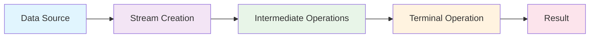

# Comprehensive Notes on Java Streams (Java 8+)

## Table of Contents
1. [Introduction to Java Streams](#introduction-to-java-streams)
2. [Stream Creation](#stream-creation)
3. [Stream Operations](#stream-operations)
4. [Intermediate Operations](#intermediate-operations)
5. [Terminal Operations](#terminal-operations)
6. [Collectors Framework](#collectors-framework)
7. [Parallel Streams](#parallel-streams)
8. [Advanced Stream Concepts](#advanced-stream-concepts)
9. [Performance Considerations](#performance-considerations)
10. [Best Practices and Common Pitfalls](#best-practices-and-common-pitfalls)
11. [Real-World Examples](#real-world-examples)
12. [Stream API vs Traditional Loops](#stream-api-vs-traditional-loops)

---

## Introduction to Java Streams

### What are Streams?

Java Streams represent a **functional approach** to processing sequences of elements. They provide a declarative way to perform bulk operations on collections, arrays, or any data source. Streams are designed to be **lazy**, **immutable**, and **stateless**.

### Key Characteristics

- **Lazy Evaluation**: Operations are not executed until a terminal operation is called
- **Immutable**: Original data source remains unchanged
- **Stateless**: Operations don't maintain state between elements
- **Functional**: Based on functional programming principles
- **Parallelizable**: Can be executed in parallel for better performance

### Stream Pipeline Model



### Stream Lifecycle

```java
// 1. Stream Creation (Source)
List<String> names = Arrays.asList("Alice", "Bob", "Charlie", "David");

// 2. Intermediate Operations (Lazy - not executed yet)
Stream<String> filteredStream = names.stream()
    .filter(name -> name.length() > 4)  // Intermediate
    .map(String::toUpperCase)           // Intermediate
    .sorted();                          // Intermediate

// 3. Terminal Operation (Executes the pipeline)
List<String> result = filteredStream.collect(Collectors.toList());
```

---

## Stream Creation

### 1. From Collections

```java
// List
List<String> list = Arrays.asList("a", "b", "c");
Stream<String> stream1 = list.stream();
Stream<String> parallelStream = list.parallelStream();

// Set
Set<Integer> set = new HashSet<>(Arrays.asList(1, 2, 3));
Stream<Integer> stream2 = set.stream();

// Map
Map<String, Integer> map = new HashMap<>();
map.put("a", 1);
map.put("b", 2);
Stream<String> keyStream = map.keySet().stream();
Stream<Integer> valueStream = map.values().stream();
Stream<Map.Entry<String, Integer>> entryStream = map.entrySet().stream();
```

### 2. From Arrays

```java
// Primitive arrays
int[] intArray = {1, 2, 3, 4, 5};
IntStream intStream = Arrays.stream(intArray);
IntStream intStreamRange = Arrays.stream(intArray, 1, 4); // from index 1 to 3

// Object arrays
String[] stringArray = {"a", "b", "c"};
Stream<String> stringStream = Arrays.stream(stringArray);

// Using Stream.of()
Stream<String> stream3 = Stream.of("a", "b", "c");
Stream<Integer> stream4 = Stream.of(1, 2, 3, 4, 5);
```

### 3. Static Factory Methods

```java
// Stream.of()
Stream<String> stream5 = Stream.of("a", "b", "c");

// Stream.builder()
Stream<String> stream6 = Stream.<String>builder()
    .add("a")
    .add("b")
    .add("c")
    .build();

// Stream.generate() - infinite stream
Stream<Double> randomStream = Stream.generate(Math::random);
Stream<Integer> constantStream = Stream.generate(() -> 42);

// Stream.iterate() - infinite stream with seed and function
Stream<Integer> evenNumbers = Stream.iterate(0, n -> n + 2);
Stream<Integer> limitedEvenNumbers = Stream.iterate(0, n -> n + 2).limit(10);

// Stream.iterate() with predicate (Java 9+)
Stream<Integer> numbersLessThan100 = Stream.iterate(0, n -> n < 100, n -> n + 1);
```

### 4. From Files

```java
// Reading lines from a file
try (Stream<String> lines = Files.lines(Paths.get("file.txt"))) {
    lines.forEach(System.out::println);
}

// Reading all lines
List<String> allLines = Files.lines(Paths.get("file.txt"))
    .collect(Collectors.toList());
```

### 5. From Random Numbers

```java
// Random integers
Random random = new Random();
IntStream randomInts = random.ints(10); // 10 random integers
IntStream randomIntsRange = random.ints(10, 1, 100); // 10 integers between 1-99

// Random doubles
DoubleStream randomDoubles = random.doubles(5);
```

### 6. Empty and Single Element Streams

```java
// Empty stream
Stream<String> emptyStream = Stream.empty();

// Single element stream
Stream<String> singleElementStream = Stream.of("single");
```

---

## Stream Operations

### Operation Categories

Stream operations are divided into two categories:

1. **Intermediate Operations**: Return a new stream, are lazy
2. **Terminal Operations**: Produce a result or side effect, are eager

### Operation Chaining

```java
// Multiple intermediate operations can be chained
List<String> result = names.stream()
    .filter(name -> name.length() > 3)     // Intermediate
    .map(String::toUpperCase)              // Intermediate
    .sorted()                              // Intermediate
    .limit(5)                              // Intermediate
    .collect(Collectors.toList());         // Terminal
```

---

## Intermediate Operations

### 1. Filter

**Purpose**: Selects elements that match a predicate.

```java
List<Integer> numbers = Arrays.asList(1, 2, 3, 4, 5, 6, 7, 8, 9, 10);

// Filter even numbers
List<Integer> evenNumbers = numbers.stream()
    .filter(n -> n % 2 == 0)
    .collect(Collectors.toList());

// Filter numbers greater than 5
List<Integer> greaterThan5 = numbers.stream()
    .filter(n -> n > 5)
    .collect(Collectors.toList());

// Multiple conditions
List<Integer> filtered = numbers.stream()
    .filter(n -> n > 3)
    .filter(n -> n < 8)
    .collect(Collectors.toList());

// Using method reference
List<String> names = Arrays.asList("Alice", "Bob", "Charlie", "David");
List<String> longNames = names.stream()
    .filter(name -> name.length() > 4)
    .collect(Collectors.toList());
```

### 2. Map

**Purpose**: Transforms each element using a function.

```java
List<String> names = Arrays.asList("alice", "bob", "charlie");

// Transform to uppercase
List<String> upperCaseNames = names.stream()
    .map(String::toUpperCase)
    .collect(Collectors.toList());

// Transform to length
List<Integer> nameLengths = names.stream()
    .map(String::length)
    .collect(Collectors.toList());

// Complex transformation
List<String> transformed = names.stream()
    .map(name -> "Hello, " + name + "!")
    .collect(Collectors.toList());

// Multiple transformations
List<String> result = names.stream()
    .map(String::toUpperCase)
    .map(name -> name + " - " + name.length())
    .collect(Collectors.toList());
```

### 3. FlatMap

**Purpose**: Flattens nested structures and applies a transformation.

```java
// Flattening lists
List<List<String>> nestedLists = Arrays.asList(
    Arrays.asList("a", "b"),
    Arrays.asList("c", "d"),
    Arrays.asList("e", "f")
);

List<String> flattened = nestedLists.stream()
    .flatMap(List::stream)
    .collect(Collectors.toList());

// Flattening with transformation
List<String> result = nestedLists.stream()
    .flatMap(list -> list.stream().map(String::toUpperCase))
    .collect(Collectors.toList());

// Real-world example: extracting words from sentences
List<String> sentences = Arrays.asList(
    "Hello world",
    "Java streams are powerful",
    "Functional programming rocks"
);

List<String> words = sentences.stream()
    .flatMap(sentence -> Arrays.stream(sentence.split(" ")))
    .collect(Collectors.toList());
```

### 4. Distinct

**Purpose**: Removes duplicate elements.

```java
List<Integer> numbers = Arrays.asList(1, 2, 2, 3, 3, 4, 5, 5);

List<Integer> uniqueNumbers = numbers.stream()
    .distinct()
    .collect(Collectors.toList());

// With objects (requires proper equals/hashCode)
List<Person> people = Arrays.asList(
    new Person("Alice", 25),
    new Person("Bob", 30),
    new Person("Alice", 25) // duplicate
);

List<Person> uniquePeople = people.stream()
    .distinct()
    .collect(Collectors.toList());
```

### 5. Sorted

**Purpose**: Sorts elements in natural order or using a comparator.

```java
List<String> names = Arrays.asList("Charlie", "Alice", "Bob", "David");

// Natural ordering
List<String> sortedNames = names.stream()
    .sorted()
    .collect(Collectors.toList());

// Custom comparator
List<String> reverseSorted = names.stream()
    .sorted(Comparator.reverseOrder())
    .collect(Collectors.toList());

// Length-based sorting
List<String> lengthSorted = names.stream()
    .sorted(Comparator.comparing(String::length))
    .collect(Collectors.toList());

// Multiple criteria
List<Person> people = Arrays.asList(
    new Person("Alice", 25),
    new Person("Bob", 30),
    new Person("Charlie", 25)
);

List<Person> sortedPeople = people.stream()
    .sorted(Comparator.comparing(Person::getAge)
                      .thenComparing(Person::getName))
    .collect(Collectors.toList());
```

### 6. Peek

**Purpose**: Performs an action on each element without modifying the stream.

```java
List<String> names = Arrays.asList("Alice", "Bob", "Charlie");

// Debugging
List<String> result = names.stream()
    .peek(name -> System.out.println("Processing: " + name))
    .map(String::toUpperCase)
    .peek(name -> System.out.println("After mapping: " + name))
    .collect(Collectors.toList());

// Logging
List<Integer> numbers = Arrays.asList(1, 2, 3, 4, 5);
long count = numbers.stream()
    .peek(n -> System.out.println("Checking: " + n))
    .filter(n -> n > 2)
    .peek(n -> System.out.println("Filtered: " + n))
    .count();
```

### 7. Limit and Skip

**Purpose**: Limit restricts the number of elements, skip ignores the first n elements.

```java
List<Integer> numbers = Arrays.asList(1, 2, 3, 4, 5, 6, 7, 8, 9, 10);

// Limit to first 5 elements
List<Integer> first5 = numbers.stream()
    .limit(5)
    .collect(Collectors.toList());

// Skip first 3 elements
List<Integer> after3 = numbers.stream()
    .skip(3)
    .collect(Collectors.toList());

// Pagination example
int pageSize = 3;
int pageNumber = 1;
List<Integer> page = numbers.stream()
    .skip(pageSize * pageNumber)
    .limit(pageSize)
    .collect(Collectors.toList());
```

### 8. Primitive Streams

**Purpose**: Specialized streams for primitive types with additional operations.

```java
List<Integer> numbers = Arrays.asList(1, 2, 3, 4, 5);

// IntStream
IntStream intStream = numbers.stream().mapToInt(Integer::intValue);
int sum = intStream.sum();
double average = numbers.stream().mapToInt(Integer::intValue).average().orElse(0.0);

// LongStream
LongStream longStream = numbers.stream().mapToLong(Integer::longValue);

// DoubleStream
DoubleStream doubleStream = numbers.stream().mapToDouble(Integer::doubleValue);

// Primitive-specific operations
int max = numbers.stream().mapToInt(Integer::intValue).max().orElse(0);
int min = numbers.stream().mapToInt(Integer::intValue).min().orElse(0);
long count = numbers.stream().mapToInt(Integer::intValue).count();
```

---

## Terminal Operations

### 1. ForEach

**Purpose**: Performs an action on each element.

```java
List<String> names = Arrays.asList("Alice", "Bob", "Charlie");

// Simple iteration
names.stream().forEach(System.out::println);

// Custom action
names.stream().forEach(name -> {
    System.out.println("Hello, " + name + "!");
    System.out.println("Length: " + name.length());
});

// Parallel processing
names.parallelStream().forEach(name -> {
    System.out.println("Processing " + name + " on thread: " + 
                      Thread.currentThread().getName());
});
```

### 2. Collect

**Purpose**: Accumulates elements into a collection or other result.

```java
List<String> names = Arrays.asList("Alice", "Bob", "Charlie");

// To List
List<String> upperCaseNames = names.stream()
    .map(String::toUpperCase)
    .collect(Collectors.toList());

// To Set
Set<String> uniqueNames = names.stream()
    .collect(Collectors.toSet());

// To Map
Map<String, Integer> nameLengthMap = names.stream()
    .collect(Collectors.toMap(
        name -> name,
        String::length
    ));

// To ArrayList with specific implementation
ArrayList<String> arrayList = names.stream()
    .collect(Collectors.toCollection(ArrayList::new));
```

### 3. Reduce

**Purpose**: Combines elements to produce a single result.

```java
List<Integer> numbers = Arrays.asList(1, 2, 3, 4, 5);

// Sum
int sum = numbers.stream().reduce(0, Integer::sum);
int sum2 = numbers.stream().reduce(0, (a, b) -> a + b);

// Product
int product = numbers.stream().reduce(1, (a, b) -> a * b);

// String concatenation
List<String> words = Arrays.asList("Hello", "World", "Java");
String concatenated = words.stream().reduce("", String::concat);

// Max value
int max = numbers.stream().reduce(Integer.MIN_VALUE, Integer::max);

// Min value
int min = numbers.stream().reduce(Integer.MAX_VALUE, Integer::min);

// Custom reduction
String longestWord = words.stream().reduce("", (a, b) -> 
    a.length() > b.length() ? a : b);
```

### 4. Min/Max

**Purpose**: Finds the minimum or maximum element.

```java
List<Integer> numbers = Arrays.asList(1, 2, 3, 4, 5);

// Min
Optional<Integer> min = numbers.stream().min(Integer::compareTo);
min.ifPresent(System.out::println);

// Max
Optional<Integer> max = numbers.stream().max(Integer::compareTo);
max.ifPresent(System.out::println);

// With custom comparator
List<String> names = Arrays.asList("Alice", "Bob", "Charlie");
Optional<String> longestName = names.stream()
    .max(Comparator.comparing(String::length));
longestName.ifPresent(System.out::println);
```

### 5. Count

**Purpose**: Counts the number of elements.

```java
List<String> names = Arrays.asList("Alice", "Bob", "Charlie", "David");

// Total count
long totalCount = names.stream().count();

// Count with filter
long longNamesCount = names.stream()
    .filter(name -> name.length() > 4)
    .count();

// Count distinct elements
long distinctCount = names.stream().distinct().count();
```

### 6. AnyMatch, AllMatch, NoneMatch

**Purpose**: Checks if elements match a predicate.

```java
List<Integer> numbers = Arrays.asList(1, 2, 3, 4, 5);

// AnyMatch - returns true if any element matches
boolean hasEven = numbers.stream().anyMatch(n -> n % 2 == 0);

// AllMatch - returns true if all elements match
boolean allPositive = numbers.stream().allMatch(n -> n > 0);

// NoneMatch - returns true if no elements match
boolean noneNegative = numbers.stream().noneMatch(n -> n < 0);

// Practical examples
List<String> names = Arrays.asList("Alice", "Bob", "Charlie");
boolean hasLongName = names.stream().anyMatch(name -> name.length() > 5);
boolean allStartWithA = names.stream().allMatch(name -> name.startsWith("A"));
boolean noneEmpty = names.stream().noneMatch(String::isEmpty);
```

### 7. FindFirst and FindAny

**Purpose**: Finds the first or any element matching a predicate.

```java
List<String> names = Arrays.asList("Alice", "Bob", "Charlie", "David");

// FindFirst
Optional<String> firstLongName = names.stream()
    .filter(name -> name.length() > 4)
    .findFirst();

firstLongName.ifPresent(System.out::println);

// FindAny (useful for parallel streams)
Optional<String> anyLongName = names.parallelStream()
    .filter(name -> name.length() > 4)
    .findAny();

anyLongName.ifPresent(System.out::println);

// With default values
String result = names.stream()
    .filter(name -> name.length() > 10)
    .findFirst()
    .orElse("No long names found");
```

### 8. ToArray

**Purpose**: Converts stream to an array.

```java
List<String> names = Arrays.asList("Alice", "Bob", "Charlie");

// To Object array
Object[] objectArray = names.stream().toArray();

// To typed array
String[] stringArray = names.stream().toArray(String[]::new);

// With transformation
Integer[] lengths = names.stream()
    .map(String::length)
    .toArray(Integer[]::new);
```

---

## Collectors Framework

### Overview

The `Collectors` class provides a rich set of predefined collectors for common operations like grouping, partitioning, and summarizing data.

### 1. Basic Collectors

```java
List<String> names = Arrays.asList("Alice", "Bob", "Charlie", "David");

// To List
List<String> list = names.stream().collect(Collectors.toList());

// To Set
Set<String> set = names.stream().collect(Collectors.toSet());

// To Collection
Collection<String> collection = names.stream()
    .collect(Collectors.toCollection(ArrayList::new));

// To Map
Map<String, Integer> nameLengthMap = names.stream()
    .collect(Collectors.toMap(
        name -> name,
        String::length
    ));

// To Map with duplicate key handling
Map<String, Integer> mapWithDuplicates = names.stream()
    .collect(Collectors.toMap(
        name -> name.substring(0, 1), // key
        String::length,               // value
        (existing, replacement) -> existing // merge function
    ));
```

### 2. Grouping and Partitioning

```java
List<Person> people = Arrays.asList(
    new Person("Alice", 25, "Engineering"),
    new Person("Bob", 30, "Sales"),
    new Person("Charlie", 25, "Engineering"),
    new Person("David", 35, "Marketing")
);

// Grouping by department
Map<String, List<Person>> byDepartment = people.stream()
    .collect(Collectors.groupingBy(Person::getDepartment));

// Grouping by age
Map<Integer, List<Person>> byAge = people.stream()
    .collect(Collectors.groupingBy(Person::getAge));

// Grouping with downstream collector
Map<String, Long> countByDepartment = people.stream()
    .collect(Collectors.groupingBy(
        Person::getDepartment,
        Collectors.counting()
    ));

// Partitioning (boolean grouping)
Map<Boolean, List<Person>> byAgeGroup = people.stream()
    .collect(Collectors.partitioningBy(p -> p.getAge() > 30));
```

### 3. Summarizing and Statistics

```java
List<Integer> numbers = Arrays.asList(1, 2, 3, 4, 5, 6, 7, 8, 9, 10);

// Summarizing statistics
IntSummaryStatistics stats = numbers.stream()
    .collect(Collectors.summarizingInt(Integer::intValue));

System.out.println("Count: " + stats.getCount());
System.out.println("Sum: " + stats.getSum());
System.out.println("Average: " + stats.getAverage());
System.out.println("Min: " + stats.getMin());
System.out.println("Max: " + stats.getMax());

// Joining strings
List<String> names = Arrays.asList("Alice", "Bob", "Charlie");
String joined = names.stream().collect(Collectors.joining(", "));
String joinedWithPrefix = names.stream()
    .collect(Collectors.joining(", ", "Names: ", "!"));
```

### 4. Custom Collectors

```java
// Custom collector to find the longest string
Collector<String, ?, Optional<String>> longestStringCollector = 
    Collector.of(
        () -> new String[1], // supplier
        (acc, str) -> {      // accumulator
            if (acc[0] == null || str.length() > acc[0].length()) {
                acc[0] = str;
            }
        },
        (acc1, acc2) -> {    // combiner
            if (acc1[0] == null) return acc2;
            if (acc2[0] == null) return acc1;
            return acc1[0].length() > acc2[0].length() ? acc1 : acc2;
        },
        acc -> Optional.ofNullable(acc[0]) // finisher
    );

List<String> names = Arrays.asList("Alice", "Bob", "Charlie", "David");
Optional<String> longest = names.stream().collect(longestStringCollector);
```

---

## Parallel Streams

### Overview

Parallel streams allow processing of data across multiple threads, potentially improving performance for large datasets.

### Creating Parallel Streams

```java
List<String> names = Arrays.asList("Alice", "Bob", "Charlie", "David");

// From collection
Stream<String> parallelStream = names.parallelStream();

// From existing stream
Stream<String> parallel = names.stream().parallel();

// From array
IntStream parallelIntStream = Arrays.stream(new int[]{1, 2, 3, 4, 5}).parallel();
```

### Parallel Processing Example

```java
List<Integer> numbers = Arrays.asList(1, 2, 3, 4, 5, 6, 7, 8, 9, 10);

// Sequential processing
long startTime = System.currentTimeMillis();
List<Integer> sequentialResult = numbers.stream()
    .map(n -> {
        try { Thread.sleep(100); } catch (InterruptedException e) {}
        return n * 2;
    })
    .collect(Collectors.toList());
long sequentialTime = System.currentTimeMillis() - startTime;

// Parallel processing
startTime = System.currentTimeMillis();
List<Integer> parallelResult = numbers.parallelStream()
    .map(n -> {
        try { Thread.sleep(100); } catch (InterruptedException e) {}
        return n * 2;
    })
    .collect(Collectors.toList());
long parallelTime = System.currentTimeMillis() - startTime;

System.out.println("Sequential time: " + sequentialTime + "ms");
System.out.println("Parallel time: " + parallelTime + "ms");
```

### Custom ForkJoinPool

```java
// Create custom thread pool
ForkJoinPool customPool = new ForkJoinPool(4);

try {
    List<Integer> numbers = Arrays.asList(1, 2, 3, 4, 5, 6, 7, 8, 9, 10);
    
    List<Integer> result = customPool.submit(() ->
        numbers.parallelStream()
            .map(n -> n * 2)
            .collect(Collectors.toList())
    ).get();
    
    System.out.println("Result: " + result);
} catch (Exception e) {
    e.printStackTrace();
} finally {
    customPool.shutdown();
}
```

### When to Use Parallel Streams

**Use parallel streams when:**
- Large datasets (typically > 10,000 elements)
- CPU-intensive operations
- Independent operations
- Low contention for shared resources

**Avoid parallel streams when:**
- Small datasets
- I/O-bound operations
- Operations with side effects
- Order-dependent operations

---

## Advanced Stream Concepts

### 1. Stream Concatenation

```java
Stream<String> stream1 = Stream.of("A", "B", "C");
Stream<String> stream2 = Stream.of("D", "E", "F");

// Concatenate streams
Stream<String> concatenated = Stream.concat(stream1, stream2);
List<String> result = concatenated.collect(Collectors.toList());
```

### 2. Stream of Primitives

```java
// IntStream
IntStream intStream = IntStream.range(1, 10);
IntStream intStreamClosed = IntStream.rangeClosed(1, 10);

// LongStream
LongStream longStream = LongStream.range(1, 100);

// DoubleStream
DoubleStream doubleStream = DoubleStream.of(1.1, 2.2, 3.3);

// Converting between stream types
List<Integer> numbers = Arrays.asList(1, 2, 3, 4, 5);
IntStream intStream2 = numbers.stream().mapToInt(Integer::intValue);
Stream<Integer> boxedStream = intStream2.boxed();
```

### 3. Infinite Streams

```java
// Generate infinite stream
Stream<Double> randomNumbers = Stream.generate(Math::random);
Stream<Integer> constantStream = Stream.generate(() -> 42);

// Take first 10 elements
List<Double> first10Random = randomNumbers.limit(10).collect(Collectors.toList());

// Iterate infinite stream
Stream<Integer> evenNumbers = Stream.iterate(0, n -> n + 2);
List<Integer> first10Even = evenNumbers.limit(10).collect(Collectors.toList());

// Iterate with predicate (Java 9+)
Stream<Integer> numbersLessThan100 = Stream.iterate(0, n -> n < 100, n -> n + 1);
```

### 4. Stream Splitting

```java
// Using partitioning
List<Integer> numbers = Arrays.asList(1, 2, 3, 4, 5, 6, 7, 8, 9, 10);

Map<Boolean, List<Integer>> partitioned = numbers.stream()
    .collect(Collectors.partitioningBy(n -> n % 2 == 0));

List<Integer> evens = partitioned.get(true);
List<Integer> odds = partitioned.get(false);
```

### 5. Stream Reduction with Identity

```java
List<String> words = Arrays.asList("Hello", "World", "Java", "Streams");

// Reduce with identity
String result = words.stream()
    .reduce("", (acc, word) -> acc + " " + word);

// Reduce with identity and combiner
String result2 = words.stream()
    .reduce("", 
        (acc, word) -> acc + " " + word,
        (acc1, acc2) -> acc1 + acc2
    );
```

---

## Performance Considerations

### 1. Stream vs Loop Performance

```java
List<Integer> numbers = Arrays.asList(1, 2, 3, 4, 5, 6, 7, 8, 9, 10);

// Traditional loop
long startTime = System.nanoTime();
int sum = 0;
for (int num : numbers) {
    sum += num;
}
long loopTime = System.nanoTime() - startTime;

// Stream
startTime = System.nanoTime();
int streamSum = numbers.stream().mapToInt(Integer::intValue).sum();
long streamTime = System.nanoTime() - startTime;

System.out.println("Loop time: " + loopTime + "ns");
System.out.println("Stream time: " + streamTime + "ns");
```

### 2. Intermediate Operation Order

```java
List<String> names = Arrays.asList("Alice", "Bob", "Charlie", "David", "Eve");

// Efficient order: filter first, then map
List<String> efficient = names.stream()
    .filter(name -> name.length() > 3)  // Reduce elements first
    .map(String::toUpperCase)           // Then transform
    .collect(Collectors.toList());

// Inefficient order: map first, then filter
List<String> inefficient = names.stream()
    .map(String::toUpperCase)           // Transform all elements
    .filter(name -> name.length() > 3)  // Then filter
    .collect(Collectors.toList());
```

### 3. Short-Circuit Operations

```java
List<Integer> numbers = Arrays.asList(1, 2, 3, 4, 5, 6, 7, 8, 9, 10);

// Short-circuit: stops when first match is found
boolean hasEven = numbers.stream()
    .anyMatch(n -> n % 2 == 0);

// Short-circuit: stops when first element is found
Optional<Integer> firstEven = numbers.stream()
    .filter(n -> n % 2 == 0)
    .findFirst();
```

### 4. Memory Considerations

```java
// Large dataset processing
List<Integer> largeList = IntStream.range(0, 1000000)
    .boxed()
    .collect(Collectors.toList());

// Process in chunks to avoid memory issues
int chunkSize = 10000;
for (int i = 0; i < largeList.size(); i += chunkSize) {
    int end = Math.min(i + chunkSize, largeList.size());
    List<Integer> chunk = largeList.subList(i, end);
    
    // Process chunk
    chunk.stream()
        .filter(n -> n % 2 == 0)
        .forEach(System.out::println);
}
```

---

## Best Practices and Common Pitfalls

### 1. Stream Reuse

```java
// ❌ Wrong: Reusing consumed stream
Stream<String> stream = Arrays.asList("a", "b", "c").stream();
List<String> list = stream.collect(Collectors.toList());
List<String> list2 = stream.collect(Collectors.toList()); // IllegalStateException

// ✅ Correct: Create new stream for each operation
List<String> source = Arrays.asList("a", "b", "c");
List<String> list3 = source.stream().collect(Collectors.toList());
List<String> list4 = source.stream().collect(Collectors.toList());
```

### 2. Mutable State

```java
// ❌ Wrong: Modifying external state
List<String> result = new ArrayList<>();
List<String> names = Arrays.asList("Alice", "Bob", "Charlie");
names.stream()
    .forEach(name -> result.add(name.toUpperCase())); // Side effect

// ✅ Correct: Use collect
List<String> result2 = names.stream()
    .map(String::toUpperCase)
    .collect(Collectors.toList());
```

### 3. Exception Handling

```java
// ❌ Wrong: Exceptions in stream operations
List<String> numbers = Arrays.asList("1", "2", "abc", "4");
List<Integer> parsed = numbers.stream()
    .map(Integer::parseInt) // NumberFormatException
    .collect(Collectors.toList());

// ✅ Correct: Handle exceptions properly
List<Integer> parsed2 = numbers.stream()
    .map(str -> {
        try {
            return Integer.parseInt(str);
        } catch (NumberFormatException e) {
            return null;
        }
    })
    .filter(Objects::nonNull)
    .collect(Collectors.toList());
```

### 4. Null Safety

```java
// ❌ Wrong: Potential NPE
List<String> names = Arrays.asList("Alice", null, "Charlie");
List<String> upperCase = names.stream()
    .map(String::toUpperCase) // NullPointerException
    .collect(Collectors.toList());

// ✅ Correct: Handle nulls
List<String> upperCase2 = names.stream()
    .filter(Objects::nonNull)
    .map(String::toUpperCase)
    .collect(Collectors.toList());
```

### 5. Performance Optimization

```java
// ❌ Inefficient: Multiple terminal operations
List<String> names = Arrays.asList("Alice", "Bob", "Charlie");
long count = names.stream().filter(name -> name.length() > 3).count();
List<String> filtered = names.stream().filter(name -> name.length() > 3).collect(Collectors.toList());

// ✅ Efficient: Single terminal operation
List<String> filtered2 = names.stream()
    .filter(name -> name.length() > 3)
    .collect(Collectors.toList());
long count2 = filtered2.size();
```

---

## Real-World Examples

### 1. Data Processing Pipeline

```java
class Employee {
    private String name;
    private String department;
    private double salary;
    private int age;
    
    // Constructor, getters, setters
}

List<Employee> employees = Arrays.asList(
    new Employee("Alice", "Engineering", 75000, 28),
    new Employee("Bob", "Sales", 65000, 32),
    new Employee("Charlie", "Engineering", 80000, 35),
    new Employee("David", "Marketing", 70000, 29),
    new Employee("Eve", "Engineering", 90000, 31)
);

// Complex data processing pipeline
Map<String, DoubleSummaryStatistics> deptStats = employees.stream()
    .filter(emp -> emp.getAge() >= 25 && emp.getAge() <= 35)
    .collect(Collectors.groupingBy(
        Employee::getDepartment,
        Collectors.summarizingDouble(Employee::getSalary)
    ));

deptStats.forEach((dept, stats) -> {
    System.out.println(dept + ":");
    System.out.println("  Count: " + stats.getCount());
    System.out.println("  Average: " + stats.getAverage());
    System.out.println("  Max: " + stats.getMax());
    System.out.println("  Min: " + stats.getMin());
});
```

### 2. File Processing

```java
// Process lines from a file
try (Stream<String> lines = Files.lines(Paths.get("data.txt"))) {
    List<String> processedLines = lines
        .filter(line -> !line.trim().isEmpty())
        .map(String::trim)
        .map(String::toLowerCase)
        .filter(line -> line.contains("error"))
        .collect(Collectors.toList());
    
    System.out.println("Error lines: " + processedLines);
} catch (IOException e) {
    e.printStackTrace();
}
```

### 3. Database Query Simulation

```java
class Order {
    private int id;
    private String customerName;
    private double amount;
    private String status;
    private LocalDate orderDate;
    
    // Constructor, getters, setters
}

List<Order> orders = Arrays.asList(
    new Order(1, "Alice", 150.0, "COMPLETED", LocalDate.now().minusDays(5)),
    new Order(2, "Bob", 300.0, "PENDING", LocalDate.now().minusDays(3)),
    new Order(3, "Charlie", 200.0, "COMPLETED", LocalDate.now().minusDays(1)),
    new Order(4, "Alice", 100.0, "CANCELLED", LocalDate.now().minusDays(2))
);

// Complex query simulation
Map<String, Double> customerTotals = orders.stream()
    .filter(order -> order.getStatus().equals("COMPLETED"))
    .filter(order -> order.getOrderDate().isAfter(LocalDate.now().minusDays(7)))
    .collect(Collectors.groupingBy(
        Order::getCustomerName,
        Collectors.summingDouble(Order::getAmount)
    ));

System.out.println("Customer totals: " + customerTotals);
```

### 4. API Response Processing

```java
class ApiResponse {
    private List<User> users;
    private int totalCount;
    private String status;
    
    // Constructor, getters, setters
}

class User {
    private String id;
    private String name;
    private String email;
    private boolean active;
    
    // Constructor, getters, setters
}

// Process API response
ApiResponse response = getApiResponse(); // Assume this method exists

List<String> activeUserEmails = response.getUsers().stream()
    .filter(User::isActive)
    .map(User::getEmail)
    .filter(email -> email != null && !email.isEmpty())
    .distinct()
    .sorted()
    .collect(Collectors.toList());

System.out.println("Active user emails: " + activeUserEmails);
```

---

## Stream API vs Traditional Loops

### Performance Comparison

```java
List<Integer> numbers = IntStream.range(0, 1000000)
    .boxed()
    .collect(Collectors.toList());

// Traditional loop
long startTime = System.currentTimeMillis();
int sum = 0;
for (int num : numbers) {
    if (num % 2 == 0) {
        sum += num * 2;
    }
}
long loopTime = System.currentTimeMillis() - startTime;

// Stream
startTime = System.currentTimeMillis();
int streamSum = numbers.stream()
    .filter(n -> n % 2 == 0)
    .mapToInt(n -> n * 2)
    .sum();
long streamTime = System.currentTimeMillis() - startTime;

System.out.println("Loop time: " + loopTime + "ms");
System.out.println("Stream time: " + streamTime + "ms");
System.out.println("Loop sum: " + sum);
System.out.println("Stream sum: " + streamSum);
```

### Readability Comparison

```java
List<Person> people = Arrays.asList(
    new Person("Alice", 25, "Engineering"),
    new Person("Bob", 30, "Sales"),
    new Person("Charlie", 25, "Engineering"),
    new Person("David", 35, "Marketing")
);

// Traditional approach
Map<String, List<Person>> deptGroups = new HashMap<>();
for (Person person : people) {
    if (person.getAge() >= 25 && person.getAge() <= 35) {
        String dept = person.getDepartment();
        if (!deptGroups.containsKey(dept)) {
            deptGroups.put(dept, new ArrayList<>());
        }
        deptGroups.get(dept).add(person);
    }
}

// Stream approach
Map<String, List<Person>> deptGroups2 = people.stream()
    .filter(p -> p.getAge() >= 25 && p.getAge() <= 35)
    .collect(Collectors.groupingBy(Person::getDepartment));
```

---

## Summary

Java Streams provide a powerful, functional approach to data processing with the following key benefits:

1. **Declarative Programming**: Express what you want to achieve rather than how
2. **Lazy Evaluation**: Operations are only executed when needed
3. **Parallel Processing**: Easy parallelization for better performance
4. **Composability**: Operations can be chained and combined
5. **Immutability**: Original data remains unchanged
6. **Readability**: More readable and maintainable code

### Key Takeaways:

- **Choose the right operation**: Use intermediate operations for transformation, terminal operations for results
- **Consider performance**: Use parallel streams for large datasets, optimize operation order
- **Handle exceptions**: Properly handle exceptions in stream operations
- **Avoid side effects**: Keep operations pure and stateless
- **Use appropriate collectors**: Choose the right collector for your needs
- **Test thoroughly**: Stream behavior can be complex, test edge cases

Java Streams revolutionize how we process collections in Java, making code more expressive, maintainable, and often more performant.

---

## Advanced Stream Patterns and Techniques

### 1. Custom Collector Implementation

```java
// Custom collector to find the most frequent element
public static <T> Collector<T, ?, Optional<T>> mostFrequent() {
    return Collector.of(
        HashMap<T, Long>::new,
        (map, element) -> map.merge(element, 1L, Long::sum),
        (map1, map2) -> {
            map2.forEach((k, v) -> map1.merge(k, v, Long::sum));
            return map1;
        },
        map -> map.entrySet().stream()
            .max(Map.Entry.comparingByValue())
            .map(Map.Entry::getKey)
    );
}

// Usage
List<String> words = Arrays.asList("apple", "banana", "apple", "cherry", "banana", "apple");
Optional<String> mostFrequent = words.stream().collect(mostFrequent());
mostFrequent.ifPresent(word -> System.out.println("Most frequent: " + word));
```

### 2. Stream Splitting and Teeing

```java
// Java 12+ teeing collector
List<Integer> numbers = Arrays.asList(1, 2, 3, 4, 5, 6, 7, 8, 9, 10);

Map<String, Object> stats = numbers.stream().collect(
    Collectors.teeing(
        Collectors.averagingInt(Integer::intValue),
        Collectors.summingInt(Integer::intValue),
        (avg, sum) -> Map.of("average", avg, "sum", sum)
    )
);

System.out.println("Stats: " + stats);
```

### 3. Stream Concatenation and Interleaving

```java
// Concatenate multiple streams
Stream<String> stream1 = Stream.of("A", "B", "C");
Stream<String> stream2 = Stream.of("D", "E", "F");
Stream<String> stream3 = Stream.of("G", "H", "I");

Stream<String> concatenated = Stream.concat(Stream.concat(stream1, stream2), stream3);

// Interleave streams (custom implementation)
public static <T> Stream<T> interleave(Stream<T> first, Stream<T> second) {
    Iterator<T> firstIterator = first.iterator();
    Iterator<T> secondIterator = second.iterator();
    
    return StreamSupport.stream(
        Spliterators.spliteratorUnknownSize(
            new Iterator<T>() {
                private boolean useFirst = true;
                
                @Override
                public boolean hasNext() {
                    return useFirst ? firstIterator.hasNext() : secondIterator.hasNext();
                }
                
                @Override
                public T next() {
                    if (useFirst && firstIterator.hasNext()) {
                        useFirst = false;
                        return firstIterator.next();
                    } else if (secondIterator.hasNext()) {
                        useFirst = true;
                        return secondIterator.next();
                    }
                    throw new NoSuchElementException();
                }
            },
            Spliterator.ORDERED
        ),
        false
    );
}
```

### 4. Stream Batching

```java
// Process stream in batches
public static <T> Stream<List<T>> batch(Stream<T> stream, int batchSize) {
    Iterator<T> iterator = stream.iterator();
    Iterator<List<T>> batchIterator = new Iterator<List<T>>() {
        @Override
        public boolean hasNext() {
            return iterator.hasNext();
        }
        
        @Override
        public List<T> next() {
            List<T> batch = new ArrayList<>();
            for (int i = 0; i < batchSize && iterator.hasNext(); i++) {
                batch.add(iterator.next());
            }
            return batch;
        }
    };
    
    return StreamSupport.stream(
        Spliterators.spliteratorUnknownSize(batchIterator, Spliterator.ORDERED),
        false
    );
}

// Usage
List<Integer> numbers = IntStream.range(0, 100).boxed().collect(Collectors.toList());
batch(numbers.stream(), 10).forEach(batch -> {
    System.out.println("Processing batch: " + batch);
});
```

### 5. Stream Memoization and Caching

```java
// Memoized stream operations
public static <T, R> Function<T, R> memoize(Function<T, R> function) {
    Map<T, R> cache = new ConcurrentHashMap<>();
    return key -> cache.computeIfAbsent(key, function);
}

// Usage with expensive operations
Function<String, Integer> expensiveOperation = memoize(str -> {
    // Simulate expensive computation
    try { Thread.sleep(1000); } catch (InterruptedException e) {}
    return str.length() * 2;
});

List<String> words = Arrays.asList("hello", "world", "hello", "java");
List<Integer> results = words.stream()
    .map(expensiveOperation)
    .collect(Collectors.toList());
```

### 6. Stream Validation and Error Handling

```java
// Stream with validation
public static <T> Stream<T> validatedStream(Stream<T> stream, Predicate<T> validator) {
    return stream.peek(element -> {
        if (!validator.test(element)) {
            throw new IllegalArgumentException("Invalid element: " + element);
        }
    });
}

// Stream with error recovery
public static <T> Stream<T> resilientStream(Stream<T> stream, Function<T, T> errorHandler) {
    return stream.map(element -> {
        try {
            return element;
        } catch (Exception e) {
            return errorHandler.apply(element);
        }
    });
}

// Usage
List<String> data = Arrays.asList("valid", "invalid", "also-valid");
try {
    validatedStream(data.stream(), str -> str.length() < 10)
        .forEach(System.out::println);
} catch (IllegalArgumentException e) {
    System.out.println("Validation failed: " + e.getMessage());
}
```

### 7. Stream Performance Monitoring

```java
// Performance monitoring wrapper
public static <T> Stream<T> monitoredStream(Stream<T> stream, String operationName) {
    long startTime = System.currentTimeMillis();
    return stream.peek(element -> {
        // Monitor each element processing
    }).onClose(() -> {
        long endTime = System.currentTimeMillis();
        System.out.println(operationName + " took " + (endTime - startTime) + "ms");
    });
}

// Usage
List<Integer> largeList = IntStream.range(0, 1000000).boxed().collect(Collectors.toList());
List<Integer> result = monitoredStream(largeList.stream(), "Filter and Map")
    .filter(n -> n % 2 == 0)
    .map(n -> n * 2)
    .collect(Collectors.toList());
```

### 8. Stream Composition Patterns

```java
// Pipeline composition
public static <T, R> Function<Stream<T>, Stream<R>> composePipeline(
    List<Function<Stream<T>, Stream<R>>> operations) {
    return operations.stream()
        .reduce(Function.identity(), Function::compose);
}

// Usage
List<Function<Stream<String>, Stream<String>>> operations = Arrays.asList(
    stream -> stream.filter(s -> s.length() > 3),
    stream -> stream.map(String::toUpperCase),
    stream -> stream.sorted()
);

Function<Stream<String>, Stream<String>> pipeline = composePipeline(operations);
List<String> result = pipeline.apply(words.stream()).collect(Collectors.toList());
```

---

## Stream API Evolution (Java 8-17)

### Java 8 Features
- Basic stream operations
- Parallel streams
- Collectors framework

### Java 9 Features
- `Stream.iterate()` with predicate
- `Stream.ofNullable()`
- `Collectors.flatMapping()`

### Java 10 Features
- `Collectors.teeing()`

### Java 11 Features
- `Stream.toList()` (preview)

### Java 16 Features
- `Stream.toList()` (stable)

### Java 17 Features
- Enhanced stream operations
- Better performance optimizations

---

## Conclusion

Java Streams represent a paradigm shift in how we process data in Java. They provide:

1. **Declarative Programming**: Express intent rather than implementation
2. **Functional Style**: Immutable, stateless operations
3. **Parallel Processing**: Easy parallelization for performance
4. **Composability**: Chain operations for complex transformations
5. **Lazy Evaluation**: Efficient processing of large datasets
6. **Type Safety**: Compile-time type checking
7. **Extensibility**: Custom collectors and operations

The Stream API continues to evolve with each Java release, providing more powerful and efficient ways to process data. Mastering streams is essential for modern Java development and can significantly improve code quality and performance.
